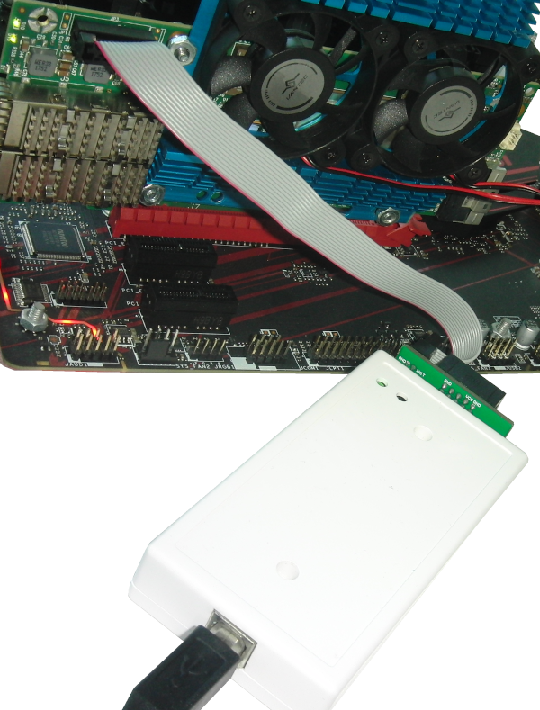
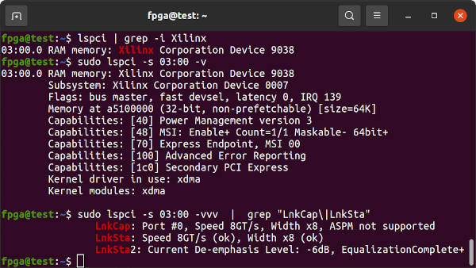
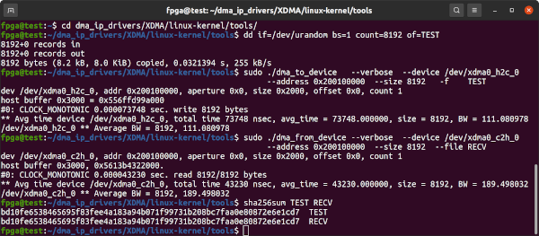

# Innova-2 Flex XCKU15P Setup and Usage Notes

The [Nvidia Mellanox Innova-2 Flex Open Programmable SmartNIC](https://www.nvidia.com/en-us/networking/ethernet/innova-2-flex/) accelerator card, model [MNV303212A-ADL](https://www.mellanox.com/files/doc-2020/pb-innova-2-flex.pdf), can be used as an FPGA development platform. It is based on the Mellanox [ConnectX-5 MT27808](https://web.archive.org/web/20220412010542/https://network.nvidia.com/files/doc-2020/pb-connectx-5-en-ic.pdf) and Xilinx [Ultrascale+ XCKU15P](https://www.xilinx.com/products/silicon-devices/fpga/kintex-ultrascale-plus.html). It is a high capacity FPGA with 8GB DDR4, connected through a PCIe x8 bridge in the ConnectX-5. Its capabilities are between that of an [Alveo U25N](https://www.xilinx.com/products/boards-and-kits/alveo/u25n.html#overview) and the [Alveo U55C](https://www.xilinx.com/products/boards-and-kits/alveo/u55c.html).


## Required Materials

* Innova-2 Flex
* Computer with 16GB+ of RAM (preferably 32GB+ and a CPU with Integrated Graphics)
* Cooling Solution (blower fan, large heatsink, thermal pads)
* 3.3V FLASH IC Programmer compatible with [flashrom](https://flashrom.org)
* Xilinx-compatible **1.8V** JTAG Adapter
* Second Computer or *External Powered PCIe Adapter* to program Flex and Factory Images via JTAG
* 25G SFP28/SFP+ Modules and Cable or [Direct-Attach Cable](https://www.fs.com/products/65841.html) to test network ports


## Cooling Solution

The card is designed for use in servers and requires up to 800 LFM of air flow. I run the board in an open air PC case and attached a hard drive heat sink to it and placed a 12V 1.3A blower fan from a server in line with the card. I run the blower fan from a 5V power rail and get acceptable noise and performance when using only the FPGA. I need to run the fan at 12V when testing the network interfaces. The board otherwise overheats and the interfaces shut down.


The two main ICs are different heights so I needed 0.8mm and 2mm thermal pads.


## System Setup

The Innova-2 requires a specific system setup. [Ubuntu 20.04](https://releases.ubuntu.com/20.04.4/) with Linux Kernel 5.8.0-43 and `MLNX_OFED 5.2-2.2.4.0` drivers is the most recent combination that works for me. I am running the card in the second PCIe slot of a system with 16GB of memory and a CPU with Integrated Graphics. Using the second PCIe slot prevents issues with the motherboard assuming the Innova-2 is a video card. A CPU with Integrated Graphics prevents conflicts between the Innova-2 and a Video Card and is useful when debugging PCIe designs.

I recommend starting with a fresh Ubuntu install on a blank SSD. An approximately 250GB SSD is enough for a working system that includes full *Vivado* 2021.2. 64GB drive space is enough for a working system with *Vivado Lab Edition* for basic functionality testing of the Innova-2.


### Linux Kernel

Begin by updating and upgrading your [Ubuntu 20.04](https://releases.ubuntu.com/20.04.4/) install but make sure to stay on **20.04**, no `dist-upgrade`. Run the following in a terminal. Run `sudo ls` before copy-and-pasting a large block of commands to prime `sudo` and avoid copying commands into the password field.
```Shell
sudo apt-get update  ;  sudo apt-get upgrade
sudo reboot
```

Install Linux Kernel `5.8.0-43-generic` which is the latest kernel I have found to work.
```Shell
sudo apt-get install   linux-buildinfo-5.8.0-43-generic \
       linux-cloud-tools-5.8.0-43-generic linux-headers-5.8.0-43-generic \
       linux-image-5.8.0-43-generic linux-modules-5.8.0-43-generic \
       linux-modules-extra-5.8.0-43-generic linux-tools-5.8.0-43-generic

sudo reboot
```

#### GRUB Bootloader Configuration

`sudo gedit /etc/default/grub` and edit GRUB's configuration to the following:

```Shell
### change timeout to 3s and add a menu
#GRUB_DEFAULT=0
GRUB_DEFAULT="Advanced options for Ubuntu>Ubuntu, with Linux 5.8.0-43-generic"
GRUB_TIMEOUT_STYLE=menu
GRUB_HIDDEN_TIMEOUT_QUIET=false
GRUB_TIMEOUT=3
GRUB_DISTRIBUTOR=`lsb_release -i -s 2> /dev/null || echo Debian`
GRUB_CMDLINE_LINUX_DEFAULT="quiet splash"
GRUB_CMDLINE_LINUX="net.ifnames=0 biosdevname=0 default_hugepagesz=1GB hugepagesz=1GB hugepages=20"
```

The `net.ifnames=0 biosdevname=0` options allow default network interface names. The `hugepages` options speed up allocation of memory for throughput testing.

Update and reboot.
```Shell
sudo update-grub
sudo reboot
```

After reboot run Ubuntu *Software Updater* and reboot when it finishes.


#### Remove all Kernels other than 5.8.0-43

List all installed Linux Kernels:
```Shell
dpkg -l | grep linux-image | grep "^ii"
```

Kernels `5.13.0-30-generic` and `5.13.0-51-generic` show up for me in the above command so I remove them both as they are **not** `5.8.0-43`.
```Shell
sudo apt remove \
       linux-buildinfo-5.13.0-51-generic \
       linux-cloud-tools-5.13.0-51-generic linux-headers-5.13.0-51-generic \
       linux-image-5.13.0-51-generic linux-modules-5.13.0-51-generic \
       linux-modules-extra-5.13.0-51-generic linux-tools-5.13.0-51-generic \
       \
       linux-buildinfo-5.13.0-30-generic \
       linux-cloud-tools-5.13.0-30-generic linux-headers-5.13.0-30-generic \
       linux-image-5.13.0-30-generic linux-modules-5.13.0-30-generic \
       linux-modules-extra-5.13.0-30-generic linux-tools-5.13.0-30-generic

sudo apt autoremove
```

Reboot and confirm you are on kernel `5.8.0-43-generic`
```
uname -s -r -m
dpkg -l | grep linux-image | grep "^ii"
```


### Install All Prerequisites

Install all necessary prerequisite libraries and software. `MLNX_OFED` drivers will install custom versions of some of the libraries that get pulled into this install. By installing everything first you can avoid library incompatibility issues and `MLNX_OFED` reinstallations. `libibverbs` is one package that gets updated and pulled in by almost every piece of networking software and `MLNX_OFED` requires a custom version.
```Shell
sudo apt install    alien apt autoconf automake binfmt-support \
    binutils-riscv64-unknown-elf binwalk bison bpfcc-tools \
    build-essential bzip2 chrpath clang clinfo cmake coreutils \
    curl cycfx2prog dapl2-utils debhelper dh-autoreconf dh-python \
    dkms dos2unix doxygen dpatch dpdk elfutils flashrom flex \
    fxload gcc gcc-multilib gcc-riscv64-unknown-elf gdb gfortran \
    gfortran-multilib ghex git graphviz gtkterm gtkwave hwdata \
    ibacm ibutils ibverbs-providers ibverbs-utils intel-opencl-icd \
    iperf3 ixo-usb-jtag kcachegrind libaio1 libaio-dev libasm1 \
    libbpfcc libbpfcc-dev libbsd0 libc6 libc6-dev libcap-dev \
    libc-dev libcharon-extauth-plugins libclang-dev libcunit1 \
    libcunit1-dev libdapl2 libdrm-dev libdw1 libdwarf++0 \
    libedit-dev libegl1-mesa-dev libelf++0 libelf1 libelf-dev \
    libelfin-dev libfdt1 libfdt-dev libfontconfig1-dev \
    libfreetype6-dev libftdi1 libgfortran4 libglib2.0-0 \
    libglib2.0-bin libglib2.0-data libglib2.0-dev libhugetlbfs-bin \
    libibdm1 libibmad5 libibmad-dev libibnetdisc5 libibnetdisc-dev \
    libibumad-dev libibverbs1 libibverbs-dev libipsec-mb0 libisal2 \
    libisal-dev libjansson4 libjpeg-dev liblzma-dev libmfx1 \
    libmfx-dev libmfx-tools libmnl0 libmnl-dev libmount-dev \
    libncurses5 libncurses-dev libnl-3-200 libnl-3-dev \
    libnl-route-3-200 libnl-route-3-dev libnuma-dev \
    libopencl-clang10 libpcap-dev libprocps-dev librdmacm1 \
    librdmacm-dev librte-pmd-qat20.0 libselinux1 \
    libselinux1-dev libsgutils2-dev libssl-dev \
    libstdc++-9-dev-riscv64-cross libstdc++-9-pic-riscv64-cross \
    libstrongswan libstrongswan-standard-plugins libsystemd0 \
    libsystemd-dev libtiff5 libtiff-dev libtinfo5 libtinfo-dev \
    libtool libudev-dev libunbound8 libunbound-dev libunwind8 \
    libunwind-dev libusb-1.0-0-dev libvma libvma-dev libxext-dev \
    libxfixes-dev libxft-dev llvm-dev logrotate lsb-base make \
    mdevctl meld mesa-opencl-icd meson module-assistant ninja-build \
    ntpdate nvme-cli ocl-icd-dev ocl-icd-libopencl1 \
    ocl-icd-opencl-dev opencl-headers openjdk-17-jdk \
    openjdk-17-jre openocd opensm openssl openvswitch-switch pandoc \
    pciutils perftest perl pkg-config procps python python3-all \
    python3-attr python3-automat python3-binwalk python3-bpfcc \
    python3-constantly python3-docutils python3-ftdi1 \
    python3-hamcrest python3-hyperlink python3-incremental \
    python3-openssl python3-pip python3-pkgconfig python3-pyasn1 \
    python3-pyasn1-modules python3-pyelftools python3-pyverbs \
    python3-service-identity python3-setuptools python3-six \
    python3-sphinx python3-twisted python3-twisted-bin \
    python3-zope.interface python-six python-zope.interface quilt \
    rdmacm-utils sg3-utils sockperf squashfs-tools \
    squashfs-tools-ng squashfuse strongswan strongswan-charon \
    strongswan-libcharon strongswan-starter swig tcl-dev \
    tcptraceroute tk-dev udev urjtag v4l2loopback-dkms \
    v4l2loopback-utils valgrind valgrind-mpi vbindiff xc3sprog \
    zlib1g zlib1g-dev dpkg-dev:i386 libgtk2.0-0:i386 libstdc++6:i386
```

Restart the system. Need to remove some extra packages that conflict with Mellanox OFED.
```Shell
sudo apt-get remove  openmpi-bin libcoarrays-openmpi-dev \
       libiscsi-bin dpdk-dev libmumps-5.2.1 librte-pmd-mlx4-20.0 \
       libsdpa-dev librte-pmd-mlx5-20.0 libcaf-openmpi-3 \
       libscotch-dev libopensm-dev libosmvendor4 libopensm8 \
       mpi-default-dev libmumps-seq-dev libopenmpi3 \
       libscalapack-openmpi2.1 libopenmpi-dev openmpi-common \
       libiscsi-dev libdpdk-dev libbibutils-dev \
       libscalapack-openmpi-dev libvma8 libfabric1 libmumps-dev \
       libbibutils6 libosmcomp4 libscalapack-mpi-dev libiscsi7 \
       mpi-default-bin

sudo apt-get update  ;  sudo apt-get upgrade
```

Install `libpng12` which is required by Vivado.
```Shell
cd ~
mkdir tmppng12
wget http://mirrors.kernel.org/ubuntu/pool/main/libp/libpng/libpng12-0_1.2.54-1ubuntu1_amd64.deb
dpkg-deb -R  libpng12-0_1.2.54-1ubuntu1_amd64.deb  tmppng12
sudo mv  tmppng12/lib/x86_64-linux-gnu/libpng12.so.0.54.0  /lib/x86_64-linux-gnu/
sudo chown root:root /lib/x86_64-linux-gnu/libpng12.so.0.54.0
sudo ln -r -s /lib/x86_64-linux-gnu/libpng12.so.0.54.0  /lib/x86_64-linux-gnu/libpng12.so.0
rm -Rf tmppng12/

sudo reboot
```

### Install Mellanox OFED

Confirm you are on kernel `5.8.0-43-generic`
```Shell
uname -s -r -m
```


`MLNX_OFED-5.2-2.2.4.0` is the latest version that works for me.


Run the following commands individually, which download and install `MLNX_OFED-5.2-2.2.4.0`.

```Shell
cd ~
wget  https://content.mellanox.com/ofed/MLNX_OFED-5.2-2.2.4.0/MLNX_OFED_LINUX-5.2-2.2.4.0-ubuntu20.04-x86_64.tgz
sha256sum  MLNX_OFED_LINUX-5.2-2.2.4.0-ubuntu20.04-x86_64.tgz
echo d2f483500afca80d7fe4f836f593016379627a9c7c005585a8ffd5373fc07401 should be the SHA256 checksum
tar -xvf  MLNX_OFED_LINUX-5.2-2.2.4.0-ubuntu20.04-x86_64.tgz
cd MLNX_OFED_LINUX-5.2-2.2.4.0-ubuntu20.04-x86_64/
sudo ./mlnxofedinstall -vvv --without-fw-update --skip-unsupported-devices-check
sudo /etc/init.d/openibd restart

sudo reboot
```


Confirm the installed version of Mellanox OFED.
```Shell
ofed_info -n
```


### Install Xilinx PCIe DMA IP Drivers

Download and extract the March 18, 2022, commit 7859957 version of Xilinx's [DMA IP Drivers](https://github.com/Xilinx/dma_ip_drivers/tree/785995783c78b2cbec6458141c4395e204c5bd9b).
```Shell
cd ~
wget https://codeload.github.com/Xilinx/dma_ip_drivers/zip/785995783c78b2cbec6458141c4395e204c5bd9b -O dma_ip_drivers-7859957.zip
unzip dma_ip_drivers-7859957.zip
mv dma_ip_drivers-785995783c78b2cbec6458141c4395e204c5bd9b dma_ip_drivers
```

#### Install and Set Up DPDK

Increase hugepages support in kernel for throughput testing.
```Shell
sudo su
echo 1024 > /sys/kernel/mm/hugepages/hugepages-2048kB/nr_hugepages
exit
```

[DPDK](https://doc.dpdk.org/guides/linux_gsg/linux_drivers.html) v20.11 is the latest version that I have tested to work with Xilinx's `dma_ip_drivers 7859957`.
```Shell
cd ~
git clone --recursive -b v20.11 --single-branch http://dpdk.org/git/dpdk-stable
cd dpdk-stable
git checkout v20.11
git describe --tags
git clone git://dpdk.org/dpdk-kmods
cp -r ../dma_ip_drivers/QDMA/DPDK/drivers/net/qdma ./drivers/net/
cp -r ../dma_ip_drivers/QDMA/DPDK/examples/qdma_testapp ./examples/
```

Configure DPDK for more ethernet ports.
```Shell
echo "dpdk_conf.set('RTE_MAX_ETHPORTS', 256)"     >>config/meson.build
echo "dpdk_conf.set('RTE_MAX_VFIO_GROUPS', 256)"  >>config/meson.build
```

`gedit drivers/net/meson.build` and add QDMA support to your DPDK build in `drivers/net/meson.build`. After `'mlx5',` add `'qdma',`

`gedit config/rte_config.h` and search for `EAL defines` in `rte_config.h` to change/add the following values:
```C
#define RTE_MAX_MEMZONE 20480
#define RTE_MAX_VFIO_CONTAINERS 256
#define RTE_MAX_QUEUES_PER_PORT 2048
#define RTE_LIBRTE_QDMA_DEBUG_DRIVER 1
```

`gedit usertools/dpdk-devbind.py` and add Xilinx QDMA Vendor and Device IDs amongst similar vendor definitions in `usertools/dpdk-devbind.py`:
```Python
xilinx_qdma_pf = {'Class': '05', 'Vendor': '10ee',
  'Device': '9011,9111,9211, 9311,9014,9114,9214,9314,9018,9118,
  9218,9318,901f,911f,921f,931f,9021,9121,9221,9321,9024,9124,9224,
  9324,9028,9128,9228,9328,902f,912f,922f,932f,9031,9131,9231,9331,
  9034,9134,9234,9334,9038,9138,9238,9338,903f,913f,923f,933f,9041,
  9141,9241,9341,9044,9144,9244,9344,9048,9148,9248,9348',
 'SVendor': None, 'SDevice': None}

xilinx_qdma_vf = {'Class': '05', 'Vendor': '10ee',
  'Device': 'a011,a111,a211,a311,a014,a114,a214,a314,a018,a118,
  a218,a318,a01f,a11f,a21f,a31f,a021,a121,a221,a321,a024,a124,a224,
  a324,a028,a128,a228,a328,a02f,a12f,a22f,a32f,a031,a131,a231,a331,
  a034,a134,a234,a334,a038,a138,a238,a338,a03f,a13f,a23f,a33f,a041,
  a141,a241,a341,a044,a144,a244,a344,a048,a148,a248,a348',
  'SVendor': None, 'SDevice': None}
```

Change (also in `dpdk-devbind.py`)
```Python
network_devices = [network_class, cavium_pkx, avp_vnic, ifpga_class]
```
to 
```Python
network_devices = [network_class, cavium_pkx, avp_vnic, ifpga_class, xilinx_qdma_pf, xilinx_qdma_vf]
```


Build DPDK:
```Shell
cd ~/dpdk-stable
meson build
cd build
ninja
sudo ninja install
sudo ldconfig
cd ../examples/helloworld/
make
```

Confirm DPDK built correctly:
```Shell
cd build
sudo ./helloworld-shared
```
Above should produce output similar to:
```
 EAL: Detected 4 lcore(s)
 EAL: Detected 1 NUMA nodes
 EAL: Multi-process socket /var/run/dpdk/rte/mp_socket
 EAL: Selected IOVA mode 'PA'
 EAL: No available hugepages reported in hugepages-1048576kB
 EAL: Probing VFIO support...
 EAL: VFIO support initialized
 hello from core 1
 hello from core 2
 hello from core 3
 hello from core 0
```

Build `igb_uio`.
```Shell
cd ~/dpdk-stable/dpdk-kmods/linux/igb_uio
make
ls -la ~/dpdk-stable/build/drivers/  |  grep librte_net_qdma.a
```
Confirm `librte_net_qdma.a` was built and shows up above. Continue to build QDMA test application:
```Shell
cd ~/dpdk-stable/examples/qdma_testapp/
make  RTE_SDK=`pwd`/../..  RTE_TARGET=build
sudo build/qdma_testapp-shared
```
Above should produce output similar to:
```
 QDMA testapp rte eal init...
 EAL: Detected 4 lcore(s)
 EAL: Detected 1 NUMA nodes
 EAL: Multi-process socket /var/run/dpdk/rte/mp_socket
 EAL: Selected IOVA mode 'VA'
 EAL: No available hugepages reported in hugepages-2048kB
 EAL: Probing VFIO support...
 EAL: VFIO support initialized
 EAL: No legacy callbacks, legacy socket not created
 Ethernet Device Count: 0
 Logical Core Count: 4
 EAL: Error - exiting with code: 1
   Cause: No Ethernet devices found. Try updating the FPGA image.
```

#### Generate Personal Signing Key

Need a personal [signing key](https://github.com/andikleen/simple-pt/issues/8#issuecomment-813438385) for compiled kernel modules. Copy and paste the following into a command terminal and it should generate a key configuration.

```Shell
cd /lib/modules/$(uname -r)/build/certs

sudo tee x509.genkey > /dev/null << 'EOF'
[ req ]
default_bits = 4096
distinguished_name = req_distinguished_name
prompt = no
string_mask = utf8only
x509_extensions = myexts
[ req_distinguished_name ]
CN = Modules
[ myexts ]
basicConstraints=critical,CA:FALSE
keyUsage=digitalSignature
subjectKeyIdentifier=hash
authorityKeyIdentifier=keyid
EOF
```

Generate custom key and reboot.
```Shell
sudo openssl req -new -nodes -utf8 -sha512 -days 36500 -batch -x509 -config x509.genkey -outform DER -out signing_key.x509 -keyout signing_key.pem
sudo reboot
```

#### Build and Install Xilinx XDMA Drivers

```Shell
cd ~/dma_ip_drivers/XDMA/linux-kernel/xdma
make
sudo make install
sudo depmod -a
sudo reboot
```

After reboot confirm Kernel Modules are Installed.
```Shell
sudo dkms status
```


### Set up Innova-2 Flex Application

The `innova2_flex_app`, part of the [Innova-2 Flex Firmware Release](https://www.nvidia.com/en-us/networking/ethernet/innova-2-flex/), allows software update of the XCKU15P FPGA User Image as well as basic diagnostics of the Innova-2.


The following commands download and install *Innova_2_Flex_Open_18_12*.
```Shell
cd ~
wget http://www.mellanox.com/downloads/fpga/flex/Innova_2_Flex_Open_18_12.tar.gz
md5sum Innova_2_Flex_Open_18_12.tar.gz
echo fdb96d4e02de11ef32bf3007281bfa53 should be the MD5 Checksum
tar -xvf Innova_2_Flex_Open_18_12.tar.gz
cd Innova_2_Flex_Open_18_12/driver/
make
sudo depmod -a
cd ../app/
make
cd ~
```

### Install Vivado or Vivado Lab Edition

Create a symbolic link for `gmake` which Vivado requires but Ubuntu already includes as `make`.
```Shell
sudo ln -s  /usr/bin/make  /usr/bin/gmake
```

Install [Xilinx Vivado ML 2021.2](https://www.xilinx.com/support/download/index.html/content/xilinx/en/downloadNav/vivado-design-tools/2021-2.html). There are only modest savings in bandwidth and space requirements when using the Web Installer so you may as well download the complete 72GB [Xilinx Unified Installer 2021.2 SFD](https://www.xilinx.com/member/forms/download/xef.html?filename=Xilinx_Unified_2021.2_1021_0703.tar.gz) offline package. Install Vitis and check Kintex Ultrascale+ under device support.  Refer to the [Vivado Release Notes](https://www.xilinx.com/content/dam/xilinx/support/documents/sw_manuals/xilinx2021_2/ug973-vivado-release-notes-install-license.pdf) for more info.

If download size is an issue, download only **Vivado Lab Edition** for now which is enough to test the Innova-2's FPGA.

Vivado **2021.2** is the latest version which has successfully synthesized a basic DDR4 design for me. 2018.3 and 2020.2 also worked. 2021.1 and 2017.2 fail. Run the following commands individually.

```Shell
echo c6f91186f332528a7b74a6a12a759fb6 should be the MD5 Checksum Value
md5sum Xilinx_Unified_2021.2_1021_0703.tar.gz
tar -xvf Xilinx_Unified_2021.2_1021_0703.tar.gz
cd Xilinx_Xilinx_Unified_2021.2_1021_0703/
sudo ./xsetup
cd /tools/Xilinx/Vivado/2021.2/data/xicom/cable_drivers/lin64/install_script/install_drivers/
sudo ./install_drivers
```


## Test the Innova-2

Power off your system. Then plug the Innova-2 into your system and power on.

Check if it shows up in `lspci`.
```Shell
sudo lspci | grep -i mellanox
```


Start Mellanox Software Tools (`mst`) to find the Innova-2's device address. Note the `/dev/mst/mt4119_pciconf0` or similar which will be needed later.
```Shell
sudo mst start
sudo mst status
sudo mst status -v
```


### Innova-2 ConnectX-5 Firmware

Run Mellanox's Flash Interface Tool `flint` for information on the Innova-2's ConnectX-5 firmware.
```Shell
sudo mst start
sudo flint --device /dev/mst/mt4119_pciconf0 query
```


If the result is `PSID: MT_0000000158` then you can attempt to program the firmware using `flint`. Otherwise, the next step requires burning the flash IC directly using an IC programmer. My device presented as `PSID: IBM0000000018` and needed to be directly programmed. Note that `sudo mst start` must be run to enable `flint`.

Make sure to **write down the GUID and MAC values**.

If the FW Version is `16.24.4020` or newer then proceed to [Testing The Network Ports](#testing-the-network-ports) as firmware is already up-to-date.

Attempt to program the firmware using `flint`. Note that the 25GbE SFP28 MT27808A0 *MNV303212A-ADL* with DDR4 is nicknamed *Morse* while the 100GbE QSFP MT28808A0 *MNV303611A-EDL* is nicknamed *MorseQ* and its firmware is in `MorseQ_FW`. `cd` into the appropriate directory.
```Shell
cd ~/Innova_2_Flex_Open_18_12/FW/Morse_FW/
sudo flint --device /dev/mst/mt4119_pciconf0 --image fw-ConnectX5-rel-16_24_4020-MNV303212A-ADL_Ax.bin --allow_rom_change burn
```


If the above works, proceed to [Testing The Network Ports](#testing-the-network-ports). If it fails as above, continue to programming the FLASH IC.

#### Programming the ConnectX5 Firmware FLASH IC Directly

If your ConnectX-5 Firmware shows up as `PSID: IBM0000000018` or is too old to update with `flint` you will need to program the FLASH directly. The IC is a 3V 128Mbit=16Mbyte [W25Q128JVS](https://www.winbond.com/resource-files/W25Q128JV%20RevI%2008232021%20Plus.pdf). I was able to successfully program it using a [CH341A Programmer](https://github.com/stahir/CH341-Store). **This is a dangerous procedure that can destroy your Innova-2**. Please do not make this your first attempt at FLASH IC programming. Consider a practice run on some other less important device or purchase a W25Q128JVS IC to test with.


If you are using a CH341A Programmer, set the configuration jumper to default/SPI mode, `1-2`.


Please take [ESD precautions](https://www.dell.com/support/kbdoc/en-ca/000137973/safety-precautions-when-working-with-electrical-equipment) seriously. Connect your 3.3V programmer to the W25Q128JVS. The Innova-2 **should not** be powered or plugged in.


Confirm pin connections are independent. Note Pins 8, 7, and 3 (Vcc, Hold, and Write-Protect) are shorted together but all other pins are independent with respect to each other. Check every combination.


Confirm Programmer-to-FLASH IC connections. 1-to-1, 2-to-2, etc.


Abort if anything appears to be incorrect. If you are certain the programmer is connected properly and you accept the risks, plug the programmer into your system. The Innova-2 **should not** be powered or plugged in.


Use `flashrom` to test the CH341A-to-FLASH connection.
```Shell
sudo flashrom --programmer ch341a_spi
```


Use `flashrom` to read the contents of the FLASH IC at least twice.
```Shell
sudo flashrom --programmer ch341a_spi --read W25Q128save.bin
sudo flashrom --programmer ch341a_spi --read W25Q128save2.bin
```


Confirm FLASH IC reads are identical, similar to below.
```Shell
sha256sum W25Q128save.bin W25Q128save2.bin
```


Confirm FLASH IC reads are sensible. Notice the `ab cd ef 00 fa de 12 34 56 78 de ad` in the first line of the header.
```Shell
od -A x -t x1z -v W25Q128save.bin  |  head
```


Abort this entire procedure if the FLASH contents are not consistent and/or the header is not sensible. Something might be wrong with your programmer or its connections.

Use `flashrom` to write the latest Innova-2 firmware to the W25Q128. This takes several minutes. Note that the 25GbE SFP28 *MNV303212A-ADL* with DDR4 is nicknamed *Morse* while the 100GbE QSFP *MNV303611A-EDL* is nicknamed *MorseQ*. `cd` into the appropriate directory.
```Shell
cd ~/Innova_2_Flex_Open_18_12/FW/Morse_FW/
sudo flashrom --programmer ch341a_spi --write fw-ConnectX5-rel-16_24_4020-MNV303212A-ADL_Ax.bin
```


Power down your system. Wait a moment, then power back up.

Start Mellanox Software Tools (MST) and query the new firmware with `flint`.
```Shell
sudo mst start
sudo mst status
sudo mst status -v
sudo flint --device /dev/mst/mt4119_pciconf0 query
```


Notice above that the GUID and MAC IDs are blank. Use `flint` to set the values back to those from earlier.
```Shell
sudo flint --device /dev/mst/mt4119_pciconf0 -guid 0xc0dec0dec0dec0de -mac 0xc0dec0dec0de sg
sudo mlxfwreset --device /dev/mst/mt4119_pciconf0 reset
sudo flint --device /dev/mst/mt4119_pciconf0 query
```


Power down and restart your system.

### Testing The Network Ports

The network interfaces can be tested using a 25G SFP28 Direct-Attach Cable (DAC) or appropriate 25GbE optical modules and cables. Note that if you have the 100GbE QSFP *MNV303611A-EDL* variant of the Innova-2 it requires 100GbE QSFP equipment.


Check that the cable is recognized.
```Shell
sudo mst start
sudo mst cable add
sudo mlxcables
```


The Innova-2 interfaces show up as `enp4s0f0` and `enp4s0f1` or similar.
```Shell
ip link show  |  grep enp
```


Two connected network interfaces on the same system can be tested by attaching each to its own namespace and then running `iperf3` between them.

In one terminal, set up a Server namespace and attach one of the network interfaces to it.
```Shell
sudo su
ip netns add serv
ip link set enp4s0f0 netns serv
ip netns exec serv ip addr add dev enp4s0f0 10.10.10.1/24
ip netns exec serv ip link set dev enp4s0f0 up
ip netns exec serv iperf3 -s -B 10.10.10.1
```

In a second terminal, set up a Client namespace and attach the other network interface to it. Then run `iperf3`.
```Shell
sudo su
ip netns add clnt
ip link set enp4s0f1 netns clnt
ip netns exec clnt ip addr add dev enp4s0f1 10.10.10.7/24
ip netns exec clnt ip link set dev enp4s0f1 up
ip netns exec clnt iperf3 -t 1 -c 10.10.10.1 -B 10.10.10.7
```

Results should approach about 23Gbits/sec as there is some overhead. Change the `-t 1` option to `-t 10` for longer throughput testing.


## Programming the FPGA

### Initial Loading of the Flex Image

In order for `innova2_flex_app` to program a User Image into the FPGA's configuration memory it must communicate with the Flex Image running in the FPGA. The Flex and Factory Images must get into FPGA configuration memory and reproduce the Memory Layout as pictured below. The `innova2_flex_app` is faster at programming a User Image than JTAG as the Flex Image provides a PCIe interface to the FPGA's Configuration Memory FLASH ICs. Refer to the [Innova-2 User Guide](https://docs.nvidia.com/networking/display/Innova2Flex/Using+the+Mellanox+Innova-2+Flex+Open+Bundle#UsingtheMellanoxInnova2FlexOpenBundle-FlashFormat) for more info.


#### Generate Configuration Images for the Full Memory Array

Create configuration images that span the entire memory map as in the layout pictured above. The `Innova_2_Flex_Open_18_12` package does not include configuration files with the binary images so everything gets written to address `0x00000000` which is incorrect. Create correct full memory images by copying data from the individual images into blank 64MB files. This should be done on the system running JTAG and requires a copy of [Innova_2_Flex_Open_18_12](http://www.mellanox.com/downloads/fpga/flex/Innova_2_Flex_Open_18_12.tar.gz) from earlier. Note that the configuration data is split into primary and secondary parts between the two x4 FLASH ICs to double throughput to x8.
```Shell
cd ~/Innova_2_Flex_Open_18_12/FPGA_image

ls -l ./Factory_image/morse_diagnostic_ku15p_bow_10g_v192_primary.bin
ls -l ./Flex_image/morse_diagnostic_ku15p_bow_10g_v193_primary.bin

dd if=/dev/zero of=completeimage0.bin bs=4096 count=67108864 iflag=count_bytes

dd if=./Factory_image/morse_diagnostic_ku15p_bow_10g_v192_primary.bin of=completeimage0.bin bs=4096 count=14532176 conv=notrunc iflag=count_bytes
dd if=./Flex_image/morse_diagnostic_ku15p_bow_10g_v193_primary.bin    of=completeimage0.bin bs=4096 seek=50331648 count=14382128 conv=notrunc oflag=seek_bytes iflag=count_bytes

sha256sum ./Factory_image/morse_diagnostic_ku15p_bow_10g_v192_primary.bin
dd if=completeimage0.bin bs=4096 count=14532176 iflag=count_bytes | sha256sum

sha256sum ./Flex_image/morse_diagnostic_ku15p_bow_10g_v193_primary.bin
dd if=completeimage0.bin bs=4096 skip=50331648 count=14382128 iflag=skip_bytes,count_bytes | sha256sum

ls -l ./Factory_image/morse_diagnostic_ku15p_bow_10g_v192_secondary.bin
ls -l ./Flex_image/morse_diagnostic_ku15p_bow_10g_v193_secondary.bin

dd if=/dev/zero of=completeimage1.bin bs=4096 count=67108864 iflag=count_bytes

dd if=./Factory_image/morse_diagnostic_ku15p_bow_10g_v192_secondary.bin of=completeimage1.bin bs=4096 count=14532176 conv=notrunc iflag=count_bytes
dd if=./Flex_image/morse_diagnostic_ku15p_bow_10g_v193_secondary.bin    of=completeimage1.bin bs=4096 seek=50331648 count=14382128 conv=notrunc oflag=seek_bytes iflag=count_bytes

sha256sum ./Factory_image/morse_diagnostic_ku15p_bow_10g_v192_secondary.bin
dd if=completeimage1.bin bs=4096 count=14532176 iflag=count_bytes | sha256sum

sha256sum ./Flex_image/morse_diagnostic_ku15p_bow_10g_v193_secondary.bin
dd if=completeimage1.bin bs=4096 skip=50331648 count=14382128 iflag=skip_bytes,count_bytes | sha256sum

echo d1fcfa0315c302a4a84c45abeae66bb8365757802f57e8979e5a46a593883340
sha256sum completeimage0.bin
echo bae7da6f6426445ca5a0f6eb8786a2e6c4c8b591599506b306ba109a634efedc
sha256sum completeimage1.bin
```

Confirm the memory images were generated correctly. These checksums are only valid for `Innova_2_Flex_Open_18_12.tar.gz`.
```Shell
sha256sum completeimage0.bin completeimage1.bin
```


#### Enable JTAG Access to the XCKU15P

The Innova-2's ConnectX-5 firmware and FPGA Factory/Flex Image communicate to prevent JTAG access to the FPGA Configuration Memory outside of `innova2_flex_app`. JTAG still works with the FPGA but access to the FPGA Configuration Memory is blocked by the ConnectX-5. The ConnectX-5 controls the Write-Protect pins of the MT25QU512 ICs. JTAG must be enabled in `innova2_flex_app` before continuing. Note that if your Innova-2 already has up-to-date Factory and Flex images that work with `innova2_flex_app` then proceed to [Loading User a Image](#loading-a-user-image). Otherwise, run `innova2_flex_app` and choose option `10`-enter to enable JTAG then `99`-enter to exit.
```Shell
sudo mst start
sudo mst status
sudo mst status -v
sudo flint -d /dev/mst/mt4119_pciconf0 q
cd ~/Innova_2_Flex_Open_18_12/driver/
sudo ./make_device
sudo insmod /usr/lib/modules/`uname -r`/updates/dkms/mlx5_fpga_tools.ko
lsmod | grep mlx
cd ~
sudo ~/Innova_2_Flex_Open_18_12/app/innova2_flex_app -v
```


#### Programming the Factory and Flex Images

Connect your Xilinx-Compatible **1.8V** JTAG Adapter to your Innova-2 but power the Innova-2 from a second computer or using a *Powered External PCIe Extender*. Running JTAG from the system with the Innova-2 may cause undefined behaviour. If JTAG halts the FPGA it will disappear off the PCIe bus and possibly crash Ubuntu.



Powered PCIe Riser for Graphics Card:


Start Vivado Hardware Manager. Any recent version of [Vivado Lab Edition](https://www.xilinx.com/support/download/index.html/content/xilinx/en/downloadNav/vivado-design-tools/2021-2.html) or full Vivado is enough for this task.


Start a Connection, `Open Target -> Auto Connect`


Right-click on `xcku15p_0` and select `Add Configuration Memory Device ...`


Select `mt25qu512-spi-x1_x2_x4_x8`.


Program the complete memory images.


Once programming finishes, which can take hours, power everything down and disconnect the JTAG adapter.


Reboot and run `innova2_flex_app` to **disable JTAG access**, option `1`, so that `innova2_flex_app` can program User Images. Reboot again.
```Shell
sudo mst start
sudo mst status
sudo mst status -v
sudo flint -d /dev/mst/mt4119_pciconf0 q
cd ~/Innova_2_Flex_Open_18_12/driver/
sudo ./make_device
sudo insmod /usr/lib/modules/`uname -r`/updates/dkms/mlx5_fpga_tools.ko
lsmod | grep mlx
cd ~
sudo ~/Innova_2_Flex_Open_18_12/app/innova2_flex_app -v

sudo reboot
```


### Loading a User Image

After Vivado generates a programming Bitstream, run *Write Memory Configuration File*, select *bin*, *mt25qu512_x1_x2_x4_x8*, *SPIx8*, *Load bitstream files*, and a location and name for the output binary files. The bitstream will end up, for example, in the `DESIGN_NAME/DESIGN_NAME.runs/impl_1` subdirectory as `SOMETHING.bit`. Vivado will add the `_primary.bin` and `_secondary.bin` extensions as the Innova-2 uses dual MT25QU512 FLASH ICs in x8 for high speed programming.


The Innova-2 Flex Image must be activated to allow `innova2_flex_app` to program the FPGA's Configuration Memory. Run the `innova2_flex_app` and choose option `1`-enter then `99`-enter to enable the Flex Image. Reboot your system for the change to take effect.
```
sudo mst start
sudo ~/Innova_2_Flex_Open_18_12/driver/make_device
sudo insmod mlx5_fpga_tools

sudo ~/Innova_2_Flex_Open_18_12/app/innova2_flex_app -v
```


After rebooting, the Flex Image should be active, check with `lspci`.
```
lspci | grep -i Mellanox
```


The commands below clone the [innova2_xcku15p_ddr4_bram_gpio](https://github.com/mwrnd/innova2_xcku15p_ddr4_bram_gpio) demo which includes bitstream binaries for testing. Run the `innova2_flex_app` with appropriate `-b` commands to program the design. Note the `_primary.bin,0` and `_secondary.bin,1`. Choose option `6`-enter to program the design, then `7`-enter to set the User Image as active, then `99`-enter to exit. After rebooting your system the new User Image should be running.
```Shell
cd ~
sudo mst start
sudo mst status
sudo mst status -v
sudo flint -d /dev/mst/mt4119_pciconf0 q
cd ~/Innova_2_Flex_Open_18_12/driver/
sudo ./make_device
sudo insmod /usr/lib/modules/`uname -r`/updates/dkms/mlx5_fpga_tools.ko
lsmod | grep mlx
cd ~
git clone https://github.com/mwrnd/innova2_xcku15p_ddr4_bram_gpio
cd innova2_xcku15p_ddr4_bram_gpio
sudo ~/Innova_2_Flex_Open_18_12/app/innova2_flex_app -v \
  -b innova2_xcku15p_ddr4_bram_gpio_primary.bin,0       \
  -b innova2_xcku15p_ddr4_bram_gpio_secondary.bin,1

sudo reboot
```


### Testing a Loaded User Image

After rebooting the User Image should be active. Check with `lspci`. It shows up at PCIe Bus Address `03:00` for me. Change the commands below appropriately.
```
lspci | grep -i Xilinx
sudo lspci  -s 03:00  -v
sudo lspci  -s 03:00  -vvv | grep "LnkCap\|LnkSta"
```



Run the Xilinx XDMA Test programs. The commands below generate 8kb of random data, then send it to a BRAM in the XCKU15P, then read it back and confirm the data is identical. The address used is specific to the [innova2_xcku15p_ddr4_bram_gpio](https://github.com/mwrnd/innova2_xcku15p_ddr4_bram_gpio) project. Note `h2c` is *Host-to-Card* and `c2h` is *Card-to-Host*
```Shell
cd ~/dma_ip_drivers/XDMA/linux-kernel/tools/
dd if=/dev/urandom bs=1 count=8192 of=TEST
sudo ./dma_to_device   --verbose --device /dev/xdma0_h2c_0 --address 0x200100000 --size 8192  -f    TEST
sudo ./dma_from_device --verbose --device /dev/xdma0_c2h_0 --address 0x200100000 --size 8192 --file RECV
sha256sum TEST RECV
```



Continue to the [innova2_xcku15p_ddr4_bram_gpio](https://github.com/mwrnd/innova2_xcku15p_ddr4_bram_gpio) project for further testing of the design.


## Upgrading the ConnectX5 Firmware

Once you have tested an Innova-2 using the current working firmware, consider upgrading the ConnectX-5 using the [mlxup](https://network.nvidia.com/support/firmware/mlxup-mft/) utility. Check out the [mlxup User Guide](https://docs.mellanox.com/display/MLXUPFWUTILITY). It has an `--online` option.
```
cd ~
wget https://www.mellanox.com/downloads/firmware/mlxup/4.20.0/SFX/linux_x64/mlxup
echo e9ce226ee43fb0ad0b84ecee44cf64989bdf5f1f6a99c459aae29f3a4e1ae32c should be the SHA256 checksum
sha256sum mlxup
sudo ./mlxup
```


## Useful Links

* [Nvidia Mellanox Innova-2 Flex Open Programmable SmartNIC](https://www.nvidia.com/en-us/networking/ethernet/innova-2-flex/)
* [Mellanox OFED Drivers](https://network.nvidia.com/products/infiniband-drivers/linux/mlnx_ofed/)
* [Innova-2 Flex User Guide](https://docs.nvidia.com/networking/display/Innova2Flex)
* [Original Constraints XDC File](https://docs.nvidia.com/networking/download/attachments/11995849/Verilog_VHDL_and_Xilinx_Design_Constrains.zip?version=3&modificationDate=1554374888353&api=v2)
* [OpenCAPI Pinout](https://docs.nvidia.com/networking/download/attachments/11995849/Innova-2%20Flex%20Open%20Interface%20Pinouts.xlsx?version=2&modificationDate=1554362542493&api=v2)
* [OpenCAPI Presentation](https://opencapi.org/wp-content/uploads/2018/12/OpenCAPI-Tech-SC18-Exhibitor-Forum.pdf)
* OpenCAPI [OpenPower Advanced Accelerator Adapter Electro-Mechanical Specification](https://files.openpower.foundation/s/xSQPe6ypoakKQdq/download/25Gbps-spec-20171108.pdf)
* OpenCAPI [SlimSAS Connector U10-J074-24 or U10-K274-26](https://www.amphenol-cs.com/media/wysiwyg/files/documentation/datasheet/inputoutput/hsio_cn_slimsas_u10.pdf)
* [SlimSAS Cable SFF-8654 8i 85-Ohm](https://www.sfpcables.com/24g-internal-slimsas-sff-8654-to-sff-8654-8i-cable-straight-to-90-degree-left-angle-8x-12-sas-4-0-85-ohm-0-5-1-meter) or [RSL74-0540](http://www.amphenol-ast.com/v3/en/product_view.aspx?id=235) or [8ES8-1DF21-0.50](https://www.3m.com/3M/en_US/p/d/b5000000278/), [8ES8-1DF Datasheet](https://multimedia.3m.com/mws/media/1398233O/3m-slimline-twin-ax-assembly-sff-8654-x8-30awg-78-5100-2665-8.pdf)
* [Vivado 2021.2 Developer AMI](https://aws.amazon.com/marketplace/pp/prodview-53u3edtjtp2fe) for full licensed access to Vivado
* [EEVblog Forum](https://www.eevblog.com/forum/repair/how-to-test-salvageable-xilinx-ultrascale-board-from-ebay/?all) post regarding the Innova-2
* [nextpnr-xilinx](https://github.com/gatecat/nextpnr-xilinx) project as well as [prjxray](https://github.com/f4pga/prjxray) and [prjxuray](https://github.com/f4pga/prjuray)


## Projects Tested to Work with the Innova2

* [innova2_xcku15p_ddr4_bram_gpio](https://github.com/mwrnd/innova2_xcku15p_ddr4_bram_gpio) - Simple PCIe XDMA to DDR4 and GPIO Demo


## Troubleshooting

### W25Q128JVS FLASH Failure

If only the PCIe Bridge shows up in `lspci`, the W25Q128JVS FLASH IC has failed or is written incorrectly.
```Shell
sudo lspci | grep -i mellanox
```


### Board Works But Not JTAG

Everything but JTAG was working so I began by trying to trace out all the JTAG connections. That went nowhere so I switched my multimeter to Diode Mode and tested all two and three terminal components. Two SC70 components marked *MXX*, U41 and U49, gave significantly different values. I replaced the part with larger readings with the same part from a different board and JTAG began working! I believe it is a [DMN63D8LW](https://www.diodes.com/assets/Datasheets/DMN63D8LW.pdf).


### Nothing Seems to Work

While testing voltages next to the SFP connectors on a powered board my multimeter lead slipped and I shorted the 12V rail. I replaced fuse F1 with a [Bel Fuse 0685P9100-01](https://belfuse.com/resources/datasheets/circuitprotection/ds-cp-0685p-series.pdf) and the board was saved. I got lucky. If I had shorted a voltage rail further down in the heirarchy I would not have been able to fix it as easily. A blown fuse is either a simple fix or a sign of catastrophic failure.


The board is well designed with all voltage rails exposed on test points. Carefully measure each one.


### Disable or Enable Above-4G Memory Decoding

It should have no effect when running a 64-Bit OS but sometimes it does. Flip this setting in your BIOS if you have any problems or throughput bandwidth seems low.


