# Innova-2 Flex XCKU15P Setup and Usage Notes

The [Nvidia Mellanox Innova-2 Flex Open Programmable SmartNIC](https://www.nvidia.com/en-us/networking/ethernet/innova-2-flex/) accelerator card, model [MNV303212A-ADLT](https://www.mellanox.com/files/doc-2020/pb-innova-2-flex.pdf), can be used as an FPGA development platform. It is based on the Mellanox [ConnectX-5 MT27808](https://web.archive.org/web/20220412010542/https://network.nvidia.com/files/doc-2020/pb-connectx-5-en-ic.pdf) and Xilinx [Ultrascale+ XCKU15P](https://www.xilinx.com/products/silicon-devices/fpga/kintex-ultrascale-plus.html). It is a high capacity FPGA with 8GB DDR4, connected through a PCIe x8 switch in the ConnectX-5.

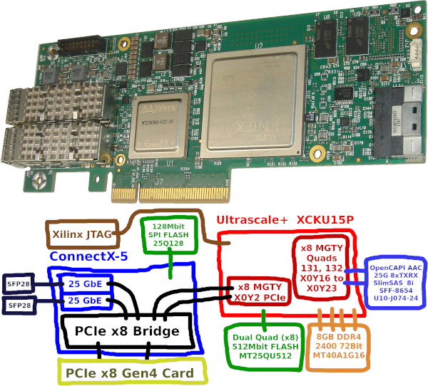

These notes include step-by-step instructions for setting up an Innova-2 system and preparing the Innova-2 for FPGA development.

If you experience any problems, search the [Nvidia SoC and SmartNIC Forum](https://forums.developer.nvidia.com/c/infrastructure/software-and-drivers/soc-and-smartnic/530) and this project's [Issues](https://github.com/mwrnd/innova2_flex_xcku15p_notes/issues?q=is%3Aissue).

# Table of Contents

   * [Required Materials](#required-materials)
   * [Cooling Solution](#cooling-solution)
   * [System Setup](#system-setup)
      * [Linux Kernel](#linux-kernel)
         * [GRUB Bootloader Configuration](#grub-bootloader-configuration)
         * [Remove all Kernels other than 5.8.0-43](#remove-all-kernels-other-than-580-43)
      * [Install All Prerequisites](#install-all-prerequisites)
      * [Install Mellanox OFED](#install-mellanox-ofed)
         * [Confirm Mellanox OFED Installed Successfully](#confirm-mellanox-ofed-installed-successfully)
      * [Install Xilinx PCIe DMA IP Drivers](#install-xilinx-pcie-dma-ip-drivers)
         * [Install and Set Up DPDK](#install-and-set-up-dpdk)
         * [Generate Personal Signing Key](#generate-personal-signing-key)
         * [Build and Install Xilinx XDMA Drivers](#build-and-install-xilinx-xdma-drivers)
      * [Set up Innova-2 Flex Application](#set-up-innova-2-flex-application)
      * [Install Vivado or Vivado Lab Edition](#install-vivado-or-vivado-lab-edition)
   * [Test the Innova-2](#test-the-innova-2)
      * [Innova-2 ConnectX-5 Firmware](#innova-2-connectx-5-firmware)
         * [Programming the ConnectX5 FLASH IC](#programming-the-connectx5-flash-ic)
            * [Programming the ConnectX5 FLASH By Corrupting its Firmware](#programming-the-connectx5-flash-by-corrupting-its-firmware)
            * [Programming the ConnectX5 FLASH By Forcing Recovery Mode](#programming-the-connectx5-flash-by-forcing-recovery-mode)
            * [Programming the ConnectX5 FLASH Using a CH341A Programmer](#programming-the-connectx5-flash-using-a-ch341a-programmer)
         * [Update GUID and MAC IDs](#update-guid-and-mac-ids)
      * [Testing The Network Ports](#testing-the-network-ports)
   * [Programming the FPGA](#programming-the-fpga)
      * [Initial Loading of the Flex Image](#initial-loading-of-the-flex-image)
         * [Enable JTAG Access to the XCKU15P](#enable-jtag-access-to-the-xcku15p)
         * [Generate Configuration Images for the Full Memory Array](#generate-configuration-images-for-the-full-memory-array)
         * [Programming the Factory and Flex Images](#programming-the-factory-and-flex-images)
      * [Loading a User Image](#loading-a-user-image)
      * [Testing the Board using the Loaded Demo User Image](#testing-the-board-using-the-loaded-demo-user-image)
         * [AXI BRAM Communication](#axi-bram-communication)
         * [AXI BRAM and Files](#axi-bram-and-files)
         * [Custom Software for Accessing AXI Blocks](#custom-software-for-accessing-axi-blocks)
   * [Loading Updated Designs Using JTAG](#loading-updated-designs-using-jtag)
      * [Confirm Motherboard BIOS and Linux Support Hotplug](#confirm-motherboard-bios-and-linux-support-hotplug)
      * [Attempt PCIe Remove and Rescan](#attempt-pcie-remove-and-rescan)
      * [Enable JTAG Access to the Innova2](#enable-jtag-access-to-the-innova2)
      * [Disconnect Innova2 from the PCIe Bridge](#disconnect-innova2-from-the-pcie-bridge)
      * [Program the FPGA Using JTAG](#program-the-fpga-using-jtag)
      * [Reconnect Innova2 FPGA to the PCIe Bridge and Rescan PCIe Bus](#reconnect-innova2-fpga-to-the-pcie-bridge-and-rescan-pcie-bus)
      * [Test the Updated Design](#test-the-updated-design)
   * [Upgrading the ConnectX5 Firmware](#upgrading-the-connectx5-firmware)
   * [Troubleshooting](#troubleshooting)
      * [W25Q128JVS FLASH Failure](#w25q128jvs-flash-failure)
      * [Factory Image Running with Flex Image Scheduled](#factory-image-running-with-flex-image-scheduled)
      * [Innova2 Flex App Will Not Program](#innova2-flex-app-will-not-program)
      * [Innova2 Flex App No BOPE or ConnectX Devices](#innova2-flex-app-no-bope-or-connectx-devices)
      * [DDR4 Communication Error](#ddr4-communication-error)
      * [JTAG Programming Failure](#jtag-programming-failure)
      * [innova2_flex_app stuck on Erasing Flash](#innova2_flex_app-stuck-on-erasing-flash)
      * [xsdb Cannot Download Program](#xsdb-cannot-download-program)
      * [Board Works But Not JTAG](#board-works-but-not-jtag)
      * [Nothing Seems to Work](#nothing-seems-to-work)
      * [Disable or Enable Resizable BAR Support](#disable-or-enable-resizable-bar-support)
      * [Disable or Enable Above-4G Memory Decoding](#disable-or-enable-above-4g-memory-decoding)
   * [JTAG Using UrJTAG](#jtag-using-urjtag)
      * [Compile and Install UrJTAG](#compile-and-install-urjtag)
      * [Create UrJTAG-Compatible JTAG Definition Files from BSDL Files](#create-urjtag-compatible-jtag-definition-files-from-bsdl-files)
      * [Add XCKU15P FFVE1517 JTAG Bit Definitions to UrJTAG](#add-xcku15p-ffve1517-jtag-bit-definitions-to-urjtag)
      * [Connect JTAG Adapter](#connect-jtag-adapter)
         * [Disconnect the Innova-2 FPGA from the PCIe Bridge](#disconnect-the-innova-2-fpga-from-the-pcie-bridge)
         * [Allow Vivado to Update Platform Cable USB II Firmware](#allow-vivado-to-update-platform-cable-usb-ii-firmware)
         * [Begin a UrJTAG Session](#begin-a-urjtag-session)
   * [FPGA Design Notes](#fpga-design-notes)
      * [Design Does Not Meet Timing Requirements](#design-does-not-meet-timing-requirements)
      * [PCIe and OpenCAPI Pinout](#pcie-and-opencapi-pinout)
   * [Useful Commands](#useful-commands)
   * [Useful Links](#useful-links)
   * [Projects Tested to Work with the Innova2](#projects-tested-to-work-with-the-innova2)


## Required Materials

* Innova-2 Flex
* Computer with 16GB+ of RAM (preferably 32GB+ and a CPU with Integrated Graphics)
* Cooling Solution (blower fan, large heatsink, thermal pads)
* [Xilinx-Compatible](https://docs.xilinx.com/r/en-US/ug908-vivado-programming-debugging/JTAG-Cables-and-Devices-Supported-by-hw_server) **1.8V** [JTAG Adapter](https://www.waveshare.com/platform-cable-usb.htm)
* Second Computer or *External Powered PCIe Adapter* to program Flex and Factory Images via JTAG
* SFP28/SFP+/SFP Modules and Cable or [Direct-Attach Cable](https://www.fs.com/products/65841.html) to test network ports


## Cooling Solution

The card is designed for use in servers and requires active cooling with up to [800 LFM of air flow](https://docs.nvidia.com/networking/display/Innova2Flex/Specifications#Specifications-MNV303212A-ADLTSpecifications). My Innova-2 came without a cooling solution so I attached a hard drive heat sink to it and placed a 12V 1.3A blower fan from a server in line with the card. I have the board in an open air setup with no enclosure. I run the blower fan from a 5V power rail and get acceptable noise and performance when using only the FPGA. I need to run the fan at 12V when testing the network interfaces. The board otherwise overheats and the interfaces shut down.

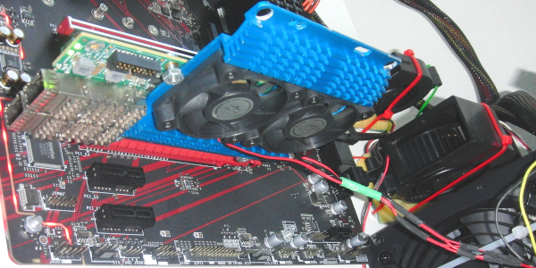

The two main ICs are different heights so I needed 2mm and 0.5mm thermal pads.

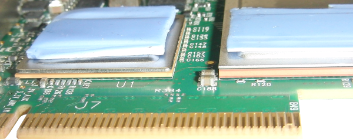

## System Setup

The Innova-2 requires a specific system setup. [Ubuntu 20.04.4](https://releases.ubuntu.com/20.04.4/) with Linux Kernel 5.8.0-43 and `MLNX_OFED 5.2-2.2.4.0` drivers is the most recent combination that works for me. I am running the card in the second PCIe slot of a system with 16GB of memory and a CPU with Integrated Graphics. Using the second PCIe slot prevents issues with the motherboard assuming the Innova-2 is a video card. A CPU with Integrated Graphics prevents conflicts between the Innova-2 and a Video Card and is useful when debugging PCIe designs.

I recommend starting with a fresh Ubuntu install on a blank SSD. An approximately 250GB SSD is enough for a working system that includes full **Vivado 2021.2**. 50GB drive space is enough for a working system with *Vivado Lab Edition* for basic functionality testing of the Innova-2.


### Linux Kernel

Begin by updating and upgrading your [Ubuntu 20.04.4 Desktop amd64](https://releases.ubuntu.com/20.04.4/) install but make sure to stay on **20.04**, no `dist-upgrade`. Run the following in a terminal. Run `sudo ls` before copy-and-pasting a large block of commands to prime `sudo` and avoid copying commands into the password field.
```Shell
sudo apt-get update  ;  sudo apt-get upgrade
```

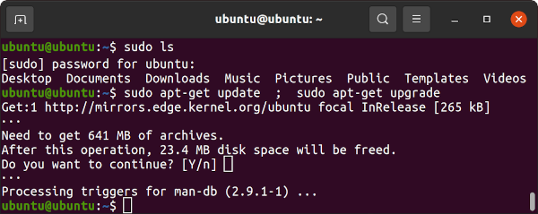

Install Linux Kernel `5.8.0-43-generic` which is the latest kernel I have found to work.
```Shell
sudo apt-get install   linux-buildinfo-5.8.0-43-generic \
       linux-cloud-tools-5.8.0-43-generic linux-headers-5.8.0-43-generic \
       linux-image-5.8.0-43-generic linux-modules-5.8.0-43-generic \
       linux-modules-extra-5.8.0-43-generic linux-tools-5.8.0-43-generic
```

Nvidia/Mellanox [only officially support kernel](https://docs.nvidia.com/networking/display/MLNXOFEDv522240/General+Support+in+MLNX_OFED) `5.4.0-26-generic`. Xilinx appears to have only thoroughly tested Vivado **2021.2** against [5.8.0](https://aws.amazon.com/marketplace/pp/prodview-53u3edtjtp2fe).


#### GRUB Bootloader Configuration

`sudo gedit /etc/default/grub` and edit GRUB's configuration to the following:

```Shell
### change timeout to 3s and add a menu
#GRUB_DEFAULT=0
GRUB_DEFAULT="Advanced options for Ubuntu>Ubuntu, with Linux 5.8.0-43-generic"
GRUB_TIMEOUT_STYLE=menu
GRUB_HIDDEN_TIMEOUT_QUIET=false
GRUB_TIMEOUT=3
GRUB_DISTRIBUTOR=`lsb_release -i -s 2> /dev/null || echo Debian`
GRUB_CMDLINE_LINUX_DEFAULT=""
GRUB_CMDLINE_LINUX="net.ifnames=0 biosdevname=0"
```

The `net.ifnames=0 biosdevname=0` options allow traditional network interface names, such as `eth0`. This is required for older versions of Vivado, such as *2017.2*.

Update `grub`.
```Shell
sudo update-grub
```

#### Remove all Kernels other than 5.8.0-43

List all installed Linux Kernels:
```Shell
dpkg -l | grep linux-image | grep "^ii"
```

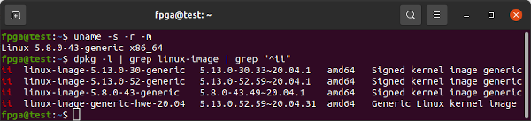

Kernels `5.13.0-30-generic` and `5.13.0-52-generic` show up for me in the above command so I remove them both as they are **not** `5.8.0-43`. Mellanox OFED driver installation attempts to compile kernel modules for every kernel on the system and it will fail to install properly if it cannot.
```Shell
sudo apt remove \
       linux-buildinfo-5.13.0-52-generic \
       linux-cloud-tools-5.13.0-52-generic linux-headers-5.13.0-52-generic \
       linux-image-5.13.0-52-generic linux-modules-5.13.0-52-generic \
       linux-modules-extra-5.13.0-52-generic linux-tools-5.13.0-52-generic \
       \
       linux-buildinfo-5.13.0-30-generic \
       linux-cloud-tools-5.13.0-30-generic linux-headers-5.13.0-30-generic \
       linux-image-5.13.0-30-generic linux-modules-5.13.0-30-generic \
       linux-modules-extra-5.13.0-30-generic linux-tools-5.13.0-30-generic

sudo apt autoremove
sudo reboot
```

After reboot run Ubuntu *Software Updater*.

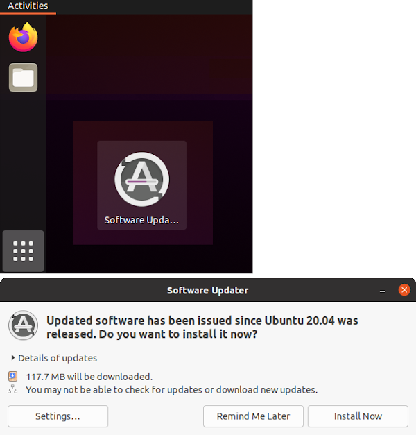


### Install All Prerequisites

Confirm you are on kernel `5.8.0-43-generic`
```
uname -s -r -m
```

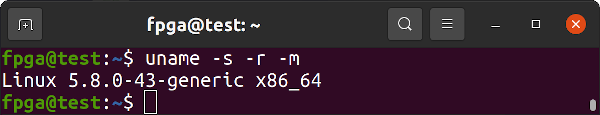

Install all necessary prerequisite libraries and software. `MLNX_OFED` drivers will install custom versions of some of the libraries that get pulled into this install. By installing everything first you can avoid library incompatibility issues and `MLNX_OFED` reinstallations. `libibverbs` is one package that gets updated and pulled in by almost every piece of networking software but `MLNX_OFED` requires a custom version.
```Shell

sudo apt install    alien apt autoconf automake binfmt-support \
    binutils-riscv64-unknown-elf binwalk bison bpfcc-tools build-essential \
    bzip2 chrpath clang clinfo cmake coreutils curl cycfx2prog dapl2-utils \
    debhelper debootstrap devmem2 dh-autoreconf dh-python dkms dos2unix \
    doxygen dpatch dpdk elfutils fio flashrom flex fxload gcc gcc-multilib \
    gcc-riscv64-unknown-elf gdb gfortran gfortran-multilib ghex git \
    graphviz gtkterm gtkwave hwdata ibacm ibutils ibverbs-providers \
    ibverbs-utils intel-opencl-icd iperf3 ixo-usb-jtag kcachegrind libaio1 \
    libaio-dev libasm1 libbpfcc libbpfcc-dev libbsd0 libc6 libc6-dev \
    libcap-dev libc-dev libcharon-extauth-plugins libclang-dev libcunit1 \
    libcunit1-dev libdapl2 libdrm-dev libdw1 libdwarf++0 libedit-dev \
    libegl1-mesa-dev libelf++0 libelf1 libelf-dev libelfin-dev libfdt1 \
    libfdt-dev libfontconfig1-dev libfreetype6-dev libftdi1 libftdi1-dev \
    libftdi1-doc libftdi-dev libgfortran4 libglib2.0-0 libglib2.0-bin \
    libglib2.0-data libglib2.0-dev libhugetlbfs-bin libibdm1 libibmad5 \
    libibmad-dev libibnetdisc5 libibnetdisc-dev libibumad-dev libibverbs1 \
    libibverbs-dev libipsec-mb0 libipsec-mb-dev libisal2 libisal-dev \
    libjansson4 libjpeg-dev liblzma-dev libmfx1 libmfx-dev libmfx-tools \
    libmnl0 libmnl-dev libmount-dev libncurses5 libncurses-dev libnl-3-200 \
    libnl-3-dev libnl-route-3-200 libnl-route-3-dev libnuma-dev \
    libopencl-clang10 libpcap-dev libprocps-dev librdmacm1 librdmacm-dev \
    libreadline-dev librte-pmd-qat20.0 libselinux1 libselinux1-dev \
    libsgutils2-dev libssl-dev libstdc++-9-dev-riscv64-cross \
    libstdc++-9-pic-riscv64-cross libstrongswan \
    libstrongswan-standard-plugins libsystemd0 libsystemd-dev libtiff5 \
    libtiff-dev libtinfo5 libtinfo-dev libtool libudev-dev libunbound8 \
    libunbound-dev libunwind8 libunwind-dev libusb-1.0-0-dev libusb-dev \
    libvma libvma-dev libxext-dev libxfixes-dev libxft-dev llvm-dev \
    logrotate lsb-base make mdevctl meld mesa-opencl-icd meson \
    module-assistant ninja-build nmap ntpdate nvme-cli ocl-icd-dev \
    ocl-icd-libopencl1 ocl-icd-opencl-dev opencl-headers openjdk-17-jdk \
    openjdk-17-jre openocd opensbi opensm openssl openvswitch-switch pandoc \
    pciutils perftest perl pkg-config procps python python3-all \
    python3-attr python3-automat python3-binwalk python3-bpfcc \
    python3-constantly python3-docutils python3-ftdi1 python3-hamcrest \
    python3-hyperlink python3-incremental python3-openpyxl python3-openssl \
    python3-pip python3-pkgconfig python3-pyasn1 python3-pyasn1-modules \
    python3-pyelftools python3-pyverbs python3-scapy \
    python3-service-identity python3-setuptools python3-six python3-sphinx \
    python3-twisted python3-twisted-bin python3-zope.interface python-six \
    python-zope.interface qemu-system-misc qemu-system-x86 qemu-utils quilt \
    rdmacm-utils sg3-utils sockperf squashfs-tools squashfs-tools-ng \
    squashfuse strongswan strongswan-charon strongswan-libcharon \
    strongswan-starter swig tcl-dev tcptraceroute tk-dev u-boot-qemu udev \
    v4l2loopback-dkms v4l2loopback-utils valgrind valgrind-mpi vbindiff \
    vtun xc3sprog xxd zlib1g zlib1g-dev

sudo apt install    dpkg-dev:i386 libgtk2.0-0:i386 libstdc++6:i386
```

Need to remove some extra packages that conflict with Mellanox OFED.
```Shell
sudo apt-get remove  openmpi-bin libcoarrays-openmpi-dev \
       libiscsi-bin dpdk-dev libmumps-5.2.1 librte-pmd-mlx4-20.0 \
       libsdpa-dev librte-pmd-mlx5-20.0 libcaf-openmpi-3 \
       libscotch-dev libopensm-dev libosmvendor4 libopensm8 \
       mpi-default-dev libmumps-seq-dev libopenmpi3 \
       libscalapack-openmpi2.1 libopenmpi-dev openmpi-common \
       libiscsi-dev libdpdk-dev libbibutils-dev \
       libscalapack-openmpi-dev libvma8 libfabric1 libmumps-dev \
       libbibutils6 libosmcomp4 libscalapack-mpi-dev libiscsi7 \
       mpi-default-bin
```

Run `update`, `autoremove`, and `upgrade` one last time. Reboot.
```Shell
sudo apt-get update  ;  sudo apt autoremove  ;  sudo apt-get upgrade
sudo reboot
```


### Install Mellanox OFED

Confirm you are on kernel `5.8.0-43-generic`
```Shell
uname -s -r -m
```


[MLNX_OFED-5.2-2.2.4.0](https://network.nvidia.com/products/infiniband-drivers/linux/mlnx_ofed/) is the latest version that works for me.


Run the following commands individually, which download and install `MLNX_OFED-5.2-2.2.4.0`.

```Shell
cd ~
wget https://content.mellanox.com/ofed/MLNX_OFED-5.2-2.2.4.0/MLNX_OFED_LINUX-5.2-2.2.4.0-ubuntu20.04-x86_64.tgz
sha256sum  MLNX_OFED_LINUX-5.2-2.2.4.0-ubuntu20.04-x86_64.tgz
echo d2f483500afca80d7fe4f836f593016379627a9c7c005585a8ffd5373fc07401 should be the SHA256 checksum
tar -xvf  MLNX_OFED_LINUX-5.2-2.2.4.0-ubuntu20.04-x86_64.tgz
cd MLNX_OFED_LINUX-5.2-2.2.4.0-ubuntu20.04-x86_64/
sudo ./mlnxofedinstall -vvv --without-fw-update --skip-unsupported-devices-check
sudo /etc/init.d/openibd restart

sudo reboot
```

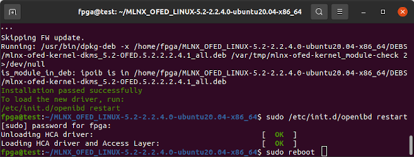

`apt-mark hold` should prevent `apt` from updating any of the packages installed by `MLNX_OFED`.
```Shell
sudo  apt-mark  hold     5.8.0-43-generic linux-image-generic \
    linux-headers-generic ofed-scripts mlnx-ofed-kernel-utils \
    mlnx-ofed-kernel-dkms iser-dkms isert-dkms srp-dkms rdma-core \
    libibverbs1 ibverbs-utils ibverbs-providers libibverbs-dev \
    libibverbs1-dbg libibumad3 libibumad-dev ibacm librdmacm1 \
    rdmacm-utils librdmacm-dev mstflint ibdump libibmad5 \
    libibmad-dev libopensm opensm opensm-doc libopensm-devel \
    libibnetdisc5 infiniband-diags mft kernel-mft-dkms perftest \
    ibutils2 ar-mgr dump-pr ibsim ibsim-doc ucx sharp hcoll \
    knem-dkms knem openmpi mpitests libdapl2 dapl2-utils \
    libdapl-dev dpcp srptools mlnx-ethtool mlnx-iproute2
```

#### Confirm Mellanox OFED Installed Successfully

After reboot confirm Kernel Modules are Installed.
```Shell
sudo dkms status
```

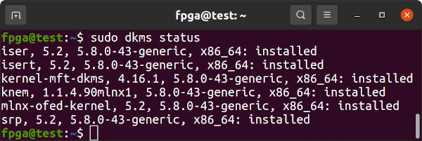

Confirm the installed version of Mellanox OFED.
```Shell
ofed_info -n
```

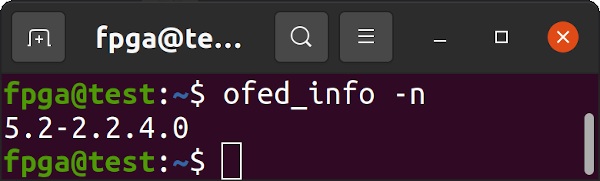


### Install Xilinx PCIe DMA IP Drivers

Download and extract the March 18, 2022, commit 7859957 version of Xilinx's [DMA IP Drivers](https://github.com/Xilinx/dma_ip_drivers/tree/785995783c78b2cbec6458141c4395e204c5bd9b).
```Shell
cd ~
wget https://codeload.github.com/Xilinx/dma_ip_drivers/zip/785995783c78b2cbec6458141c4395e204c5bd9b -O dma_ip_drivers-7859957.zip
unzip dma_ip_drivers-7859957.zip
mv dma_ip_drivers-785995783c78b2cbec6458141c4395e204c5bd9b dma_ip_drivers
```

#### Install and Set Up DPDK

DPDK requires hugepages.
```Shell
sudo su
echo 1024 > /sys/kernel/mm/hugepages/hugepages-2048kB/nr_hugepages
exit
```

[DPDK](https://www.dpdk.org/) [v20.11.5 LTS](https://doc.dpdk.org/guides-20.11/rel_notes/release_20_11.html) is the latest version that works with Xilinx's `dma_ip_drivers 7859957`. DPDK needs to be compiled and installed from source as *dma_ip_drivers* requires DPDK's `librte` to be built with QDMA support from *dma_ip_drivers* so that *dma_ip_drivers* can compile with a `librte` that supports QDMA so that XDMA drivers can build.
```Shell
cd ~
git clone --recursive -b v20.11.5 --single-branch http://dpdk.org/git/dpdk-stable
cd dpdk-stable
git checkout v20.11.5
git describe --tags
git clone git://dpdk.org/dpdk-kmods
echo Copy QDMA-related files from dma_ip_drivers
cp -r ~/dma_ip_drivers/QDMA/DPDK/drivers/net/qdma ./drivers/net/
cp -r ~/dma_ip_drivers/QDMA/DPDK/examples/qdma_testapp ./examples/
echo Configure DPDK for more ethernet ports
echo "dpdk_conf.set('RTE_MAX_ETHPORTS', 256)"     >>config/meson.build
echo "dpdk_conf.set('RTE_MAX_VFIO_GROUPS', 256)"  >>config/meson.build
```

`gedit drivers/net/meson.build` and add QDMA support to your DPDK build in `meson.build`. After `'mlx5',` add `'qdma',`

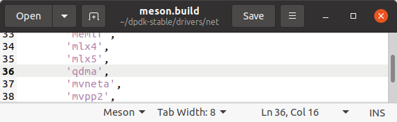


`gedit config/rte_config.h` and search for `EAL defines` in `rte_config.h` to change/add the following values:
```C
#define RTE_MAX_MEMZONE 20480
#define RTE_MAX_VFIO_CONTAINERS 256
#define RTE_MAX_QUEUES_PER_PORT 2048
#define RTE_LIBRTE_QDMA_DEBUG_DRIVER 1
```

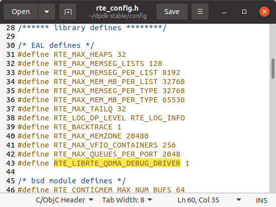


`gedit usertools/dpdk-devbind.py` and add Xilinx QDMA Vendor and Device IDs amongst similar vendor definitions in `dpdk-devbind.py`:
```Python
xilinx_qdma_pf = {'Class': '05', 'Vendor': '10ee',
  'Device': '9011,9111,9211, 9311,9014,9114,9214,9314,9018,9118,\
  9218,9318,901f,911f,921f,931f,9021,9121,9221,9321,9024,9124,9224,\
  9324,9028,9128,9228,9328,902f,912f,922f,932f,9031,9131,9231,9331,\
  9034,9134,9234,9334,9038,9138,9238,9338,903f,913f,923f,933f,9041,\
  9141,9241,9341,9044,9144,9244,9344,9048,9148,9248,9348',
  'SVendor': None, 'SDevice': None}

xilinx_qdma_vf = {'Class': '05', 'Vendor': '10ee',
  'Device': 'a011,a111,a211,a311,a014,a114,a214,a314,a018,a118,\
  a218,a318,a01f,a11f,a21f,a31f,a021,a121,a221,a321,a024,a124,a224,\
  a324,a028,a128,a228,a328,a02f,a12f,a22f,a32f,a031,a131,a231,a331,\
  a034,a134,a234,a334,a038,a138,a238,a338,a03f,a13f,a23f,a33f,a041,\
  a141,a241,a341,a044,a144,a244,a344,a048,a148,a248,a348',
  'SVendor': None, 'SDevice': None}
```

Change (also in `dpdk-devbind.py`)
```Python
network_devices = [network_class, cavium_pkx, avp_vnic, ifpga_class]
```
to 
```Python
network_devices = [network_class, cavium_pkx, avp_vnic, ifpga_class, xilinx_qdma_pf, xilinx_qdma_vf]
```

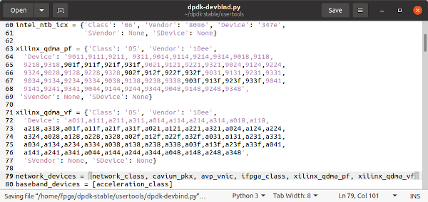


Build DPDK:
```Shell
cd ~/dpdk-stable
meson build
cd build
ninja
sudo ninja install
sudo ldconfig
cd ../examples/helloworld/
make
```

Confirm DPDK built correctly:
```Shell
cd build
sudo ./helloworld-shared
```
Above should produce output similar to:
```
 EAL: Detected 4 lcore(s)
 EAL: Detected 1 NUMA nodes
 EAL: Multi-process socket /var/run/dpdk/rte/mp_socket
 EAL: Selected IOVA mode 'PA'
 EAL: No available hugepages reported in hugepages-1048576kB
 EAL: Probing VFIO support...
 EAL: VFIO support initialized
 hello from core 1
 hello from core 2
 hello from core 3
 hello from core 0
```

Build `igb_uio`.
```Shell
cd ~/dpdk-stable/dpdk-kmods/linux/igb_uio
make
```

Confirm `librte_net_qdma.a` was built and exists. 
```
ls -la ~/dpdk-stable/build/drivers/  |  grep librte_net_qdma.a
```

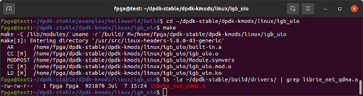


Edit `dma_ip_drivers`'s QDMA to enable [Xilinx Virtual Cable (XVC)](https://docs.xilinx.com/r/en-US/ug908-vivado-programming-debugging/Vivado-Debug-Bridge-IP-and-Xilinx-Virtual-Cable-XVC-Flow). Uncomment `export enable_xvc` in `dma_ip_drivers/QDMA/linux-kernel/driver/Makefile`:

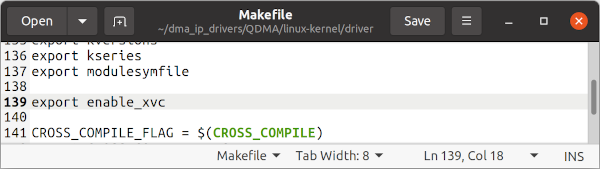

Continue to build QDMA test application:
```Shell
cd ~/dpdk-stable/examples/qdma_testapp/
make  RTE_SDK=`pwd`/../..  RTE_TARGET=build
sudo build/qdma_testapp-shared
```
Above should produce output similar to:
```
 QDMA testapp rte eal init...
 EAL: Detected 4 lcore(s)
 EAL: Detected 1 NUMA nodes
 EAL: Multi-process socket /var/run/dpdk/rte/mp_socket
 EAL: Selected IOVA mode 'VA'
 EAL: No available hugepages reported in hugepages-2048kB
 EAL: Probing VFIO support...
 EAL: VFIO support initialized
 EAL: No legacy callbacks, legacy socket not created
 Ethernet Device Count: 0
 Logical Core Count: 4
 EAL: Error - exiting with code: 1
   Cause: No Ethernet devices found. Try updating the FPGA image.
```

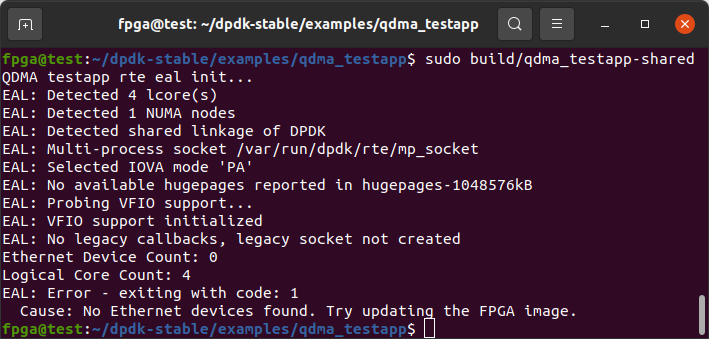


#### Generate Personal Signing Key

Need a personal [signing key](https://github.com/andikleen/simple-pt/issues/8#issuecomment-813438385) for compiled kernel modules. Run `sudo ls` to prime `sudo` then copy and paste the following into a command terminal and it should generate a key configuration.

```Shell
cd /lib/modules/$(uname -r)/build/certs

sudo tee x509.genkey > /dev/null << 'EOF'
[ req ]
default_bits = 4096
distinguished_name = req_distinguished_name
prompt = no
string_mask = utf8only
x509_extensions = myexts
[ req_distinguished_name ]
CN = Modules
[ myexts ]
basicConstraints=critical,CA:FALSE
keyUsage=digitalSignature
subjectKeyIdentifier=hash
authorityKeyIdentifier=keyid
EOF
```

Generate custom key and reboot.
```Shell
sudo openssl req -new -nodes -utf8 -sha512 -days 36500 -batch -x509 -config x509.genkey -outform DER -out signing_key.x509 -keyout signing_key.pem
sudo reboot
```

#### Build and Install Xilinx XDMA Drivers

```Shell
cd ~/dma_ip_drivers/QDMA/linux-kernel/
make
sudo make install

cd ~/dma_ip_drivers/XDMA/linux-kernel/xdma/
make
sudo make install

sudo depmod -a
sudo ldconfig

cd ~/dma_ip_drivers/XDMA/linux-kernel/tools
make

sudo reboot
```


### Set up Innova-2 Flex Application

The `innova2_flex_app`, part of the [Innova-2 Flex Firmware Release](https://www.nvidia.com/en-us/networking/ethernet/innova-2-flex/), allows software update of the XCKU15P FPGA User Image as well as basic diagnostics of the Innova-2.

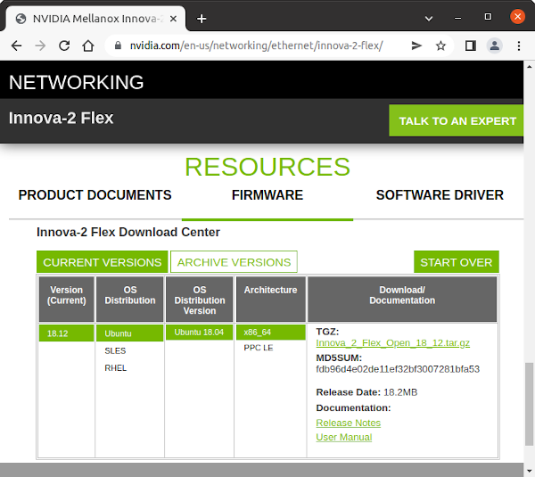


The following commands download and install *Innova_2_Flex_Open_18_12*.
```Shell
cd ~
wget http://www.mellanox.com/downloads/fpga/flex/Innova_2_Flex_Open_18_12.tar.gz
md5sum Innova_2_Flex_Open_18_12.tar.gz
echo fdb96d4e02de11ef32bf3007281bfa53 should be the MD5 Checksum
tar -xvf Innova_2_Flex_Open_18_12.tar.gz
cd ~/Innova_2_Flex_Open_18_12/driver/
make
sudo depmod -a
cd ~/Innova_2_Flex_Open_18_12/app/
make

sudo reboot
```

### Install Vivado or Vivado Lab Edition

Vivado is not strictly required on the system with the Innova-2. A seperate computer with Vivado can be used for development and JTAG. However, if you intend to develop with any of Xilinx's [Accelerator Projects](https://www.xilinx.com/products/design-tools/vitis/vitis-ai.html), they require the [Xilinx Runtime XRT](https://xilinx.github.io/XRT/2021.2/html/index.html) which requires Vitis, which requires Vivado.

Create a symbolic link for `gmake` which Vivado requires but Ubuntu already includes as `make`.
```Shell
sudo ln -s  /usr/bin/make  /usr/bin/gmake
```

Install `libpng12` which is required by Vivado.
```Shell
cd ~
mkdir tmppng12
wget http://mirrors.kernel.org/ubuntu/pool/main/libp/libpng/libpng12-0_1.2.54-1ubuntu1_amd64.deb
dpkg-deb -R  libpng12-0_1.2.54-1ubuntu1_amd64.deb  tmppng12
sudo mv  tmppng12/lib/x86_64-linux-gnu/libpng12.so.0.54.0  /lib/x86_64-linux-gnu/
sudo chown root:root /lib/x86_64-linux-gnu/libpng12.so.0.54.0
sudo ln -r -s /lib/x86_64-linux-gnu/libpng12.so.0.54.0  /lib/x86_64-linux-gnu/libpng12.so.0
rm -Rf tmppng12/
```

Install [Xilinx Vivado ML 2021.2](https://www.xilinx.com/support/download/index.html/content/xilinx/en/downloadNav/vivado-design-tools/2021-2.html). Vivado **2021.2** is the latest version which has successfully synthesized and implemented a basic Innova-2 DDR4 design for me. 2018.3 and 2020.2 also worked. 2021.1 and 2017.2 fail. If download size is an issue, download only **Vivado Lab Edition** for now which is enough to test the Innova-2's FPGA. There are only modest savings in bandwidth and space requirements when using the Web Installer so you may as well download the complete 72GB [Xilinx Unified Installer 2021.2 SFD](https://www.xilinx.com/member/forms/download/xef.html?filename=Xilinx_Unified_2021.2_1021_0703.tar.gz) offline package.

If you have decided to install full Vivado, select Vitis (which will include Vivado) and at least *Kintex Ultrascale+* and *Zynq Ultrascale+ MPSoC* under device support. *Zynq Ultrascale+ MPSoC* seems to pull in some files needed by Vitis.

Refer to the [Vivado Release Notes](https://www.xilinx.com/content/dam/xilinx/support/documents/sw_manuals/xilinx2021_2/ug973-vivado-release-notes-install-license.pdf) for more info. You will also need to obtain a Vivado License, such as an [Evaluation License](https://www.xilinx.com/getlicense.html).

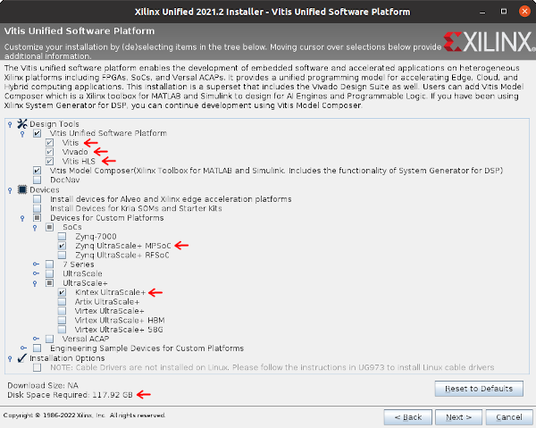

Run the following commands individually.
```Shell
echo c6f91186f332528a7b74a6a12a759fb6 should be the MD5 Checksum Value
md5sum Xilinx_Unified_2021.2_1021_0703.tar.gz
tar -xvf Xilinx_Unified_2021.2_1021_0703.tar.gz
cd Xilinx_Xilinx_Unified_2021.2_1021_0703/
sudo ./xsetup
cd /tools/Xilinx/Vivado/2021.2/data/xicom/cable_drivers/lin64/install_script/install_drivers/
sudo ./install_drivers
```

Vivado requires 4GB of system RAM per Job (Thread) plus a base of 10GB. An Ubuntu system with 16GB of RAM running just Vivado can reliably use only 1 core during synthesis and implementation. Otherwise, it will overwhelm the [Kernel Swap Daemon](https://askubuntu.com/questions/259739/kswapd0-is-taking-a-lot-of-cpu).

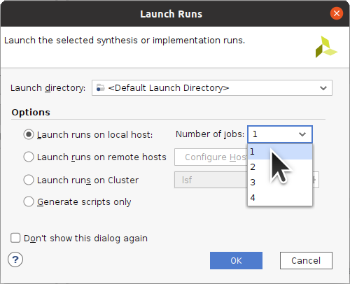


## Test the Innova-2

Power off your system. Then plug the Innova-2 into your system and power on.

Check if it shows up in `lspci`.
```Shell
sudo lspci | grep -i mellanox
```


If the Innova-2 does not show up, try a different PCIe slot. It should work in any x16 or x8 slot or even in an x1 with an [appropriate adapter](https://www.startech.com/en-ca/cards-adapters/pex1to162). If it does not, proceed to [Programming the ConnectX FLASH IC](#programming-the-connectx5-flash).

Start Mellanox Software Tools (`mst`) to find the Innova-2's device address. Note the `/dev/mst/mt4119_pciconf0` or similar which will be needed later.
```Shell
sudo mst start
sudo mst status
sudo mst status -v
```

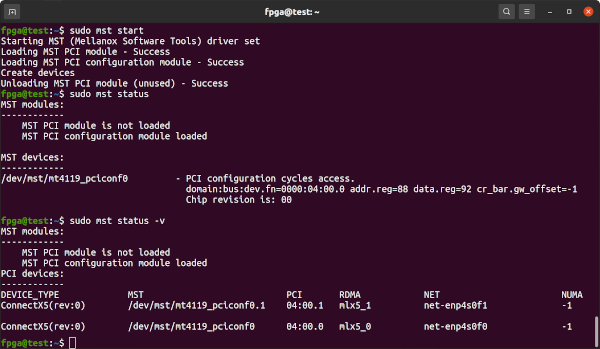

### Innova-2 ConnectX-5 Firmware

Run Mellanox's Flash Interface Tool `flint` for information on the Innova-2's ConnectX-5 firmware.
```Shell
sudo mst start
sudo flint --device /dev/mst/mt4119_pciconf0 query
```


If the result is `PSID: MT_0000000158` then you can attempt to program the firmware using `flint`. Otherwise, the next step may require physical access to the board. My device presented as `PSID: IBM0000000018` and needed to be programmed. `sudo mst start` must be run to enable `flint`.

Make sure to **write down the GUID and MAC values**.

If the FW Version is `16.24.4020` or newer then proceed to [Testing The Network Ports](#testing-the-network-ports) as firmware is already up-to-date.

Attempt to program the firmware using `flint`. The 25GbE SFP28 MT27808A0 *MNV303212A-ADLT* with 8GB of DDR4 is nicknamed *Morse* while the 100GbE QSFP MT28808A0 *MNV303611A-EDLT* is nicknamed *MorseQ* and its firmware is in `MorseQ_FW`. `cd` into the appropriate directory.
```Shell
cd ~/Innova_2_Flex_Open_18_12/FW/Morse_FW/
sudo flint --device /dev/mst/mt4119_pciconf0 --image fw-ConnectX5-rel-16_24_4020-MNV303212A-ADL_Ax.bin --allow_rom_change burn
```

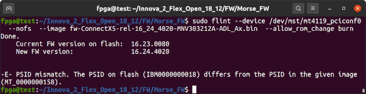

If the above works, proceed to [Testing The Network Ports](#testing-the-network-ports). If it fails as above due to a `-E- PSID mismatch` or other error, continue with programming the ConnectX5 Firmware FLASH IC.


#### Programming the ConnectX5 FLASH IC

If your ConnectX-5 Firmware shows up as `PSID: IBM0000000018` or is too old to update with `flint` you will need to update it so that it works with `innova2_flex_app`. There are three methods: [Corrupting the firmware and using `mstflint`](#programming-the-connectx5-flash-by-corrupting-its-firmware), [using a programmer](#programming-the-connectx5-flash-using-a-ch341a-programmer), or by [forcing the board into Recovery Mode](#programming-the-connectx5-flash-by-forcing-recovery-mode). Each option has associated risks.


##### Programming the ConnectX5 FLASH By Corrupting its Firmware

`mstflint` does not allow you to overwrite ConnectX-5 firmware if there is a `PSID` mismatch but it _will_ allow you to write arbitrary data to the flash IC. By corrupting the firmware and causing a CRC error you can enable `mstflint` to program new firmware.

First, save copies of the current firmware using both Read Block (`rb`) and Read Image (`ri`) methods. This will **NOT** be an exact copy of the firmware IC as only the executable sections are saved. Consider [reading the Flash using an SPI programmer](#programming-the-connectx5-flash-using-a-ch341a-programmer) if you want to be certain you have a complete copy of the FLASH IC.

The device ID is the PCI address of the first Mellanox Ethernet Controller found using `lspci -vnn -d 15b3:`. Be careful if your system has other Mellanox devices installed.
```
sudo mstflint --device 04:00.0  rb  FW_SAVE1.bin
sudo mstflint --device 04:00.0  rb  FW_SAVE2.bin
sudo mstflint --device 04:00.0  ri  FW_SAVE3.bin
sudo mstflint --device 04:00.0  ri  FW_SAVE4.bin
```

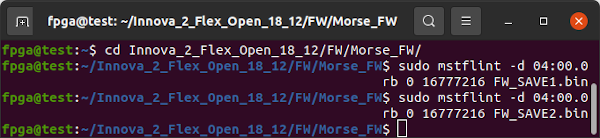

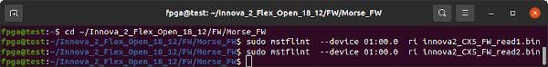

Attempt to program the firmware using `mstflint`. The 25GbE SFP28 MT27808A0 *MNV303212A-ADLT* with 8GB of DDR4 is nicknamed *Morse* while the 100GbE QSFP MT28808A0 *MNV303611A-EDLT* is nicknamed *MorseQ* and its firmware is in `MorseQ_FW`. `cd` into the appropriate directory.

```
cd ~/Innova_2_Flex_Open_18_12/FW/Morse_FW/
sudo mstflint --nofs --use_image_ps --ignore_dev_data  --device 04:00.0  --image fw-ConnectX5-rel-16_24_4020-MNV303212A-ADL_Ax.bin  burn
```

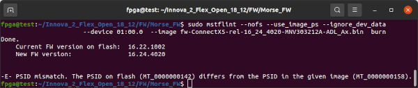

If programming succeeds, proceed to [update the GUID and MAC IDs](#update-guid-and-mac-ids). Otherwise, write some data to corrupt the ConnectX-5 firmware. The exact memory locations and data are not critical but I found the following to work when I tried to modify the `PSID`.

```
sudo mstflint --device 04:00.0 ww 0x00357734 0x30303135
sudo mstflint --device 04:00.0 ww 0x00357738 0x38000000
```

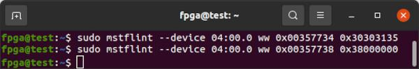

Confirm there is now a CRC error with the ConnectX-5 firmware.
```
sudo mstflint --device 04:00.0 query
```

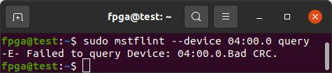

Program the ConnectX-5 firmware. The `Current FW` should show up as `N/A` due to the CRC error.
```
sudo mstflint --nofs --use_image_ps --ignore_dev_data  --device 04:00.0  --image fw-ConnectX5-rel-16_24_4020-MNV303212A-ADL_Ax.bin  burn
```

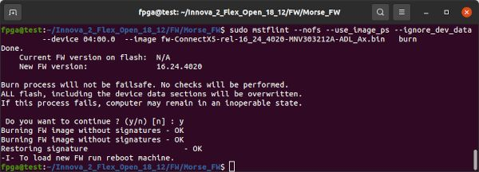

If the above worked, proceed to [update the GUID and MAC IDs](#update-guid-and-mac-ids). If it fails, try the following method of Forcing Recovery Mode.


##### Programming the ConnectX5 FLASH By Forcing Recovery Mode

Thanks [yangl1996](https://github.com/yangl1996) for [pointing out](https://github.com/mwrnd/innova2_flex_xcku15p_notes/issues/2) the ConnectX-5 can be forced into Flash Recovery Mode and [its FLASH read and written with `mstflint`](https://github.com/Tualua/labnotes/wiki/Mellanox-ConnectX-4-Lx-Firmware-recovery). Shorting the [W25Q128JVS](https://www.winbond.com/resource-files/W25Q128JV%20RevI%2008232021%20Plus.pdf) FLASH IC's pins 2 (DO=Data Output) and 4 (GND) during boot prevents the firmware from loading and should put the ConnectX-5 into Recovery Mode. Hold the short until the Operating System has fully loaded so that the board is recognized as being in Recovery Mode. Use precision metal tweezers or fine pitch [SMD Grabber Test Clips](https://www.trustedparts.com/en/part/danaher/5243-0) to short the pins. **This is a dangerous procedure that can damage your Innova-2** so please be careful. Release the short after boot to allow the IC to be programmed. `mstflint` will only read and write the firmware sections of the Flash. Checksums will not match as empty sections will be different.

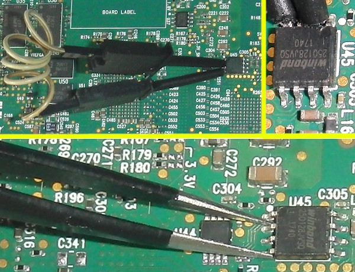

If all goes well the Innova-2 should show up as `Memory controller [0580]: Mellanox Technologies MT28800 Family [ConnectX-5 Flash Recovery] [15b3:020d]` under `lspci -vnn`. It should show up as `/dev/mst/mt525_pciconf0` under `mst status`. The 25GbE SFP28 *MNV303212A-ADLT* with 8GB DDR4 is nicknamed *Morse* while the 40GbE/100GbE QSFP *MNV303611A-EDLT* **without** DDR memory is nicknamed *MorseQ*. `cd` into the appropriate directory.

```
sudo lspci -vnn
cd ~/Innova_2_Flex_Open_18_12/FW/Morse_FW/
ls
sudo mst start
sudo mst status
sudo flint --device /dev/mst/mt525_pciconf0 query
```

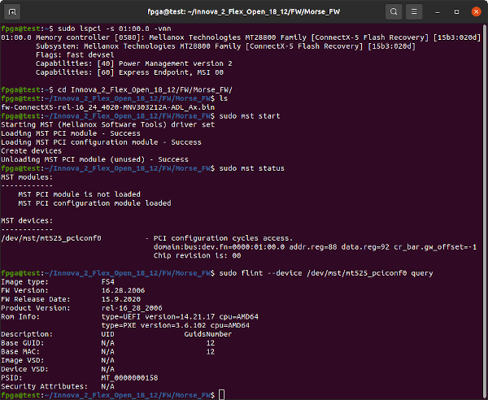

Save a copy of the current FLASH IC firmware then program the ConnectX-5 firmare using `mstflint`. The device name is the PCI address from `lspci -vnn`
```
sudo mstflint --device 01:00.0  ri  innova2_CX5_FW_read1.bin
sudo mstflint --nofs --use_image_ps --ignore_dev_data  --device 01:00.0  --image fw-ConnectX5-rel-16_24_4020-MNV303212A-ADL_Ax.bin  burn
sudo mstflint --device 01:00.0  ri  innova2_CX5_FW_read2_after_write.bin
```

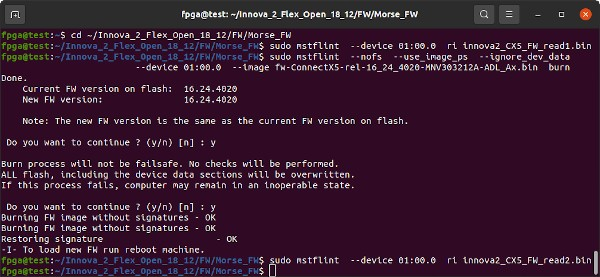


###### Try Overwriting with Empty Image

If the above fails, try overwriting the complete FLASH IC with a blank image:
```
sudo lspci -v -d 15b3:
dd if=/dev/zero of=BLANK.bin bs=4096 count=4096
sudo mstflint --device 01:00.0 wb BLANK.bin 0
```

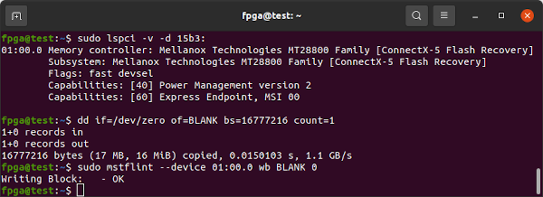

Attempt to program the firmware using `mstflint`'s Write Block (`wb`) command. The 25GbE SFP28 MT27808A0 *MNV303212A-ADLT* with 8GB of DDR4 is nicknamed *Morse* while the 100GbE QSFP MT28808A0 *MNV303611A-EDLT* is nicknamed *MorseQ* and its firmware is in `MorseQ_FW`. `cd` into the appropriate directory.

```
cd ~/Innova_2_Flex_Open_18_12/FW/Morse_FW/
sudo mstflint --device 01:00.0 wb fw-ConnectX5-rel-16_24_4020-MNV303212A-ADL_Ax.bin  0
```

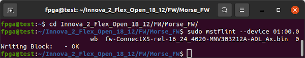

Program the ConnectX-5 firmare a second time using `mstflint`'s Write Image command:
```
sudo mstflint --allow_rom_change  --device 01:00.0  --image fw-ConnectX5-rel-16_24_4020-MNV303212A-ADL_Ax.bin  burn
```

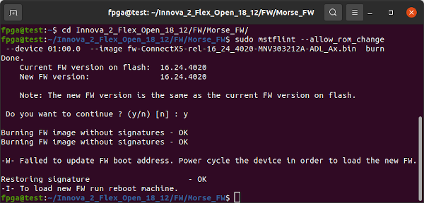

Power cycle the Innova-2 system. Completely power off, wait 15 seconds, then power back on. Confirm the ConnectX-5 firmware has been updated.

```
sudo mst start
sudo mst status
sudo flint --device /dev/mst/mt525_pciconf0 query
```

If the above worked, proceed to [update the GUID and MAC IDs](#update-guid-and-mac-ids).


##### Programming the ConnectX5 FLASH Using a CH341A Programmer

If the above method of forcing Recovery Mode worked, you may skip this section. I have only needed an exact copy of the initial firmware that came with the board when preparing these notes. However, if you have the ability to read FLASH ICs then it is safer to have a copy.

The ConnectX-5's FLASH IC is a 3V 128Mbit=16Mbyte [W25Q128JVS](https://www.winbond.com/resource-files/W25Q128JV%20RevI%2008232021%20Plus.pdf). I was able to successfully program it using a [CH341A Programmer](https://github.com/stahir/CH341-Store/tree/5b4fda3add3d492f14f73a8376c580644f6c8195). **This is a dangerous procedure that can damage your Innova-2**. Please do not make this your first attempt at FLASH IC programming. Consider a practice run on some other less important device or [purchase a W25Q128JVS](https://www.trustedparts.com/en/search/W25Q128JVS) IC to test with.

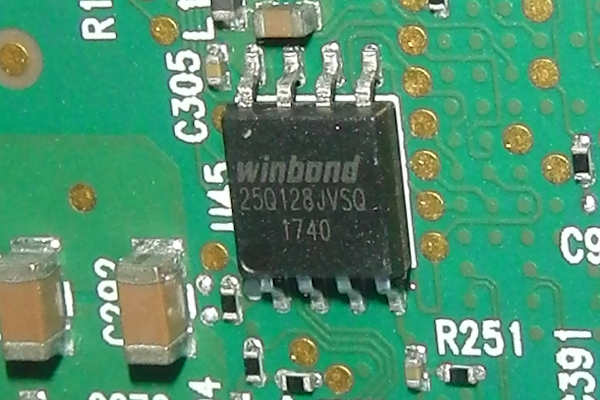

If you are using a CH341A Programmer, set the configuration jumper to default/SPI mode, `1-2`.

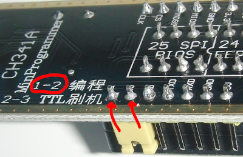

Please take [ESD precautions](https://www.dell.com/support/kbdoc/en-ca/000137973/safety-precautions-when-working-with-electrical-equipment) seriously. Connect your 3.3V programmer to the W25Q128JVS. The Innova-2 **should not** be powered or plugged in.

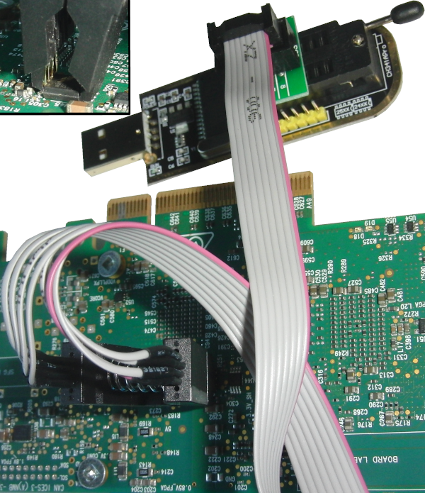

Confirm pin connections are independent. Pins 8, 7, and 3 (Vcc, Hold, and Write-Protect) are shorted together but all other pins are independent with respect to each other. Check every combination.

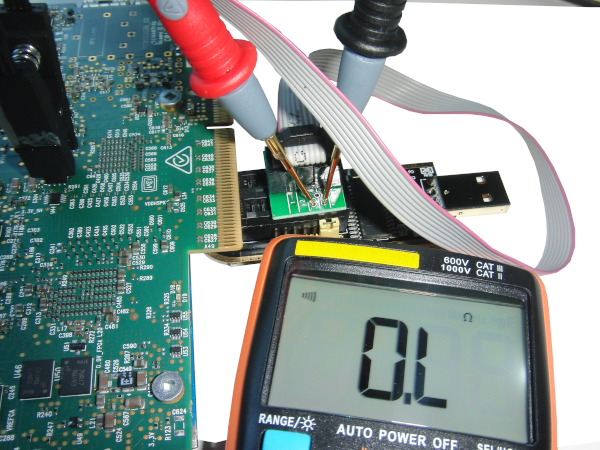

Confirm Programmer-to-FLASH IC connections. 1-to-1, 2-to-2, etc.

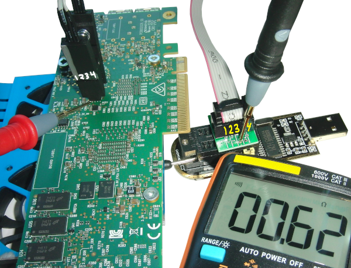

Abort if anything appears to be incorrect. If you are certain the programmer is connected properly and you accept the risks, plug the programmer into your system. The Innova-2 **should not** be powered or plugged in.

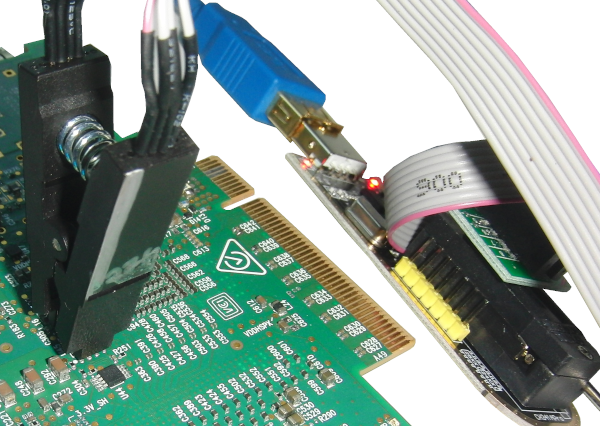

Use `flashrom` to test the Programmer-to-FLASH connection. The `W25Q128.V` should be found automatically by `flashrom`. If it is not found then there is something wrong with the IC and/or flashrom and/or connections.
```Shell
sudo flashrom --programmer ch341a_spi
```

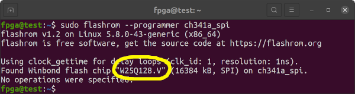

Use `flashrom` to read the contents of the FLASH IC at least twice.
```Shell
sudo flashrom --programmer ch341a_spi --read W25Q128save.bin
sudo flashrom --programmer ch341a_spi --read W25Q128save2.bin
```

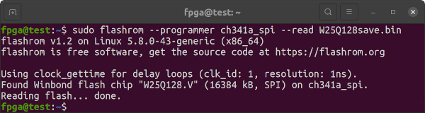

Confirm FLASH IC reads are identical, similar to below. Inconsistent reads imply there is something wrong with the connection. If your programmer supports it, slow down the [SPI Speed](https://manpages.debian.org/testing/flashrom/flashrom.8.en.html#buspirate_spi_programmer) and try again.
```Shell
sha256sum W25Q128save.bin W25Q128save2.bin
```

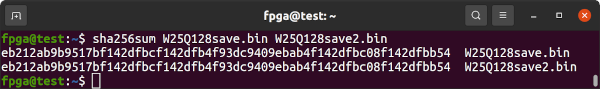

Confirm FLASH IC reads are sensible. Notice the `ab cd ef 00 fa de 12 34 56 78 de ad` in the first line of the header. An all-ones `ff` data read means the W25Q128 has been erased or was never programmed.
```Shell
od -A x -t x1z -v W25Q128save.bin  |  head
```

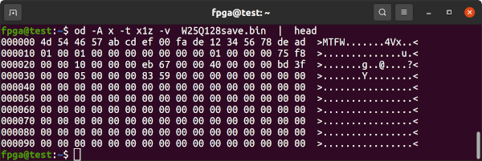

If `flashrom` successfully detected the `W25Q128.V` and reads are consistent, then the requirement for sensible reads is a judgement call on your part.

Use `flashrom` to write the latest Innova-2 firmware to the `W25Q128`. This takes several minutes. The 25GbE SFP28 *MNV303212A-ADLT* with 8GB DDR4 is nicknamed *Morse* while the 40GbE/100GbE QSFP *MNV303611A-EDLT* **without** DDR memory is nicknamed *MorseQ*. `cd` into the appropriate directory.
```Shell
cd ~/Innova_2_Flex_Open_18_12/FW/Morse_FW/
sudo flashrom --programmer ch341a_spi --write fw-ConnectX5-rel-16_24_4020-MNV303212A-ADL_Ax.bin
```

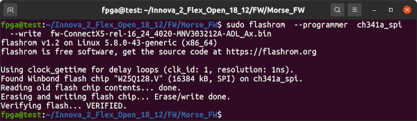

Power down your system. Wait a moment, then power back up.


#### Update GUID and MAC IDs

Start Mellanox Software Tools (MST) and query the new firmware with `flint`.
```Shell
sudo mst start
sudo mst status
sudo mst status -v
sudo flint --device /dev/mst/mt4119_pciconf0 query
```

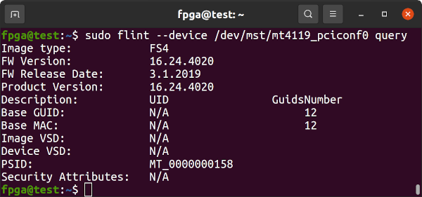

If the GUID and MAC IDs are blank, you can use `flint` to set the values back to those from earlier. Note the `0x` hex designator prepended to the values.
```Shell
sudo flint --device /dev/mst/mt4119_pciconf0 -guid 0xc0dec0dec0dec0de -mac 0xc0dec0dec0de sg
sudo mlxfwreset --device /dev/mst/mt4119_pciconf0 reset
sudo flint --device /dev/mst/mt4119_pciconf0 query
```

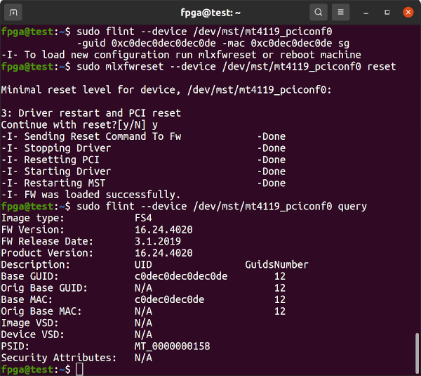

Power down and restart your system.

### Testing The Network Ports

The network interfaces can be tested using 1G, 10G, or 25G SFP/SFP+/SFP28 modules and cables. The [ConnectX-5 MT2x808](https://web.archive.org/web/20220412010542/https://network.nvidia.com/files/doc-2020/pb-connectx-5-en-ic.pdf) supports all three speeds. If you have the 100GbE QSFP *MNV303611A-EDL* variant of the Innova-2 it requires 40GbE or 100GbE QSFP equipment. I used a [Direct-Attach Cable (DAC)](https://www.te.com/usa-en/product-2821224-7.html). Any DAC that is [Mellanox or Cisco compatible](https://www.fs.com/products/65841.html) should work.

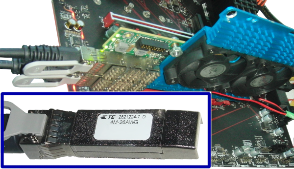

Check that the cable is recognized.
```Shell
sudo mst start
sudo mst cable add
sudo mlxcables
```

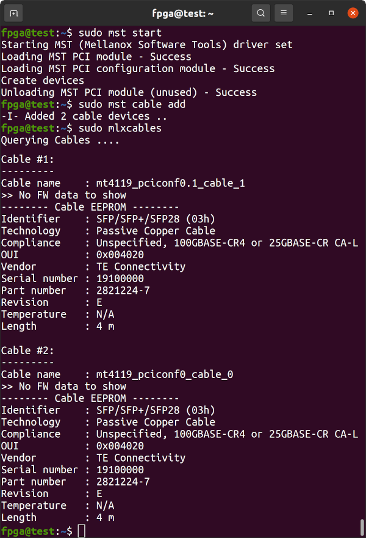

The Innova-2 interfaces show up as `enp4s0f0` and `enp4s0f1` or similar.
```Shell
ip link show  |  grep enp
```

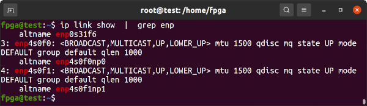

Two connected network interfaces on the same system can be tested by attaching each to its own namespace and then running `iperf3` between them.

In one terminal, set up a Server namespace and attach one of the network interfaces to it.
```Shell
sudo su
ip netns add serv
ip link set enp4s0f0 netns serv
ip netns exec serv ip addr add dev enp4s0f0 10.10.10.1/24
ip netns exec serv ip link set dev enp4s0f0 up
ip netns exec serv iperf3 -s -B 10.10.10.1
```

In a second terminal, set up a Client namespace and attach the other network interface to it. Then run `iperf3`.
```Shell
sudo su
ip netns add clnt
ip link set enp4s0f1 netns clnt
ip netns exec clnt ip addr add dev enp4s0f1 10.10.10.7/24
ip netns exec clnt ip link set dev enp4s0f1 up
ip netns exec clnt iperf3 -t 1 -c 10.10.10.1 -B 10.10.10.7
```

Results should approach about 23Gbits/sec as there is some overhead. Change the `-t 1` option to `-t 10` for longer throughput testing.

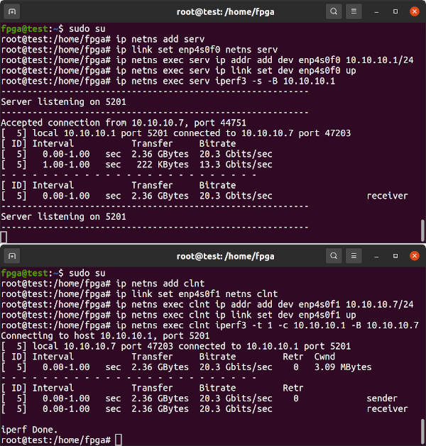


## Programming the FPGA

### Initial Loading of the Flex Image

In order for `innova2_flex_app` to program a User Image into the FPGA's configuration memory it must communicate with the Flex Image running in the FPGA. The Flex and Factory Images must get into FPGA Configuration Memory and reproduce the Memory Layout as pictured below. The `innova2_flex_app` is faster at programming a User Image than JTAG as the Flex Image provides a PCIe interface to the FPGA's Configuration Memory FLASH ICs. Refer to the [Innova-2 User Guide](https://docs.nvidia.com/networking/display/Innova2Flex/Using+the+Mellanox+Innova-2+Flex+Open+Bundle#UsingtheMellanoxInnova2FlexOpenBundle-FlashFormat) for more info.


#### Enable JTAG Access to the XCKU15P

The Innova-2's ConnectX-5 firmware and FPGA Factory/Flex Image communicate to prevent JTAG access to the FPGA Configuration Memory outside of `innova2_flex_app`. JTAG must be enabled in `innova2_flex_app` before using JTAG. The *Enable JTAG Access* feature will reset to disabled after a system reboot. If your Innova-2 already has up-to-date Factory and Flex images that work with `innova2_flex_app` (notice the `FPGA image version: 0xc1` below) then proceed to [Loading User a Image](#loading-a-user-image). Press `99`-Enter to exit `innova2_flex_app`.

```Shell
sudo mst start
sudo mst status
sudo mst status -v
sudo flint -d /dev/mst/mt4119_pciconf0 q
cd ~/Innova_2_Flex_Open_18_12/driver/
sudo ./make_device
sudo insmod /usr/lib/modules/`uname -r`/updates/dkms/mlx5_fpga_tools.ko
lsmod | grep mlx
cd ~
sudo ~/Innova_2_Flex_Open_18_12/app/innova2_flex_app -v
```


If the FPGA Image is *NOT* Version `0xc1`, choose option `10`-enter to enable JTAG then `99`-enter to exit.


#### Generate Configuration Images for the Full Memory Array

Create configuration images that span the entire memory map as in the memory layout pictured earlier. The `Innova_2_Flex_Open_18_12` package does not include configuration files with the binary images so everything gets written to address `0x00000000` which is incorrect. Create correct full memory images by copying data from the individual images into blank 64MB files. This should be done on the system running JTAG and requires a copy of [Innova_2_Flex_Open_18_12](http://www.mellanox.com/downloads/fpga/flex/Innova_2_Flex_Open_18_12.tar.gz) from earlier. The configuration data is split into primary and secondary parts between the two x4 FLASH ICs to double throughput to x8 during loading.
```Shell
cd ~/Innova_2_Flex_Open_18_12/FPGA_image

ls -l ./Factory_image/morse_diagnostic_ku15p_bow_10g_v192_primary.bin
ls -l ./Flex_image/morse_diagnostic_ku15p_bow_10g_v193_primary.bin

dd if=/dev/zero of=completeimage0.bin bs=4096 count=67108864 iflag=count_bytes

dd if=./Factory_image/morse_diagnostic_ku15p_bow_10g_v192_primary.bin of=completeimage0.bin bs=4096 count=14532176 conv=notrunc iflag=count_bytes
dd if=./Flex_image/morse_diagnostic_ku15p_bow_10g_v193_primary.bin    of=completeimage0.bin bs=4096 seek=50331648 count=14382128 conv=notrunc oflag=seek_bytes iflag=count_bytes

sha256sum ./Factory_image/morse_diagnostic_ku15p_bow_10g_v192_primary.bin
dd if=completeimage0.bin bs=4096 count=14532176 iflag=count_bytes | sha256sum

sha256sum ./Flex_image/morse_diagnostic_ku15p_bow_10g_v193_primary.bin
dd if=completeimage0.bin bs=4096 skip=50331648 count=14382128 iflag=skip_bytes,count_bytes | sha256sum

ls -l ./Factory_image/morse_diagnostic_ku15p_bow_10g_v192_secondary.bin
ls -l ./Flex_image/morse_diagnostic_ku15p_bow_10g_v193_secondary.bin

dd if=/dev/zero of=completeimage1.bin bs=4096 count=67108864 iflag=count_bytes

dd if=./Factory_image/morse_diagnostic_ku15p_bow_10g_v192_secondary.bin of=completeimage1.bin bs=4096 count=14532176 conv=notrunc iflag=count_bytes
dd if=./Flex_image/morse_diagnostic_ku15p_bow_10g_v193_secondary.bin    of=completeimage1.bin bs=4096 seek=50331648 count=14382128 conv=notrunc oflag=seek_bytes iflag=count_bytes

sha256sum ./Factory_image/morse_diagnostic_ku15p_bow_10g_v192_secondary.bin
dd if=completeimage1.bin bs=4096 count=14532176 iflag=count_bytes | sha256sum

sha256sum ./Flex_image/morse_diagnostic_ku15p_bow_10g_v193_secondary.bin
dd if=completeimage1.bin bs=4096 skip=50331648 count=14382128 iflag=skip_bytes,count_bytes | sha256sum

echo d1fcfa0315c302a4a84c45abeae66bb8365757802f57e8979e5a46a593883340
sha256sum completeimage0.bin
echo bae7da6f6426445ca5a0f6eb8786a2e6c4c8b591599506b306ba109a634efedc
sha256sum completeimage1.bin
```

Confirm the memory images were generated correctly. These checksums are only valid for files generated from `Innova_2_Flex_Open_18_12.tar.gz`.
```Shell
sha256sum completeimage0.bin completeimage1.bin
```


#### Programming the Factory and Flex Images

Connect your [Xilinx-Compatible](https://docs.xilinx.com/r/en-US/ug908-vivado-programming-debugging/JTAG-Cables-and-Devices-Supported-by-hw_server) **1.8V** JTAG Adapter to your Innova-2 but power the Innova-2 from a second computer or using a *Powered External PCIe Extender*. Running JTAG from the system with the Innova-2 may cause undefined behaviour. If JTAG halts the FPGA it will disappear off the PCIe bus and crash Ubuntu.


A Powered PCIe Riser/Extender is another option for powering the Innova-2 while JTAG programming.


Start Vivado Hardware Manager. Any recent version of [Vivado Lab Edition](https://www.xilinx.com/support/download/index.html/content/xilinx/en/downloadNav/vivado-design-tools/2021-2.html) or full Vivado is enough for this task.


Start a Connection, `Open Target -> Auto Connect`


Right-click on `xcku15p_0` and select `Add Configuration Memory Device ...`


Select `mt25qu512-spi-x1_x2_x4_x8`.


Program the complete memory images.


Once programming finishes, which can take hours, power everything down and disconnect the JTAG adapter.


Reboot and run `innova2_flex_app` to **disable JTAG access**, option `1`, so that `innova2_flex_app` can program User Images. Reboot again.
```Shell
sudo mst start
sudo mst status
sudo mst status -v
sudo flint -d /dev/mst/mt4119_pciconf0 q
cd ~/Innova_2_Flex_Open_18_12/driver/
sudo ./make_device
sudo insmod /usr/lib/modules/`uname -r`/updates/dkms/mlx5_fpga_tools.ko
lsmod | grep mlx
cd ~
sudo ~/Innova_2_Flex_Open_18_12/app/innova2_flex_app -v

sudo reboot
```


### Loading a User Image

The process of enabling the Flex Image, rebooting, programming, enabling the User Image, then rebooting takes approximately 10 minutes each time you update your User Image.

These instructions include a link to a bitstream for a working demo. Otherwise, after Vivado generates a programming Bitstream for your design, run *Generate Memory Configuration File*:


Select *bin*, *mt25qu512_x1_x2_x4_x8*, *SPIx8*, *Load bitstream files*, and a location and name for the output binary files. The bitstream will end up, for example, in the `DESIGN_NAME/DESIGN_NAME.runs/impl_1` subdirectory as `SOMETHING.bit`. Vivado will add the `_primary.bin` and `_secondary.bin` extensions as the Innova-2 uses dual MT25QU512 FLASH ICs in x8 for high speed programming.


Before using `innova2_flex_app` for programming, **disconnect any JTAG adapter** (unplug its USB cable).

The Innova-2 Flex Image must be activated to allow `innova2_flex_app` to program the FPGA's Configuration Memory. Run the `innova2_flex_app` and choose option `1`-enter then `99`-enter to enable the Flex Image. Reboot your system for the change to take effect. This is the start of a programming cycle which is: disable JTAG and schedule the Flex image, reboot, program with `innova2_flex_app`, reboot, and then test your loaded bitstream.
```
sudo mst start
cd ~/Innova_2_Flex_Open_18_12/driver/
sudo ./make_device
sudo insmod /usr/lib/modules/`uname -r`/updates/dkms/mlx5_fpga_tools.ko

sudo ~/Innova_2_Flex_Open_18_12/app/innova2_flex_app -v

sudo reboot
```


After rebooting the Flex Image should be active. Look for `Class 2000: Mellanox Technologies Innova-2 Flex Burn image` or similar.
```
lspci | grep -i Mellanox
```


Start MST and load FPGA Tool modules.
```Shell
cd ~
sudo mst start
sudo mst status
sudo mst status -v
sudo flint -d /dev/mst/mt4119_pciconf0 q
cd ~/Innova_2_Flex_Open_18_12/driver/
sudo ./make_device
sudo insmod /usr/lib/modules/`uname -r`/updates/dkms/mlx5_fpga_tools.ko
cd ~
```

For board testing, the following command will clone the [innova2_xdma_demo](https://github.com/mwrnd/innova2_xdma_demo) project which includes bitstream binaries for programming to the FPGA. Otherwise, `cd` into your own project directory.
```Shell
git clone --depth=1 https://github.com/mwrnd/innova2_xdma_demo.git
cd innova2_xdma_demo
```

Run `innova2_flex_app` with appropriate `-b` commands to program a design into the FPGA. Note the `_primary.bin,0` and `_secondary.bin,1`. Choose option `6`-enter to program the design, then `7`-enter to set the User Image as active, then `99`-enter to exit.
```Shell
sudo ~/Innova_2_Flex_Open_18_12/app/innova2_flex_app -v \
  -b innova2_xdma_demo_primary.bin,0                    \
  -b innova2_xdma_demo_secondary.bin,1
```


Reboot your system.
```
sudo reboot
```


### Testing the Board using the Loaded Demo User Image

After programming the bitstream and rebooting, the design should show up as `Memory controller: Xilinx Corporation Device 9038`. It shows up at PCIe Bus Address `03:00` for me.
```
lspci -d 10ee:
```


The following [lspci](https://manpages.ubuntu.com/manpages/jammy/man8/lspci.8.html) commands list all Mellanox and Xilinx devices and show their relation.
```
lspci -nn | grep "Mellanox\|Xilinx"
lspci -tv | grep "0000\|Mellanox\|Xilinx"
```

The FPGA is attached to a PCIe Bridge (`02:08.0`), as are the two Ethernet Controllers (`02:10.0`).
```
01:00.0 PCI bridge [0604]: Mellanox Technologies MT28800 Family [ConnectX-5 PCIe Bridge] [15b3:1974]
02:08.0 PCI bridge [0604]: Mellanox Technologies MT28800 Family [ConnectX-5 PCIe Bridge] [15b3:1974]
02:10.0 PCI bridge [0604]: Mellanox Technologies MT28800 Family [ConnectX-5 PCIe Bridge] [15b3:1974]
03:00.0 Memory controller [0580]: Xilinx Corporation Device [10ee:9038]
04:00.0 Ethernet controller [0200]: Mellanox Technologies MT27800 Family [ConnectX-5] [15b3:1017]
04:00.1 Ethernet controller [0200]: Mellanox Technologies MT27800 Family [ConnectX-5] [15b3:1017]

-[0000:00]-+-00.0  Intel Corporation Device 3e0f
           +-1d.0-[01-04]----00.0-[02-04]--+-08.0-[03]----00.0  Xilinx Corporation Device 9038
           |                               \-10.0-[04]--+-00.0  Mellanox Technologies MT27800 Family [ConnectX-5]
           |                                            \-00.1  Mellanox Technologies MT27800 Family [ConnectX-5]
```


The current PCIe Link status is useful. This is the FPGA to ConnectX-5 PCIe Bridge link.
```
sudo lspci -nnvd 10ee:  ;  sudo lspci -nnvvd 10ee: | grep Lnk
```


`dmesg | grep -i xdma` provides details on how Xilinx's PCIe XDMA driver has loaded.


#### AXI BRAM Communication

The XDMA Driver ([`dma_ip_drivers`](https://github.com/xilinx/dma_ip_drivers)) creates [character device files](https://en.wikipedia.org/wiki/Device_file#Character_devices) that are [write-only and read-only](https://manpages.debian.org/bookworm/manpages-dev/open.2.en.html#File_access_mode), `/dev/xdma0_h2c_0` and `/dev/xdma0_c2h_0` respectively. They allow direct access to the FPGA design's AXI Bus. To read from an AXI Block at address `0x80000000` you would read from address `0x80000000` of the `/dev/xdma0_c2h_0` (Card-to-Host) file. To write you would write to the appropriate address of `/dev/xdma0_h2c_0` (Host-to-Card).


The commands below generate 8kb of random data then use the utilities from `dma_ip_drivers` to send the data to the `M_AXI` [BRAM Controller Block](https://docs.xilinx.com/v/u/en-US/pg078-axi-bram-ctrl) in the XCKU15P, then read it back and confirm the data is identical. The [address of the BRAM](https://github.com/mwrnd/innova2_xdma_demo/tree/56b1e6eb09055167956287890aeceb23fff3e8f5#axi-addresses) Controller is `0x80000000` in the `innova2_xdma_demo` project.
```Shell
cd dma_ip_drivers/XDMA/linux-kernel/tools/
dd if=/dev/urandom of=TEST bs=8192 count=1
sudo ./dma_to_device   --verbose --device /dev/xdma0_h2c_0 --address 0x80000000 --size 8192  -f    TEST
sudo ./dma_from_device --verbose --device /dev/xdma0_c2h_0 --address 0x80000000 --size 8192 --file RECV
md5sum TEST RECV
```


#### AXI BRAM and Files

The AXI Blocks can also be accessed using [`dd`](https://manpages.debian.org/testing/coreutils/dd.1.en.html). `dd` requires numbers in Base-10 so you can use [`printf`](https://manpages.debian.org/testing/coreutils/printf.1.en.html) to convert from the hex address, `0x80000000=2147483648`. `count=1` as this is a single transfer to address `0x80000000` so the [lseek](https://manpages.ubuntu.com/manpages/focal/en/man2/write.2.html#description) address should not be reset.

```
dd if=/dev/urandom of=TEST bs=8192 count=256
printf "%d\n" 0x80000000
sudo dd if=TEST of=/dev/xdma0_h2c_0 bs=2097152 count=1 seek=2147483648 oflag=seek_bytes
sudo dd if=/dev/xdma0_c2h_0 of=RECV bs=2097152 count=1 skip=2147483648 iflag=skip_bytes
md5sum TEST RECV
```


#### Custom Software for Accessing AXI Blocks

[innova2_xdma_test.c](https://github.com/mwrnd/innova2_xdma_demo/blob/56b1e6eb09055167956287890aeceb23fff3e8f5/innova2_xdma_test.c) is a simple program that demonstrates XDMA communication in [C](https://en.wikipedia.org/wiki/C_(programming_language)). It uses [`pread` and `pwrite`](https://manpages.ubuntu.com/manpages/jammy/en/man2/pread.2.html) to communicate with AXI Blocks. [`read` and `write`](https://manpages.ubuntu.com/manpages/jammy/en/man2/read.2.html) plus [`lseek`](https://manpages.ubuntu.com/manpages/jammy/en/man2/lseek.2.html) can also be used.

```
gcc -Wall innova2_xdma_test.c -o innova2_xdma_test -lm
sudo ./innova2_xdma_test
```


The design allows for measuring the frequency of various connected clocks by [comparing](https://github.com/mwrnd/innova2_xdma_demo/blob/f1dba215a96e209c0a278857c47d4f3ddf8e8f3f/innova2_xdma_test.c#L173) them to the 250MHz XDMA *axi_aclk*.

If the above works then great! Your Innova-2 has a working FPGA with PCIe. The [innova2_xdma_demo](https://github.com/mwrnd/innova2_xdma_demo/tree/56b1e6eb09055167956287890aeceb23fff3e8f5#memory-functionality-tests) project page has more testing.


## Loading Updated Designs Using JTAG

Designs with [identical](https://stackoverflow.com/questions/32334870/how-to-do-a-true-rescan-of-pcie-bus) XDMA Block configurations can be updated using JTAG. Bitstream update over JTAG is only retained for as long as the board is powered but takes under 1 minute which is less than the approximately 10 required when updating the configuration Flash memory. Very useful when iterating designs.

### Confirm Motherboard BIOS and Linux Support Hotplug

The host system for the Innova-2 needs to support PCIe Hotplug for Bitstream update to work with PCIe. Confirm your computer's motherboard chipset and BIOS support PCIe hotplug. Check your [Linux](https://lwn.net/Articles/767885/) kernel by looking for `CONFIG_HOTPLUG_PCI_PCIE=y` in its `/boot/config-???` configuration file.
```
cat /boot/config-5.8.0-43-generic | grep -i pci | grep -i hotplug
```


### Attempt PCIe Remove and Rescan

Find your design on the PCIe bus address, the `03` below, and remove it. Then rescan the PCIe bus.
```
lspci -nn -d 15b3:
sudo lspci -tv -nn -d 15b3:

sudo su
echo 1 > /sys/bus/pci/devices/0000\:03\:00.0/remove
lspci -nn -d 15b3:
echo 1 > /sys/bus/pci/rescan 
lspci -nn -d 15b3:
exit
```


### Enable JTAG Access to the Innova2

If remove and rescan works, run `innova2_flex_app` and choose option `3`-Enter to enable JTAG Access then `99`-Enter to exit. The *Enable JTAG Access* feature will reset to disabled after a system reboot.
```
sudo mst start
cd ~/Innova_2_Flex_Open_18_12/driver/
sudo ./make_device
cd ~
sudo insmod /usr/lib/modules/5.8.0-43-generic/updates/dkms/mlx5_fpga_tools.ko
sudo ~/Innova_2_Flex_Open_18_12/app/innova2_flex_app
```


### Disconnect Innova2 from the PCIe Bridge

Confirm the XDMA device is present then remove it from the PCIe bus and disconnect it from its PCIe Bridge. The ConnectX-5 PCIe Bridge for the FPGA on the Innova-2 is sub-device `08`, function `0`, `:08.0`.
```
lspci  |  grep -i "Xilinx\|Mellanox"

sudo su
lspci -nn -d 10ee:
echo 1 > /sys/bus/pci/devices/0000\:03\:00.0/remove
lspci -nn -d 10ee:

setpci  -s 02:08.0  0x70.w=0x50
```


### Program the FPGA Using JTAG

Confirm checksum of the Bitstream.


```
md5sum xdma_wrapper_208MHz.bit
echo b7feb55f6d84bbf4ed96b7f9c791c5c8 should be the MD5 checksum of xdma_wrapper_208MHz.bit
```

Load your Vivado or Vivado Lab `settings64.sh` and start `xsdb`. The `after 7000` command waits 7 seconds for [Xilinx-Compatible JTAG adapters](https://docs.xilinx.com/r/en-US/ug908-vivado-programming-debugging/JTAG-Cables-and-Devices-Supported-by-hw_server) based on the [FX2](https://www.infineon.com/cms/en/product/universal-serial-bus/usb-2.0-peripheral-controllers/ez-usb-fx2lp-fx2g2-usb-2.0-peripheral-controller/) to update their firmware and needs to happen every time the adapter is powered.
```
source /tools/Xilinx/Vivado_Lab/2023.1/settings64.sh
xsdb
```
```
connect
after 7000
targets
target 1
fpga -state
fpga xdma_wrapper_208MHz.bit
fpga -state
disconnect
exit
```


### Reconnect Innova2 FPGA to the PCIe Bridge and Rescan PCIe Bus

Reconnect the FPGA to the PCIe Bridge and rescan the PCIe bus.
```
setpci  -s 02:08.0  0x70.w=0x40
echo 1 > /sys/bus/pci/rescan 
exit
```


The PCIe device should return with the same settings as before.
```
sudo lspci -nnvd 10ee:  ;  sudo lspci -nnvvd 10ee: | grep Lnk
```


`dmesg | grep -i xdma` will inform you if the XDMA driver has loaded correctly.


### Test the Updated Design

Run the test program. It should now show 208.333333MHz as an estimate for *uram_clk*.
```
sudo ./innova2_xdma_test
```


## Upgrading the ConnectX5 Firmware

If you are experiencing issues with your Innova-2 or require PXE Boot capability, explore upgrading the ConnectX-5 using the [mlxup](https://network.nvidia.com/support/firmware/mlxup-mft/) utility. Check out the [mlxup User Guide](https://docs.mellanox.com/display/MLXUPFWUTILITY). The latest version to support the Innova-2 is [`4.15.2`](http://www.mellanox.com/downloads/firmware/mlxup/4.15.2/SFX/linux_x64/mlxup) and will upgrade your ConnectX-5 firmware to **16.28.2006** and PXE Boot `3.6.0102`.


```
cd ~
wget https://www.mellanox.com/downloads/firmware/mlxup/4.15.2/SFX/linux_x64/mlxup
echo b3c1c1e6b5c3f37c46bc6ceb319d4b888379a7c813a7e08d931f962572eb7ac4 should be the SHA256 checksum
sha256sum mlxup
sudo mst start
sudo chmod +x mlxup
sudo ./mlxup --version
sudo ./mlxup
```


The latest firmware [directy downloadable](http://www.mellanox.com/downloads/firmware/fw-ConnectX5-rel-16_26_4012-MNV303212A-ADL_Ax-UEFI-14.19.17-FlexBoot-3.5.805.bin.zip) from Nvidia/Mellanox is **16.26.4012** which is older than the version included with `mlxup 4.15.2`


## Troubleshooting

### W25Q128JVS FLASH Failure

If the PCIe Bridge partially shows up in `lspci`, the W25Q128JVS FLASH IC has failed or is written incorrectly.
```Shell
sudo lspci | grep -i mellanox
```


Shut down your Innova2 system and unplug power, wait a minute, then power the system back up. If that fails, [Confirm Mellanox OFED Installed Successfully](#confirm-mellanox-ofed-installed-successfully). If all else fails, try [re-programming the W25Q128JVS](#programming-the-connectx5-flash).


### Factory Image Running with Flex Image Scheduled

The *Factory Image* (FLASH IC Address `0x00000000`) is *Running* even though the *Flex Image* (FLASH IC Address `0x03000000`) is the *Scheduled* image. This implies there is a fault with the *Flex Image*, or it was overwritten, or a *User Image* was written to address `0x00000000` by mistake, instead of `0x01000000`. The Innova2 Flex App will **not** be able to program a *User Image* into the FPGA Configuration Memory.


[Enable JTAG Access](#enable-jtag-access-to-the-xcku15p) and [program the FPGA Configuration Memory to factory default](#programming-the-fpga).


### Innova2 Flex App Will Not Program

Confirm the ConnectX and BOPE Devices are present when running `innova2_flex_app -v`.


The ConnectX device is created by running `insmod /usr/lib/modules/5.8.0-43-generic/updates/dkms/mlx5_fpga_tools.ko`

The BOPE device is created by running `~/Innova_2_Flex_Open_18_12/driver/make_device`. BOPE will fail to load if the FPGA Image is not compatible with your `innova2_flex_app` version. [Program the FPGA](#programming-the-fpga).

```
cd ~
sudo mst start
sudo mst status
sudo mst status -v
sudo flint -d /dev/mst/mt4119_pciconf0 q
cd ~/Innova_2_Flex_Open_18_12/driver/
sudo ./make_device
sudo insmod /usr/lib/modules/`uname -r`/updates/dkms/mlx5_fpga_tools.ko
```


### Innova2 Flex App No BOPE or ConnectX Devices

If you run `sudo ~/Innova_2_Flex_Open_18_12/app/innova2_flex_app -v` and do not see a BOPE and ConnectX device:

```
===============================================
 Verbosity:        1
 BOPE device:      None
 ConnectX device:  None
Cannot find appropriate ConnectX device
```


The following commands must be run after each reboot to reinstall the BOPE and ConnectX devices if you intend to program the FPGA.

```
sudo mst start
sudo mst status
sudo mst status -v
sudo flint -d /dev/mst/mt4119_pciconf0 q
cd ~/Innova_2_Flex_Open_18_12/driver/
sudo ./make_device
sudo insmod /usr/lib/modules/`uname -r`/updates/dkms/mlx5_fpga_tools.ko
lsmod | grep mlx
cd ~
sudo ~/Innova_2_Flex_Open_18_12/app/innova2_flex_app -v
```

The `mlx5_fpga_tools` module creates the ConnectX device:

```
sudo insmod /usr/lib/modules/`uname -r`/updates/dkms/mlx5_fpga_tools.ko
sudo ~/Innova_2_Flex_Open_18_12/app/innova2_flex_app -v
```

```
===============================================
 Verbosity:        1
 BOPE device:      None
 ConnectX device:  None
 ConnectX device: /dev/0000:04:00.0_mlx5_fpga_tools
 BOPE device:     None
 Scheduled image:  Innova2 Flex Image
 Running image:    User Image(Success)
 Type of board: Morse

Jump-to-Innova2-User menu
------------------
[ 1 ] Set Innova2_Flex image active (reboot required)
[ 2 ] Set User image active
[ 3 ] Enable JTAG Access - no thermal status
[ 4 ] Read FPGA thermal status
[ 5 ] Reload User image
[99 ] Exit
Your choice: 99
```


The `make_device` utility creates the BOPE device:

```
cd ~/Innova_2_Flex_Open_18_12/driver/
sudo ./make_device
sudo ~/Innova_2_Flex_Open_18_12/app/innova2_flex_app -v
```

```
===============================================
 Verbosity:        1
 BOPE device:      None
 ConnectX device:  None
 ConnectX device: /dev/0000:04:00.0_mlx5_fpga_tools
 BOPE device:     /dev/0000:03:00.0_mlx_fpga_bope
 Scheduled image:  Innova2 Flex Image
 Running image:    Innova2 Flex Image(Success)
 Type of board: Morse
	***   FPGA image version: 0xc1   ***
	***   Mailbox Done counter   0   ***

Burn-Diagnostics menu
------------------
[ 1 ] Query Innova2_Flex FPGA version
[ 2 ] DDR stress test
[ 3 ] PCI test
[ 4 ] Read FPGA thermal status
[ 5 ] Read Fan speed
[ 6 ] Burn of customer User image
[ 7 ] Set User image active (reboot required)
[ 8 ] Set Innova2_Flex image active
[ 9 ] Increase FPGA power consumption
[10 ] Enable JTAG Access - no thermal status
[99 ] Exit
Your choice: 99
```


Once both BOPE and ConnectX devices exist and the `Flex Image` is the Active Image, you can run `innova2_flex_app` with appropriate `-b` commands to [program a design into the FPGA](#loading-a-user-image). Note the `_primary.bin,0` and `_secondary.bin,1`. Choose option `6`-enter to program the design, then `7`-enter to set the User Image as active, then `99`-enter to exit.
```Shell
sudo ~/Innova_2_Flex_Open_18_12/app/innova2_flex_app -v \
  -b innova2_xcku15p_ddr4_bram_gpio_primary.bin,0       \
  -b innova2_xcku15p_ddr4_bram_gpio_secondary.bin,1
```


### DDR4 Communication Error

If you attempt to send data to the DDR4 address but get `write file: Unknown error 512` it means DDR4 did not initialize properly or you are attempting to communicate with the wrong address. The *innova2_xcku15p_ddr4_bram_gpio* project has DDR4 at address `0x0` but if you made any changes confirm in the Vivado Block Design *Address Editor* that it is still `0x0`. The [DDR4 IP Block](https://www.xilinx.com/content/dam/xilinx/support/documents/ip_documentation/ultrascale_memory_ip/v1_4/pg150-ultrascale-memory-ip.pdf) does not allow reading from memory that has not yet been written to. Test with a write then a read. See the [Innova-2 DDR4 Troubleshooting](https://github.com/mwrnd/innova2_ddr4_troubleshooting) project for DDR4 hardware debugging help.
```Shell
cd ~/dma_ip_drivers/XDMA/linux-kernel/tools/
dd if=/dev/urandom bs=1 count=8192 of=TEST
sudo ./dma_to_device   --verbose --device /dev/xdma0_h2c_0 --address 0x0 --size 8192  -f    TEST
sudo ./dma_from_device --verbose --device /dev/xdma0_c2h_0 --address 0x0 --size 8192 --file RECV
md5sum TEST RECV
```


### JTAG Programming Failure

If Vivado finishes Configuration Memory Programming in under a minute with a *\[Labtools 27-3165\] End of startup status: Low* error, it has **not** programmed anything. This occurs when the Innova-2 still has control over JTAG.


**Enable JTAG Access** before attempting JTAG programming. `10`-Enter then `99`-Enter in `innova2_flex_app`. The *Enable JTAG Access* feature will reset to disabled after a system reboot.
```Shell
sudo mst start
sudo mst status
sudo mst status -v
sudo flint -d /dev/mst/mt4119_pciconf0 q
cd ~/Innova_2_Flex_Open_18_12/driver/
sudo ./make_device
sudo insmod /usr/lib/modules/`uname -r`/updates/dkms/mlx5_fpga_tools.ko
lsmod | grep mlx

cd ~
sudo ~/Innova_2_Flex_Open_18_12/app/innova2_flex_app -v
```


### innova2_flex_app stuck on Erasing Flash

`innova2_flex_app` will get stuck on `Erasing flash ( 0%)` if a JTAG Adapter has not released control of JTAG signals. Disconnect the JTAG Adapter from USB and perform a cold reboot of the Innova-2 system.


### xsdb Cannot Download Program

If you are attempting to use `xsdb` to load a program into a Soft Processor Core (RISC-V, MicroBlaze) using [JTAG](https://docs.xilinx.com/v/u/en-US/pg245-debug-bridge) and encounter *Memory Write Errors*:
```
...
 83%    0MB   0.0MB/s  00:02 ETA
Failed to download /home/user/vivado-risc-v/workspace/boot.elf
Memory write error at 0x80226400. Debug Transport Module: data corruption (ID)
xsdb% Info: Hart #0 (target 3) Running (FPGA reprogrammed, wait for debugger resync)
...
```

*JTAG Access* must be enabled before attempting to download programs to a Soft Processor Core in the FPGA using JTAG. `3`-Enter then `99`-Enter in `innova2_flex_app`.


`xsdb` then works:


### Board Works But Not JTAG

Everything but JTAG was working so I began by trying to trace out all the JTAG connections. That went nowhere so I switched my multimeter to Diode Mode and tested all two and three terminal components. Two SC70 components marked *MXX*, U41 and U49, gave significantly different values. I replaced the part with larger readings with the same part from a different board and JTAG began working! Aside from the 10k resistor, the resistance values in the diagram are measured to labeled test points on the board.


It is a [DMN63D8LW](https://www.diodes.com/assets/Datasheets/DMN63D8LW.pdf) N-Channel MOSFET.


### Nothing Seems to Work

While testing voltages next to the SFP connectors on a powered board my multimeter lead slipped and I shorted the 12V rail. I replaced fuse F1 with a [Bel Fuse 0685P9100-01](https://belfuse.com/resources/datasheets/circuitprotection/ds-cp-0685p-series.pdf) Fast 1206 10A SMT fuse and the board was saved. I got lucky. A blown fuse is either a simple fix or a sign of catastrophic failure.


The board is well designed with all voltage rails exposed on test points. Carefully measure each one.


### Disable or Enable Resizable BAR Support

If you are experiencing PCIe communication problems, flip this setting in your BIOS.


### Disable or Enable Above-4G Memory Decoding

It should have no effect when running a 64-Bit OS but sometimes it does. Flip this setting in your BIOS if you have any problems or throughput bandwidth seems low.


## JTAG Using UrJTAG

[UrJTAG](http://urjtag.org) is a low-level tool for communicating with JTAG devices. It supports [Xilinx Platform Cable USB II](https://docs.xilinx.com/v/u/en-US/ds593) adapters and [clones](https://www.waveshare.com/platform-cable-usb.htm). Main use is *EXTEST* pin toggling although it is theoretically possible to program the FPGA using an *SVF* file [generated from the Vivado Tcl Console](https://docs.xilinx.com/r/2021.2-English/ug908-vivado-programming-debugging/Using-the-Command-Line?tocId=L2PEfMkFFNtSZI~r7QbNVg).

### Compile and Install UrJTAG

```Shell
cd ~
wget https://versaweb.dl.sourceforge.net/project/urjtag/urjtag/2021.03/urjtag-2021.03.tar.xz
sha256sum urjtag-2021.03.tar.xz
echo b0a2eaa245513af096dc4d770109832335c694c6c12aa5e92fefae8685416f1c should be the SHA256 Checksum
tar -xvf urjtag-2021.03.tar.xz
cd urjtag-2021.03/
./configure
make
sudo make install
sudo ldconfig
```

### Create UrJTAG-Compatible JTAG Definition Files from BSDL Files

Xilinx's [Kintex Ultrascale+ BSDL Files](https://www.xilinx.com/member/forms/download/sim-model-eval-license-xef.html?filename=bsdl_kintexuplus_2021_2.zip) include [`STD_1149_6_2003.all`](https://ieeexplore.ieee.org/document/1196298/) Advanced I/O Testing definitions that UrJTAG's `bsdl2jtag` [cannot process](https://sourceforge.net/p/urjtag/enhancements/126/). They must therefore be removed. The included [xcku15p_ffve1517_bsd.patch](xcku15p_ffve1517_bsd.patch) is a patch to Xilinx's BSDL file for the 1517-pin XCKU15P that removes incompatible definitions. The resulting file is then processed with `bsdl2jtag` to produce the included [xcku15p_ffve1517.jtag](https://raw.githubusercontent.com/mwrnd/innova2_flex_xcku15p_notes/main/xcku15p_ffve1517.jtag) file.

### Add XCKU15P FFVE1517 JTAG Bit Definitions to UrJTAG

From the directory containing [xcku15p_ffve1517.jtag](https://raw.githubusercontent.com/mwrnd/innova2_flex_xcku15p_notes/main/xcku15p_ffve1517.jtag) run the following commands which create *PART* and *STEPPINGS* files for the XCKU15P. These commands assume UrJTAG installed support files to the default `/usr/local/share/` directory. Values were found by running the UrJTAG `detect` command which reads the `Device Id` from the JTAG chain. First 4 bits (`0001`) are the *STEPPING*, next 16 bits (`0100101001010110`) are the *PART*, last 12 bits (`000010010011`) are the *MANUFACTURER*.
```Shell
sudo su
echo "# Kintex Ultrascale+ (XCKUxxP)" >>/usr/local/share/urjtag/xilinx/PARTS
echo "0100101001010110        xcku15p_1517   xcku15p_ffve1517" >>/usr/local/share/urjtag/xilinx/PARTS
mkdir /usr/local/share/urjtag/xilinx/xcku15p_1517
touch /usr/local/share/urjtag/xilinx/xcku15p_1517/STEPPINGS
echo "0000 xcku15p_1517 0" >>/usr/local/share/urjtag/xilinx/xcku15p_1517/STEPPINGS
echo "0001 xcku15p_1517 1" >>/usr/local/share/urjtag/xilinx/xcku15p_1517/STEPPINGS
cp xcku15p_ffve1517.jtag /usr/local/share/urjtag/xilinx/xcku15p_1517/xcku15p_1517
exit
```

### Connect JTAG Adapter

JTAG Communication is controlled by the ConnectX-5 on the Innova-2. Enable JTAG Access to the FPGA using `innova2_flex_app`. The *Enable JTAG Access* feature will reset to disabled after a system reboot.
```Shell
sudo mst start
sudo mst status
sudo mst status -v
sudo flint -d /dev/mst/mt4119_pciconf0 q
cd ~/Innova_2_Flex_Open_18_12/driver/
sudo ./make_device
sudo insmod /usr/lib/modules/`uname -r`/updates/dkms/mlx5_fpga_tools.ko
lsmod | grep mlx
cd ~
sudo ~/Innova_2_Flex_Open_18_12/app/innova2_flex_app -v
```


#### Disconnect the Innova-2 FPGA from the PCIe Bridge

`lspci | grep -i Mellanox` shows all connected Mellanox PCIe devices. The PCIe Bridge on the Innova-2 is device `08`, function `0`, `:08.0`. In the example below it shows up with Bus ID `02`. Disable the FPGA-to-PCIe connection so that JTAG does not interfere with the PCIe bus. Notice the `(rev ff)` on the Xilinx device after disconnection.
```Shell
sudo setpci  -s 02:08.0  0x70.w=0x50
```


It can later be re-enabled with the following command or a cold reboot.
```Shell
sudo setpci  -s 02:08.0  0x70.w=0x40
```


#### Allow Vivado to Update Platform Cable USB II Firmware

Connect your JTAG Adapter to the Innova-2. If you are using a Platform Cable USB II compatible adapter it will show up under `lsusb` as `03fd:0013 Xilinx, Inc.` In this state it cannot be used for JTAG.


Load your Vivado or Vivado Lab `settings64.sh` and start `xsdb`. The `after 7000` command waits 7 seconds for [Xilinx-Compatible JTAG adapters](https://docs.xilinx.com/r/en-US/ug908-vivado-programming-debugging/JTAG-Cables-and-Devices-Supported-by-hw_server) based on the [FX2](https://www.infineon.com/cms/en/product/universal-serial-bus/usb-2.0-peripheral-controllers/ez-usb-fx2lp-fx2g2-usb-2.0-peripheral-controller/) to update their firmware and needs to happen every time the adapter is powered.
```
source /tools/Xilinx/Vivado_Lab/2023.1/settings64.sh
xsdb
```
```
connect
after 7000
targets
fpga -state
disconnect
exit
```


`lsusb` should now show `03fd:0008 Xilinx, Inc. Platform Cable USB II`. The JTAG adapter is now ready to be used by UrJTAG.


#### Begin a UrJTAG Session

`sudo jtag` to start UrJTAG with access to USB. You should see the `jtag> ` command prompt. A [JTAG Overview](https://www.xjtag.com/about-jtag/jtag-a-technical-overview/) may be helpful before you begin.

`cable xpc_ext` selects the Xilinx Platform Cable, external JTAG chain

`detect` finds all devices in the JTAG chain

`print chain` prints all devices in the JTAG chain

`part 0` selects the first JTAG part for communication. Good practise to always make this explicit.

`instruction EXTEST` select the External Test Function

`shift ir` shifts EXTEST into the JTAG Instruction Register to put the device into EXTEST mode

`shift dr` shifts the Data Register containing all pin states into UrJTAG memory

`get signal IO_A6` displays the value of pin A6 (the inverted D19 LED) from the Data Register (1 = off)

`get signal IO_B6` displays the value of pin B6 (the inverted D18 LED) from the Data Register (1 = off)

`set signal IO_A6 out 0` sets pin A6 to output 0 in the Data Register in UrJTAG memory

`shift dr` shifts the Data Register out onto the device which should light up the D19 LED (0 = on)

`set signal IO_B6 out 0` sets pin B6 to output 0 in the Data Register in UrJTAG memory

`shift dr` shifts the Data Register out onto the device which should light up the D18 LED (0 = on)

`get signal IO_A6` displays the value of pin A6 from the last Data Register shift (0 = on)

`get signal IO_B6` displays the value of pin B6 from the last Data Register shift (1=off is an error)

`shift dr` shifts the Data Register from the device into UrJTAG memory

`get signal IO_B6` displays the value of pin B6 from the last Data Register shift (0=on is correct)

`reset` resets the JTAG chain and enters Bypass Mode

`quit` exits UrJTAG


## FPGA Design Notes

### Design Does Not Meet Timing Requirements

If your DDR4-based design does not meet timing requirements:


Then slow down the DDR4:


If all goes well your design will meet timing requirements:


### PCIe and OpenCAPI Pinout

Taken from [ug575 UltraScale+ Device Packaging Pinouts](https://docs.xilinx.com/r/en-US/ug575-ultrascale-pkg-pinout).


PCIe connections are on Quads 127 and 128 which are [GTY Transceivers](https://www.xilinx.com/support/documentation-navigation/design-hubs/dh0085-ultrascale-gty-tabbed-hub.html) `X0Y0`-to-`X0Y7`. OpenCAPI connections are on Quads 131 and 132 which are [GTY Transceivers](https://www.xilinx.com/support/documentation-navigation/design-hubs/dh0085-ultrascale-gty-tabbed-hub.html) `X0Y16`-to-`X0Y23`.


### LEDs

LEDs D18 and D19 are connected to pins B6 and A6, respectively, in Bank 90 of the XCKU15P.


## Useful Commands

`dmesg | grep -i xdma` will show you whether the Xilinx XDMA driver from *dma_ip_drivers* successully loaded for a PCIe-based FPGA design.


`dmesg | grep -i mlx` will show you whether the Mellanox OFED drivers successully loaded for the ConnectX-5.


`sudo lspci -tv | grep "Mellanox\|Xilinx"` displays a tree view of the PCIe bus.


## Useful Links

* [Nvidia Mellanox Innova-2 Flex Open Programmable SmartNIC](https://www.nvidia.com/en-us/networking/ethernet/innova-2-flex/)
* [Mellanox OFED Drivers](https://network.nvidia.com/products/infiniband-drivers/linux/mlnx_ofed/)
* [Innova-2 Flex User Guide](https://docs.nvidia.com/networking/display/Innova2Flex)
* Lenovo sells the Innova-2 as the [Lenovo 4XC7A16683](http://lenovopress.com/lp1169.pdf).
* [Lenovo Innova-2 Product Page](https://lenovopress.lenovo.com/lp1169-thinksystem-mellanox-innova-2-connectx-5-fpga-25gbe-2-port-adapter)
* [Lenovo Version of User Guide](https://download.lenovo.com/servers/mig/2019/05/15/20295/mlnx-lnvgy_utl_nic_in2-18.12_manual_2.0.pdf)
* [Original Constraints XDC File](https://docs.nvidia.com/networking/download/attachments/11995849/Verilog_VHDL_and_Xilinx_Design_Constrains.zip?version=3&modificationDate=1554374888353&api=v2)
* [Xilinx XDMA Support](https://support.xilinx.com/s/article/71435?language=en_US)
* [Xilinx QDMA Support](https://support.xilinx.com/s/article/70928?language=en_US)
* [OpenCAPI Open Source Projects](https://opencapi.github.io/)
* [OpenCAPI Presentation](https://opencapi.org/wp-content/uploads/2018/12/OpenCAPI-Tech-SC18-Exhibitor-Forum.pdf) mentions the Innova-2
* [OpenCAPI3.0 Reference Design](https://github.com/OpenCAPI/OpenCAPI3.0_Client_RefDesign/wiki) has no Innova-2 support
* [OpenCAPI Pinout](https://docs.nvidia.com/networking/download/attachments/11995849/Innova-2%20Flex%20Open%20Interface%20Pinouts.xlsx?version=2&modificationDate=1554362542493&api=v2)
* OpenCAPI [OpenPower Advanced Accelerator Adapter Electro-Mechanical Specification](https://files.openpower.foundation/s/xSQPe6ypoakKQdq/download/25Gbps-spec-20171108.pdf)
* OpenCAPI [SlimSAS Connector U10-J074-24 or U10-K274-26](https://www.amphenol-cs.com/media/wysiwyg/files/documentation/datasheet/inputoutput/hsio_cn_slimsas_u10.pdf)
* [SlimSAS Cable SFF-8654 8i 85-Ohm](https://www.sfpcables.com/24g-internal-slimsas-sff-8654-to-sff-8654-8i-cable-straight-to-90-degree-left-angle-8x-12-sas-4-0-85-ohm-0-5-1-meter)([Archived](https://web.archive.org/web/20210121175017/https://www.sfpcables.com/24g-internal-slimsas-sff-8654-to-sff-8654-8i-cable-straight-to-90-degree-left-angle-8x-12-sas-4-0-85-ohm-0-5-1-meter)) or [RSL74-0540](http://www.amphenol-ast.com/v3/en/product_view.aspx?id=235) or [8ES8-1DF21-0.50](https://www.3m.com/3M/en_US/p/d/b5000000278/)([Datasheet](https://multimedia.3m.com/mws/media/1398233O/3m-slimline-twin-ax-assembly-sff-8654-x8-30awg-78-5100-2665-8.pdf))
* [SocketDirect](https://support.mellanox.com/s/article/How-to-Work-with-Socket-Direct) is an example of OpenCAPI use.
* The [XCKU15P is an XCZU19 with its Processing System (PS) disabled](https://en.wikipedia.org/w/index.php?title=List_of_Xilinx_FPGAs&oldid=1129244401#UltraScale_and_UltraScale+)
* According to the [FCC](https://fccid.io/RR-MLN-NV303212A) the board may also be labeled with: RR-MLN-NV303212A 01PG974 SN37A28065 SN37A48123 01FT833 MNV303212A-ADAT_C18 MNV303212A-ADLS NV303212A
* I have also seen the Innova-2 labeled: Innova-2 Flex VPI - IBM 01FT833_Ax - MNV303212A-ADIT - MNV303212A-ADAT - MNV303212A-ADL_Ax - DP/N 0NMD3R - NMD3R - FRU PN: 01PG974
* MNV303212A-AD**I**T and MNV303212A-AD**A**T are [EOL](https://network.nvidia.com/pdf/eol/LCR-000437.pdf) **4GB** ([D9TBK FBGA Code](https://www.micron.com/support/tools-and-utilities/fbga?fbga=D9TBK#pnlFBGA)) variants of the Innova-2 which [have some caveats to their use](https://github.com/mwrnd/innova2_flex_xcku15p_notes/issues/4)
* MNV303611A-EDLT variant of the Innova-2 has 40GbE/100GbE QSFP connectors but **no DDR4**
* DDR4 Memory ICS are [MT40A1G16KNR-075](https://media-www.micron.com/-/media/client/global/documents/products/data-sheet/dram/ddr4/ddr4_16gb_x16_1cs_twindie.pdf) x16 Twin Die with **D9WFR** [FBGA Code](https://www.micron.com/support/tools-and-utilities/fbga?fbga=D9WFR#pnlFBGA)
* FPGA Configuration is stored in paired [MT25QU512](https://media-www.micron.com/-/media/client/global/documents/products/data-sheet/nor-flash/serial-nor/mt25q/die-rev-b/mt25q_qlkt_u_512_abb_0.pdf) FLASH ICs with **RW193** [FBGA Code](https://www.micron.com/support/tools-and-utilities/fbga?fbga=RW193#pnlFBGA)
* If trying to improve PCIe DMA communication on server class systems with 64GB+ of RAM, explore [hugepages](https://wiki.debian.org/Hugepages) support from the [Linux Kernel](https://www.kernel.org/doc/Documentation/vm/hugetlbpage.txt)
* [Mipsology's Zebra AI Accelerator](https://www.globenewswire.com/en/news-release/2018/11/08/1648425/0/en/Mipsology-Delivers-Deep-Learning-Inference-at-20X-Speedup-versus-Midrange-Xeon-CPU-Leveraging-Mellanox-SmartNIC-Adapters.html) used to be based on the Innova-2
* A team associated with [Nvidia Networking](https://developer.nvidia.com/networking/ethernet-adapters) has the [FlexDriver](https://haggaie.github.io/files/flexdriver-preprint-asplos22.pdf) project which can supposedly do direct NIC-to-FPGA data processing via PCIe Peer-to-Peer. Unfortunately, this is a [Proprietary Feature](https://github.com/acsl-technion/flexdriver-iot-auth/issues/1). Refer to [Issue #1](https://github.com/mwrnd/innova2_flex_xcku15p_notes/issues/1) for any progress with this functionality.
* [Awesome SmartNIC](https://github.com/mashemat/awesome-smartnic/tree/074e2513b1daa3e8fed38ff8ec35ff574cf2dd8f) project has many SmartNIC-related research links
* [AWS Vivado 2021.2 Developer AMI](https://aws.amazon.com/marketplace/pp/prodview-53u3edtjtp2fe) provides by-the-hour fully licensed access to Vivado
* [ServeTheHome Forum](https://forums.servethehome.com/index.php?threads/mellanox-innova2-connect-x-5-25gbps-sfp28-and-xilinx-kintex-ultrascale-dpu-250-bestoffer.31993/) post regarding the Innova-2
* [EEVblog Forum](https://www.eevblog.com/forum/repair/how-to-test-salvageable-xilinx-ultrascale-board-from-ebay/?all) post regarding the Innova-2
* [nextpnr-xilinx](https://github.com/gatecat/nextpnr-xilinx) project as well as [prjxray](https://github.com/f4pga/prjxray) and [prjxuray](https://github.com/f4pga/prjuray) - not aware of anyone working on this but it is [theoretically possible](https://scholarsarchive.byu.edu/cgi/viewcontent.cgi?article=8746&context=etd) for an FPGA Soft Processor to partially reconfigure its own FPGA


## Projects Tested to Work with the Innova2

* [innova2_xdma_demo](https://github.com/mwrnd/innova2_xdma_demo) - Simple PCIe XDMA Demo without DDR4 that should work on all Innova-2 variants
* [innova2_8gb_adlt_xdma_ddr4_demo](https://github.com/mwrnd/innova2_8gb_adlt_xdma_ddr4_demo) - XDMA PCIe and DDR4 Demonstration Starter Project for the 8GB MNV303212A-ADLT
* [innova2_4gb_adlt_xdma_ddr4_demo](https://github.com/mwrnd/innova2_4gb_adlt_xdma_ddr4_demo) - XDMA PCIe and DDR4 Demonstration Starter Project for the 4GB MNV303212A-ADIT/MNV303212A-ADAT
* [innova2_ddr4_troubleshooting](https://github.com/mwrnd/innova2_ddr4_troubleshooting) - DDR4 Troubleshooting Bitstreams and Guide
* [xdma_uart-to-uart](https://github.com/mwrnd/innova2_experiments/tree/main/xdma_uart-to-uart) - UART-over-XDMA Testing


