# Troubleshooting Innova-2 Flex XCKU15P FPGA Designs

## Troubleshooting DDR4

### DDR4 Communication Error

If you attempt to send data to the DDR4 address but get `write file: Unknown error 512` it likely means DDR4 did not initialize properly. Start by performing a cold reboot and checking communication again. The [innova2_xcku15p_ddr4_bram_gpio](https://github.com/mwrnd/innova2_xcku15p_ddr4_bram_gpio) project has DDR4 at address `0x0` but if you made any changes to the design confirm in the *Vivado Block Design Address Editor* that it is still `0x0`. If [BRAM and GPIO communication](https://github.com/mwrnd/innova2_xcku15p_ddr4_bram_gpio#axi-bram-communication) succeed but DDR4 fails then the issue is with DDR4.
```Shell
cd ~/dma_ip_drivers/XDMA/linux-kernel/tools/
dd if=/dev/urandom bs=1 count=8192 of=TEST
sudo ./dma_to_device   --verbose --device /dev/xdma0_h2c_0 --address 0x0 --size 8192  -f    TEST
```

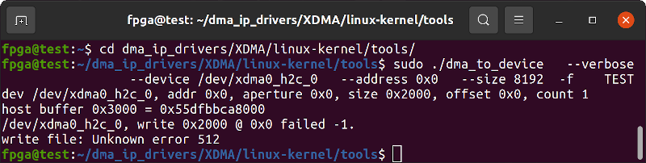

See the [UltraScale+ DDR4 Memory IP Interface Calibration and Hardware Debug Guide](https://support.xilinx.com/s/article/68937?language=en_US) for more support.

#### Connect JTAG

Connect JTAG to view calibration status.

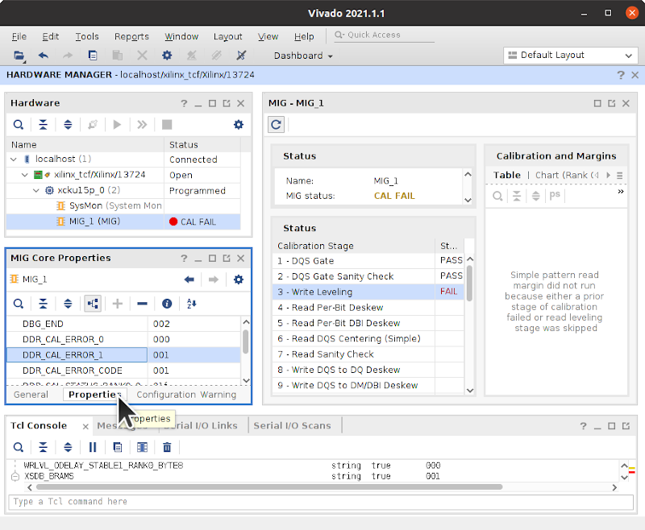

#### CAL FAIL Write Leveling

A *Write Leveling* failure is unfortunately a hardware issue. Refer to [Xilinx's PG150 Memory IP Guide](https://www.xilinx.com/support/documentation/ip_documentation/ultrascale_memory_ip/v1_4/pg150-ultrascale-memory-ip.pdf).


Write Leveling calibrates clock to Data Strobe (DQS) signal timings. DDR4 uses a fly-by wiring topology for control and address signals but point-to-point for Data Strobe (DQS), Data Mask (DM), and Data Byte Lanes (DQ). It is worthwhile to test individual byte lanes on a Write Leveling error as it is unlikely every memory IC is broken. Some of the memory address space may still be usable.

There are five [MT40A1G16KNR-075 ICs](https://www.micron.com/products/dram/ddr4-sdram/part-catalog/mt40a1g16knr-075) with **D9WFR** [FBGA Code](https://www.micron.com/support/tools-and-utilities/fbga?fbga=D9WFR#pnlFBGA) on the board which each have two x8 dies. The full memory interface is 72-Bit (64-Bit + ECC) so only 9 of the 10 dies are used.

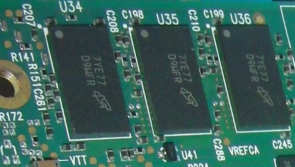

The Xilinx DDR4 IP only allows 8, 16, 32, 64, and 72 bit (64-bit with ECC) wide DDR4 interfaces. Therefore you can have 1GB, 2GB, 4GB, 8GB, or 8GB with ECC of memory space. Bank 66 is the main Address/Control/Byte-Lane-0 bank while Bank 67 is for Byte Lanes 3, 4, 5, and 6. Bank 68 is for Byte Lanes 1, 2, 7, and 8.

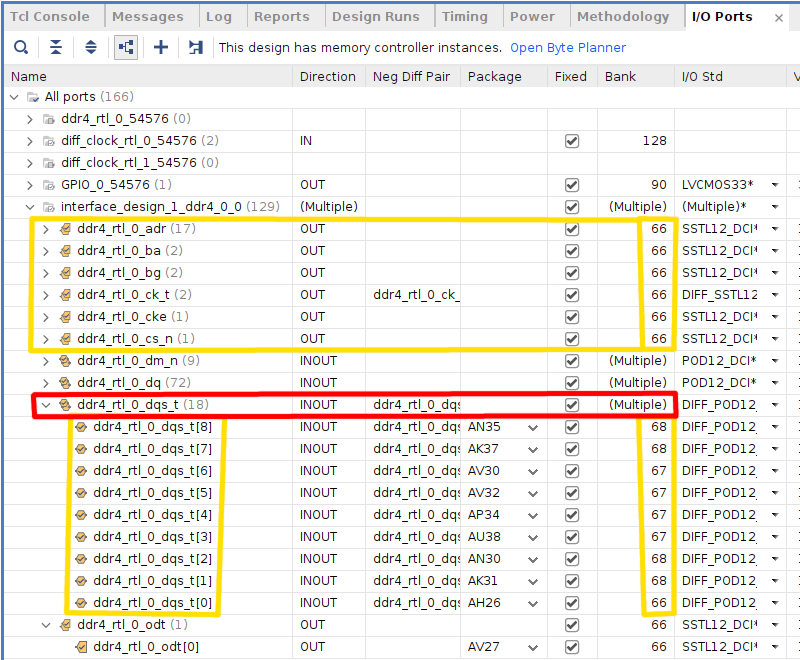

I first tested a slower version of the DDR4 memory interface, DDR4-1400 which runs at 700MHz. I also got a Write Leveling Calibration error.

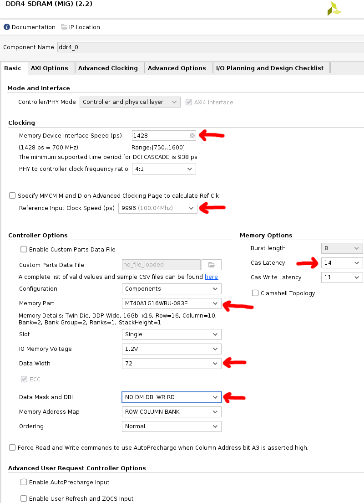

I also connected *ddr4_ui_clk* to the divide-by-2^27 counter to blink the D18 LED if the DDR4 block is active.

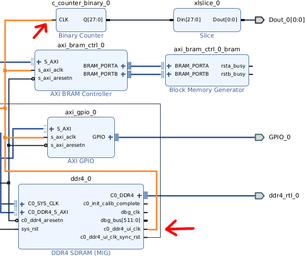

I then tested an 8-Bit wide version, [innova2_constraints_ddr4_8bit_byte-lane-0.xdc](innova2_constraints_ddr4_8bit_byte-lane-0.xdc), that uses only Byte Lane 0. It worked! My board has at least 1GB of working DDR4.

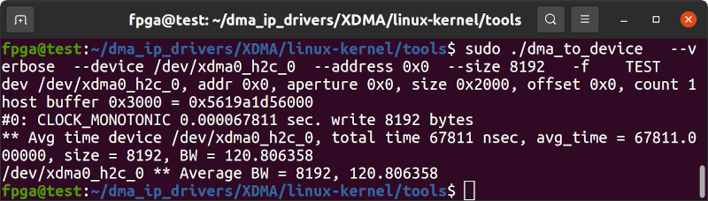

I then tested 8-Bit wide versions of the DDR4 interface using different Byte Lanes from Bank 67. Each 8-Bit interface using Byte Lanes from Bank 67 worked!

I then tested a 32-Bit wide version of the DDR4 interface using [all four Byte Lanes from Bank 67](https://github.com/mwrnd/innova2_flex_xcku15p_notes/blob/a80d521a60757b3b8c5ceabf8a41422d13a8c0a1/Troubleshooting/innova2_constraints_ddr4_32bit_byte-lanes-3-4-5-6-Bank67.xdc#L138). It worked! At least 4GB of DDR4 is usable.

I then tested 16-Bit wide versions of the DDR4 interface using different Byte Lanes from Bank 67 and Bank 68. Banks used must be contiguous. You cannot skip Bank 67 and use Banks 66 and 68. Bank 67 must be used for Bank 68 Byte Lanes to be tested so I used the known-working Byte Lane 3 from Bank 67 to test Bank 68 lanes. Byte Lanes [1+3](innova2_constraints_ddr4_16bit_byte-lanes-1-3.xdc) failed but Byte Lanes [2+3](innova2_constraints_ddr4_16bit_byte-lanes-2-3.xdc) worked! Byte Lane 1 is broken.

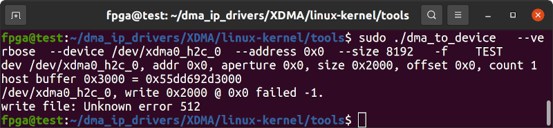

I then tested [3+7](innova2_constraints_ddr4_16bit_byte-lanes-3-7.xdc) and [3+8](innova2_constraints_ddr4_16bit_byte-lanes-3-8.xdc) and both worked. Only Byte Lane 1 is broken. Bank 68 otherwise works.

I then tested 64-Bit versions of the DDR4 memory interface without Byte Lane 1 at two speeds, DDR4-1400 (**1428**ps) and DDR4-2400 (**833**ps). Both worked! Since I do not have access to a schematic I cannot further investigate this Byte Lane issue. However, I do not need ECC so having the full 8GB of working RAM is good enough.

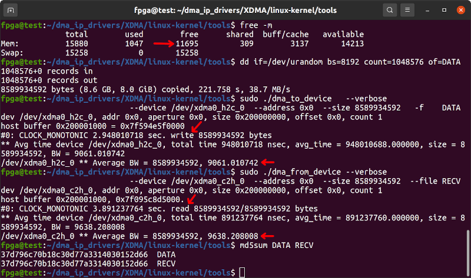


#### Recreating ddr4_0_ex Example Design

The included [ddr4_0_ex_example_design.xdc](ddr4_0_ex_example_design.xdc) constraints file has the correct pin mappings when creating the DDR4 Example Design using **Vivado 2021.2**.

Begin by `source`ing the [innova2_xcku15p_ddr4_bram_gpio](https://github.com/mwrnd/innova2_xcku15p_ddr4_bram_gpio#recreating-the-design-in-vivado) project and editing the DDR4 options to slower memory speeds (**1250**ps) and the built-in IC configuration (**MT40A1G16WBU-083E**).

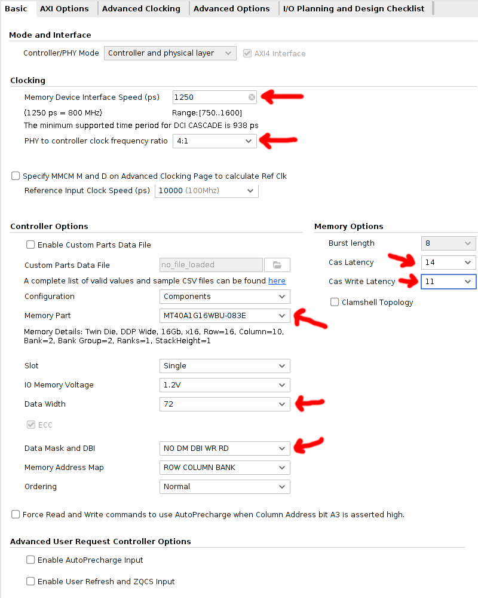

Select the option to enable Debug Signals under Advanced Options in the DDR4 IP Customizer.

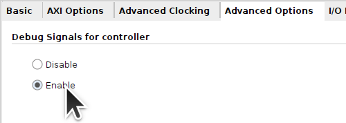

Right-click on the DDR4 Block and choose *Open IP Example Design*.

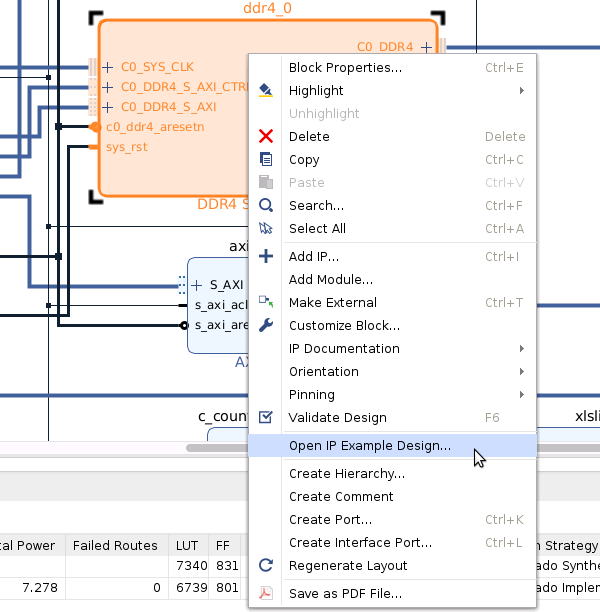

After Vivado generates the Example Design, update the Constraints File *example_design.xdc* with the contents of the included [ddr4_0_ex_example_design.xdc](ddr4_0_ex_example_design.xdc) file. Also, the `sys_rst` signal must be inverted in *example_top.sv*.

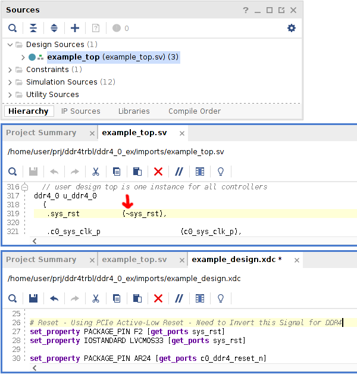


#### JTAG Communication with ddr4_0_ex Example Design

Xilinx's *ddr4_0_ex* Example Design includes additional testing infrastructure.

CAL Pass:

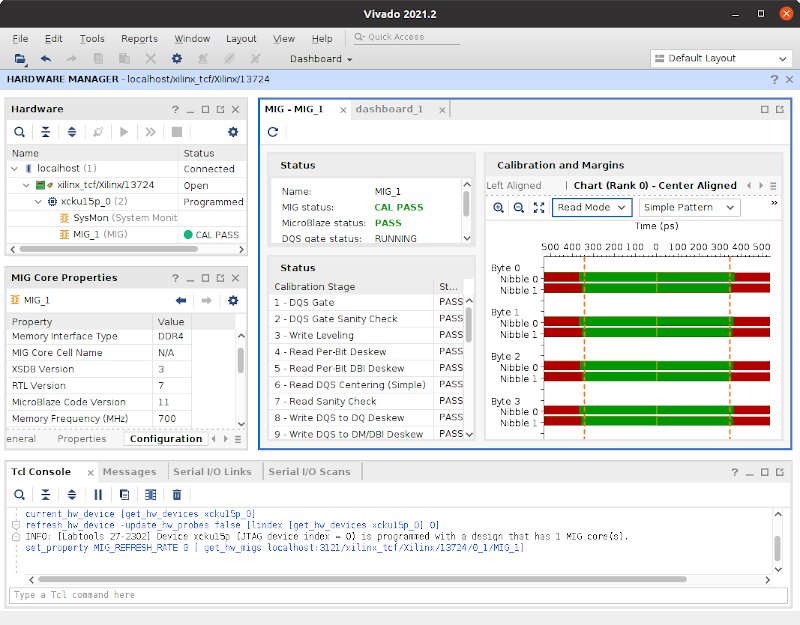

CAL Fail:

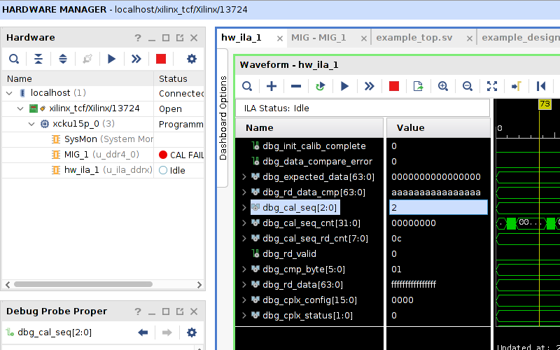

