# Debug Notes

## Delay Motherboard Boot Using RESET Capacitor

Slowing down BIOS boot is a simple trick that solves many PCIe issues. You can do this by pressing the POWER button, then pressing and holding the RESET button for a second before releasing it. Or, connect a capacitor across the reset pins of your motherboard's [Front Panel Header](https://www.intel.com/content/www/us/en/support/articles/000007309/intel-nuc.html). This prevents you from using the RESET button as that would short the capacitor. Try values between 100uF and 1000uF. Optimal value depends on required delay and motherboard design.

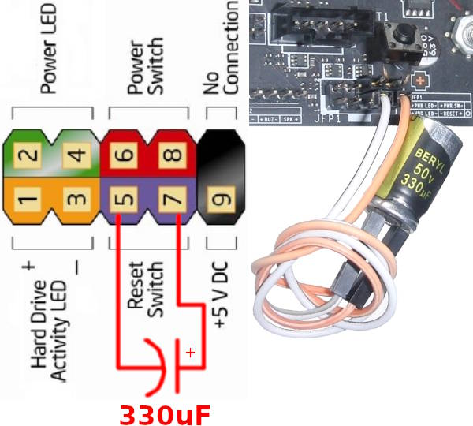

The capacitor across RESET works thanks to an [RC Delay](https://en.wikipedia.org/wiki/RC_time_constant) on the reset signal buffer. The [OpenCompute](https://en.wikipedia.org/wiki/Open_Compute_Project) project has a public schematic and the RESET Button is on Pg#151 in *Project_Olympus_Intel_XSP_Schematics_20171016.pdf* found in [`Project_Olympus_Intel_XSP_Collateral.zip`](http://files.opencompute.org/oc/public.php?service=files&t=e969672c57d6e17647adea54f2c3e5a7&download).

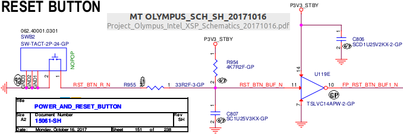

A standard Schmitt-Trigger inverter such as the [SN74LVC1G14](https://www.ti.com/lit/gpn/SN74LVC1G14) has a positive-going threshold voltage of about 1.5V with a 3.3V supply. I have measured 1k-Ohm between the RESET+ pin and the 3.3V ATX Power supply rail. A 330uF capacitor [delays](http://ladyada.net/library/rccalc.html) boot by about 200ms.

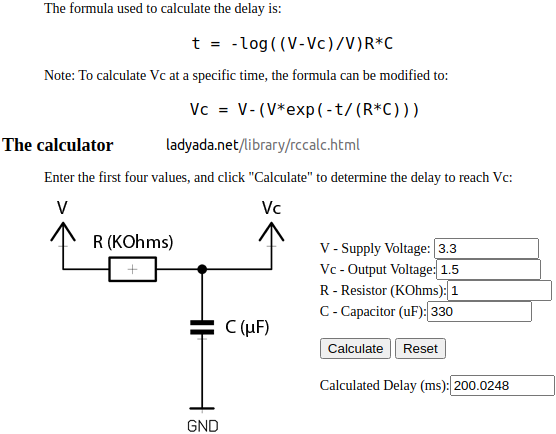

I found out about this technique [here](https://hackaday.com/2018/02/17/catching-the-pcie-bus/):

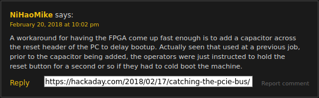


## Discerning ADLT vs ADAT and ADIT Variants

[Innova2 8GB MNV303212A-ADLT](https://www.mellanox.com/files/doc-2020/pb-innova-2-flex.pdf) boards have [`MT40A1G16KNR-075`](https://media-www.micron.com/-/media/client/global/documents/products/data-sheet/dram/ddr4/ddr4_16gb_x16_1cs_twindie.pdf) DDR4 ICs with [**D9WFR** FBGA Code](https://www.micron.com/support/tools-and-utilities/fbga?fbga=D9WFR#pnlFBGA). [Innova2 4GB MNV303212A-ADAT/MNV303212A-ADIT](https://network.nvidia.com/pdf/eol/LCR-000437.pdf) boards have [`MT40A512M16JY-083E`](https://media-www.micron.com/-/media/client/global/documents/products/data-sheet/dram/ddr4/8gb_ddr4_sdram.pdf) DDR4 ICs with [**D9TBK** FBGA Code](https://www.micron.com/support/tools-and-utilities/fbga?fbga=D9TBK#pnlFBGA).


## Tracing OpenCAPI Connector Signals

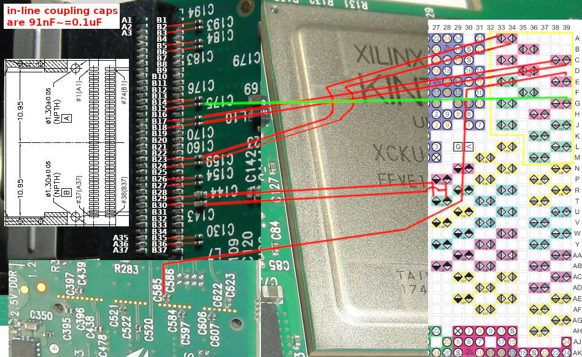

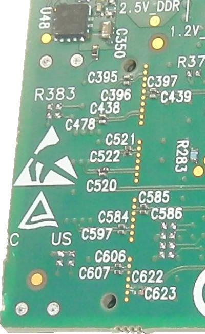


## Debugging Vivado xsdb xsct JTAG Errors

If commands in `xsdb` lead to Memory Write Errors or Debug Transport Module errors:
```Shell
Failed to download /home/user/boot.elf
Memory write error at 0x8022D500. FPGA reprogrammed, wait for debugger resync
xsdb% Info: Hart #0 (target 3) Stopped at 0x10dd4 (Suspended)
...
Failed to download vivado-risc-v/workspace/boot.elf
Memory write error at 0x80000100. Debug Transport Module timeout
xsdb% Info: Hart #0 (target 3) Running (Debug Transport Module: data corruption (ID))
```

Edit the `xsdb.tcl` script to add debug logging to the call to `exec $server ...` which is on line 2986 in Vivado 2021.2's `xsdb`:
```Shell
sudo gedit /tools/Xilinx/Vivado/2021.2/scripts/xsdb/xsdb/xsdb.tcl
```

The core JTAG-related logging options are:
```Tcl
-l protocol,context,jtag,jtag2 -L hw_server_log_xsdb
```

Logging *everything* is also an option but the log file generates about 5MB/sec:
```
-l alloc,eventcore,waitpid,events,protocol,context,children,discovery,asyncreq,proxy,tcflog,elf,stack,plugin,shutdown,disasm,jtag,jtag2,slave,dpc -L hw_server_log_xsdb
```

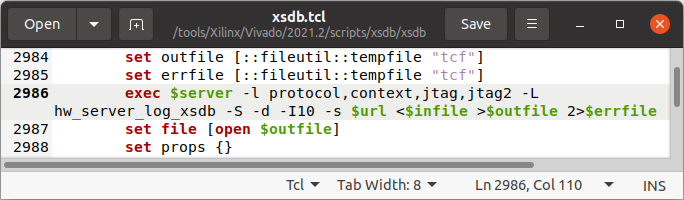

To interleave JTAG log data with `xsdb`, its `stdout` and `stderr` can be append-redirected to the log file `>>`.
```Shell
source /tools/Xilinx/Vivado/2021.2/settings64.sh
/tools/Xilinx/Vitis/2021.2/bin/unwrapped/lnx64.o/rlwrap -rc -f /tools/Xilinx/Vitis/2021.2/scripts/xsdb/xsdb/cmdlist /tools/Xilinx/Vitis/2021.2/bin/loader -exec rdi_xsdb  >>hw_server_log_xsdb  2>>hw_server_log_xsdb
```

However, this means commands must be sent blindly to `xsdb`. Try running a regular interactive `xsdb` session prior to a logging session to get a sense of the delay required between commands.
```
connect
targets 3
dow boot.elf
exit
```

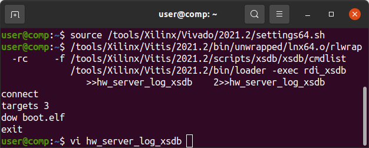

It is possible to redirect `xsdb` output to both the screen and the log file but usage is messy. Lines are repeated or disappear.
```Shell
(/tools/Xilinx/Vitis/2021.2/bin/unwrapped/lnx64.o/rlwrap -rc -f /tools/Xilinx/Vitis/2021.2/scripts/xsdb/xsdb/cmdlist /tools/Xilinx/Vitis/2021.2/bin/loader -exec rdi_xsdb 2>  >(tee -a /dev/stderr)) | tee -a hw_server_log_xsdb
```

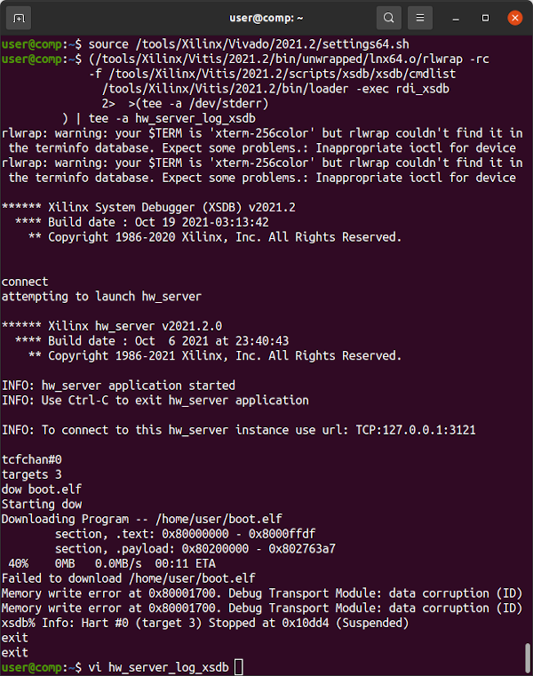

Edit `hw_server_log_xsdb` and look for the `Memory write` error:

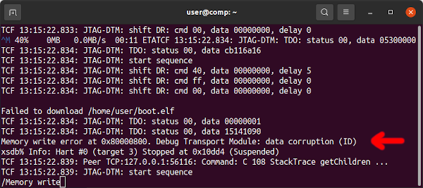

The above notes are a result of working on [`eugene-tarassov/vivado-risc-v` Issue 97](https://github.com/eugene-tarassov/vivado-risc-v/issues/97).


## Debugging PCIe Using Xilinx IBERT

**Work-In-Progress**

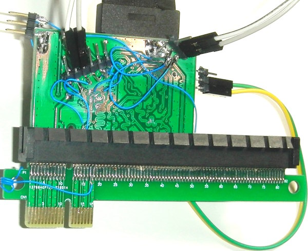

Create an `xdma_0_ex` example design with all debugging options enabled. Connect a JTAG debugger to the board and run `source test_rd.tcl` in the [**Tcl Console**](https://docs.xilinx.com/r/2021.1-English/ug893-vivado-ide/Using-the-Tcl-Console). It will be in the `xdma_0_ex/xdma_0_ex.gen/sources_1/ip/xdma_0/ip_0/xdma_0_pcie4_ip/pcie_debugger` directory. Refer to the [IBERT Product Guide](https://docs.xilinx.com/v/u/en-US/pg246-in-system-ibert).

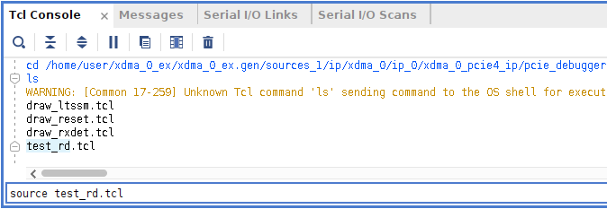

In your OS's terminal, `cd` into the `xdma_0_ex/xdma_0_ex.gen/sources_1/ip/xdma_0/ip_0/xdma_0_pcie4_ip/pcie_debugger` directory and run the various state diagrams.
```
tclsh draw_ltssm.tcl
tclsh draw_reset.tcl
```

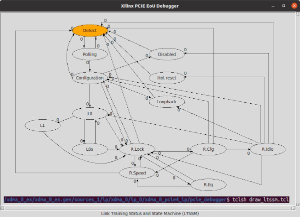

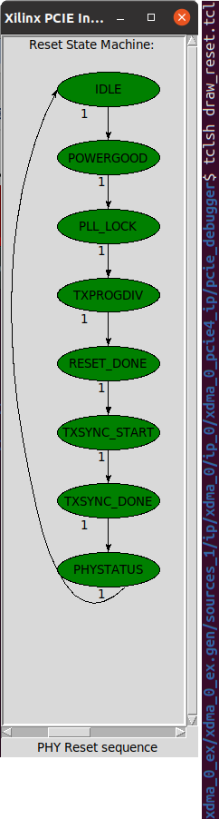

Run a Sweep in Vivado to see an [Eye Diagram](https://en.wikipedia.org/wiki/Eye_pattern).

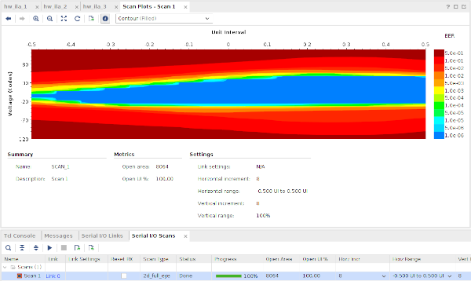


## Useful Hardware for Debug

A PCIe x16-to-x1 Adapter forces x1 lane width.

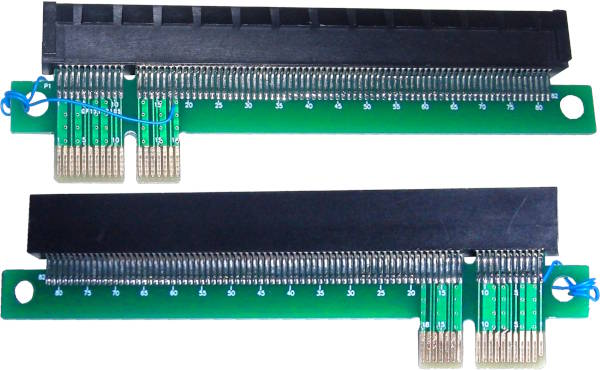

A PCIe Extender can be used to solder directly to individual lanes.

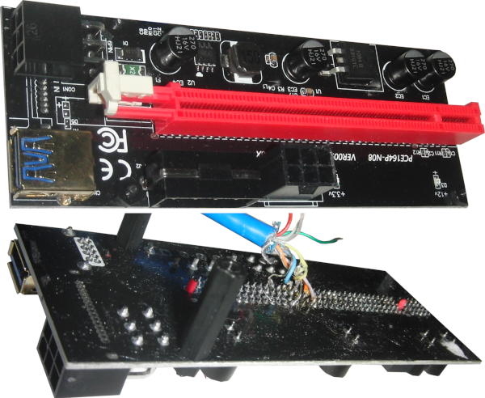


## Platform Cable for JTAG

### Xilinx DLC10 Platform Cable USB II

The [Xilinx Platform Cable USB II](https://docs.xilinx.com/v/u/en-US/ds593) is based on an [FX2 USB MCU](https://www.infineon.com/cms/en/product/universal-serial-bus/usb-2.0-peripheral-controllers/ez-usb-fx2lp-fx2g2-usb-2.0-peripheral-controller/) and [Spartan-3 FPGA](https://www.xilinx.com/products/silicon-devices/fpga/spartan-3.html).

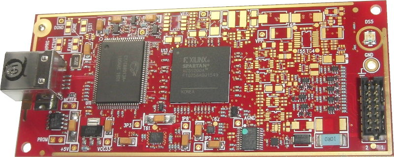


### Xilinx DLC10 Platform Cable USB II

The [Waveshare Platform USB Cable clone](https://www.waveshare.com/platform-cable-usb.htm) is also based on an [FX2 USB MCU](https://www.infineon.com/cms/en/product/universal-serial-bus/usb-2.0-peripheral-controllers/ez-usb-fx2lp-fx2g2-usb-2.0-peripheral-controller/) but instead uses a [Lattice MachXO2 CPLD](https://www.latticesemi.com/Products/FPGAandCPLD/MachXO2).

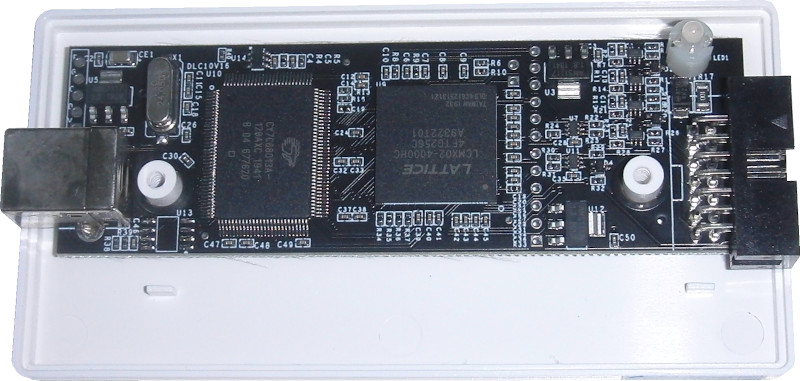


