# Debug Notes


## Delay Motherboard Boot Using RESET Capacitor

Slowing down BIOS boot is a simple trick that solves many PCIe issues. You can do this by pressing the POWER button, then pressing and holding the RESET button for a second before releasing it. Or, connect a capacitor across the reset pins of your motherboard's [Front Panel Header](https://www.intel.com/content/www/us/en/support/articles/000007309/intel-nuc.html). This prevents you from using the RESET button as that would short the capacitor. Try capacitors with values such as 330uF or 680uF. Optimal value depends on required delay and motherboard design.


The capacitor across RESET works thanks to an [RC Delay](https://en.wikipedia.org/wiki/RC_time_constant) on the reset signal buffer. The [OpenCompute](https://en.wikipedia.org/wiki/Open_Compute_Project) project has a public schematic and the RESET Button is on Pg#151 in *Project_Olympus_Intel_XSP_Schematics_20171016.pdf* found in [`Project_Olympus_Intel_XSP_Collateral.zip`](http://files.opencompute.org/oc/public.php?service=files&t=e969672c57d6e17647adea54f2c3e5a7&download).


A standard Schmitt-Trigger inverter such as the [SN74LVC1G14](https://www.ti.com/lit/gpn/SN74LVC1G14) has a positive-going threshold voltage of about 1.5V with a 3.3V supply. I have measured 1k-Ohm between the RESET+ pin and the 3.3V ATX Power supply rail. A 330uF capacitor therefore [delays](http://ladyada.net/library/rccalc.html) boot by about 200ms.


I found out about this technique [here](https://hackaday.com/2018/02/17/catching-the-pcie-bus/):


## Recreating innova2_flex_app Functionality for latest MLNX OFED

[MLNX_OFED](https://network.nvidia.com/products/infiniband-drivers/linux/mlnx_ofed/) versions > 5.2 do not include `mlx5_fpga_tools` which is required by `innova2_flex_app` to program the FPGA, switch the active image, and enable/disable JTAG.

Check if your current kernel supports tracing.
```
cat /boot/config-`uname -r` | grep -e "CONFIG_FUNCTION[[:print:]]*TRACER\|CONFIG_KPROBES"
```

Results should be:
```
CONFIG_FUNCTION_TRACER=y
CONFIG_FUNCTION_GRAPH_TRACER=y
CONFIG_KPROBES=y
CONFIG_KPROBES_ON_FTRACE=y
```

I used [ftrace](https://www.kernel.org/doc/html/latest/trace/ftrace.html) ([Quick Introduction](https://opensource.com/article/21/7/linux-kernel-ftrace)) to figure out the call tree when JTAG is enabled in `innova2_flex_app`.

```
sudo su
cd /sys/kernel/tracing
ps aux | grep innova
echo PID_FROM_ABOVE > set_ftrace_pid
echo function_graph > current_tracer
cat trace > /home/fpga/trace_enablejtag
### run a command in innova2_flex_app now
echo nop > current_tracer
exit
```

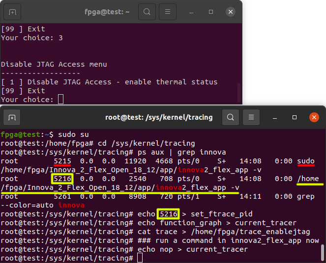

The results show that the `mlx5_core_access_reg` from the `mlx5_core` driver is the function that changes JTAG status.

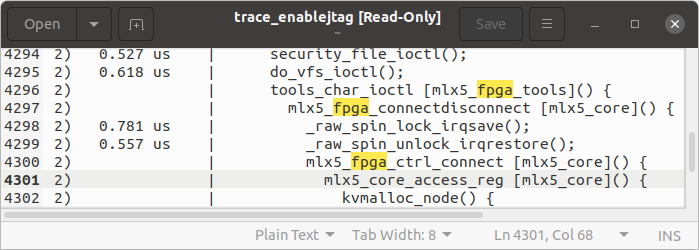

I then used a [kprobe event tracer](https://www.kernel.org/doc/html/latest/trace/kprobetrace.html) ([Quick Introduction](https://events19.linuxfoundation.org/wp-content/uploads/2017/12/oss-eu-2018-fun-with-dynamic-trace-events_steven-rostedt.pdf)) to figure out the arguments to `mlx5_core_access_reg`.

```
sudo su
cd /sys/kernel/tracing
echo 'p:myprobe mlx5_core_access_reg dev=$arg1:x64 data_in=$arg2:x64 di0=+0($arg2):x32 di1=+4($arg2):x32 di2=+8($arg2):x32 di3=+12($arg2):x32 size_in=$arg3:s32 data_out=$arg4:x64 size_out=$arg5:s32 reg_id=$arg6:x16 arg=$arg7:s32 write=$arg8:s32' > kprobe_events
echo 'r:myretprobe mlx5_core_access_reg ret=$retval'  >> kprobe_events
echo 1 > events/kprobes/myprobe/enable
echo 1 > events/kprobes/myretprobe/enable
echo 1 > tracing_on
## Enable JTAG Access in innova2_flex_app ##
cat trace | grep myprobe
echo 0 > tracing_on
echo 0 > events/kprobes/myprobe/enable
echo 0 > events/kprobes/myretprobe/enable
echo   > kprobe_events  # deletes all probes
exit
```

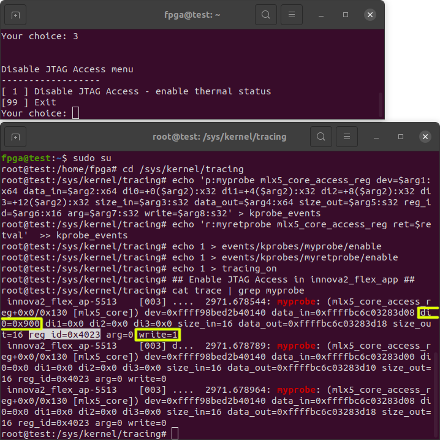

JTAG is enabled by writing `0x900` to register `0x4023`.
```
 innova2_flex_ap-5513    [003] ....  2971.678544: myprobe: (mlx5_core_access_reg+0x0/0x130 [mlx5_core]) dev=0xffff98bed2b40140 data_in=0xffffbc6c03283d08 di0=0x900 di1=0x0 di2=0x0 di3=0x0 size_in=16 data_out=0xffffbc6c03283d18 size_out=16 reg_id=0x4023 arg=0 write=1
```

`mlx5_fpga_ctrl_connect` is in `cmd.c` in the `mlnx-ofed-kernel-5.2` archive.

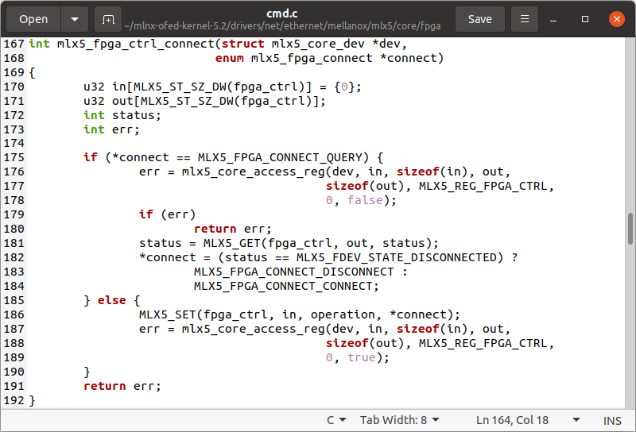

`mlx5_core_access_reg` is an [EXPORT_SYMBOL](https://lkw.readthedocs.io/en/latest/doc/04_exporting_symbols.html) so it can be called from other kernel modules.

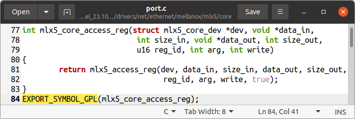

`MLX5_ST_SZ_DW` sets the value to send.

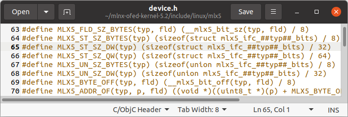

The values are defined in `mlx_ifc_fpga.h`. The `0x900` is in Little-Endian (`0x00090000` in Big-Endian) so it is written to the `operation[0x8]` bits of the `FPGA_CTRL` register.

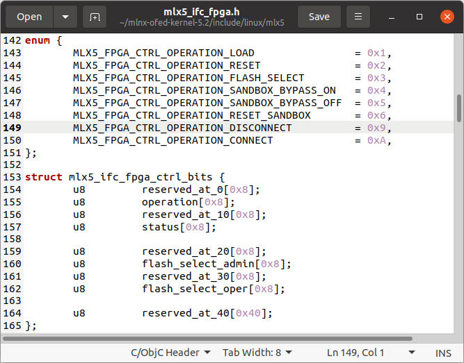

[`mlxreg`](https://docs.nvidia.com/networking/display/mftv4250/mlxreg+utility) can be used to access registers. By running `innova2_flex_app` in one window and `mlxreg` in another, the `FPGA_CTRL` register can be watched.

```
sudo mst start
sudo mlxreg -d /dev/mst/mt4119_pciconf0 --yes --reg_id 0x4023 --reg_len 0x4 --get
```

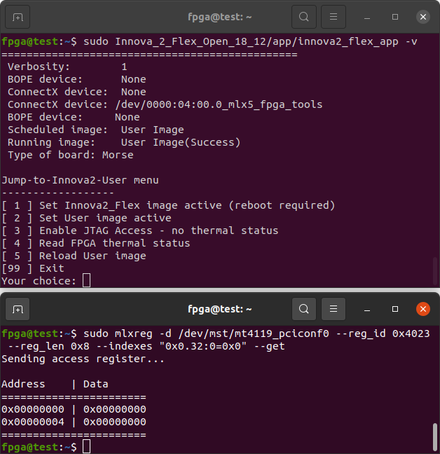

After enabling JTAG, the `status[0x8]` bits are `0x3`:

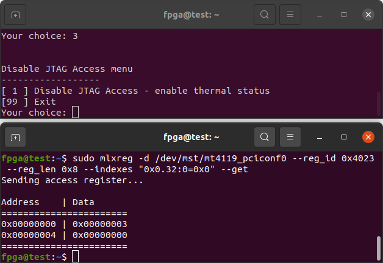

After enabling the Flex Image, the `flash_select_admin[0x8]` bits are `0x01`:

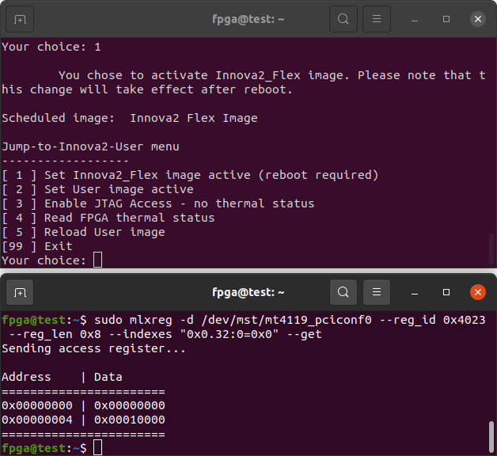

Unfortunately, `mlxreg --set` fails with `-E- Failed send access register: ME_ICMD_OPERATIONAL_ERROR` when trying to write the register.
```
sudo mlxreg -d /dev/mst/mt4119_pciconf0 --yes --reg_id 0x4023 --reg_len 0x4 --get
sudo mlxreg -d /dev/mst/mt4119_pciconf0 --yes --reg_id 0x4023 --reg_len 0x4 --set "0x0.16:4=0xA"
sudo mlxreg -d /dev/mst/mt4119_pciconf0 --yes --reg_id 0x4023 --reg_len 0x4 --set "0x0.16:4=0x9"
echo Try to set reserved bits:
sudo mlxreg -d /dev/mst/mt4119_pciconf0 --yes --reg_id 0x4023 --reg_len 0x4 --set "0x0.12:4=0x9"
```

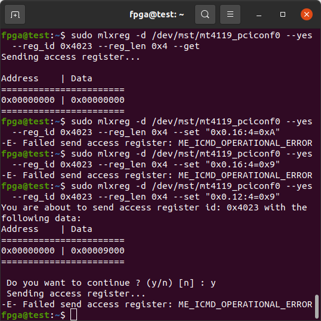


### Using mstreg to write FPGA Control Register

`mstreg` from [**mstflint v4.26.0-1**](https://github.com/Mellanox/mstflint/releases/tag/v4.26.0-1) is able to write the FPGA Control registers.

```
wget https://github.com/Mellanox/mstflint/releases/download/v4.26.0-1/mstflint-4.26.0-1.tar.gz
tar -xvf mstflint-4.26.0-1.tar.gz
cd mstflint-4.26.0
./configure --enable-adb-generic-tools --enable-rdmem
make
cd mlxreg/
lspci | grep Mellanox | grep Ethernet
sudo find / * -name register_access_table.adb
```

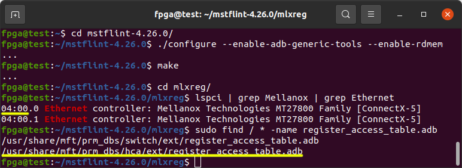

Note the Ethernet Controller PCIe address, `04:00.0` above, and the ADB File location, `usr/share/mft/prm_dbs/hca/ext/register_access_table.adb` above.


#### Enable or Disable JTAG Connector

`mstreg` can be used to *DISCONNECT* the FPGA's JTAG from the ConnectX-5 to enable the board's JTAG header to be used.

```
sudo ./mstreg --yes --device 04:00.0 --adb_file /usr/share/mft/prm_dbs/hca/ext/register_access_table.adb --reg_id 0x4023 --reg_len 0x8 --get
sudo ./mstreg --yes --device 04:00.0 --adb_file /usr/share/mft/prm_dbs/hca/ext/register_access_table.adb --reg_id 0x4023 --reg_len 0x8 --set "0x0.16:4=0x9"
sudo ./mstreg --yes --device 04:00.0 --adb_file /usr/share/mft/prm_dbs/hca/ext/register_access_table.adb --reg_id 0x4023 --reg_len 0x8 --get
```

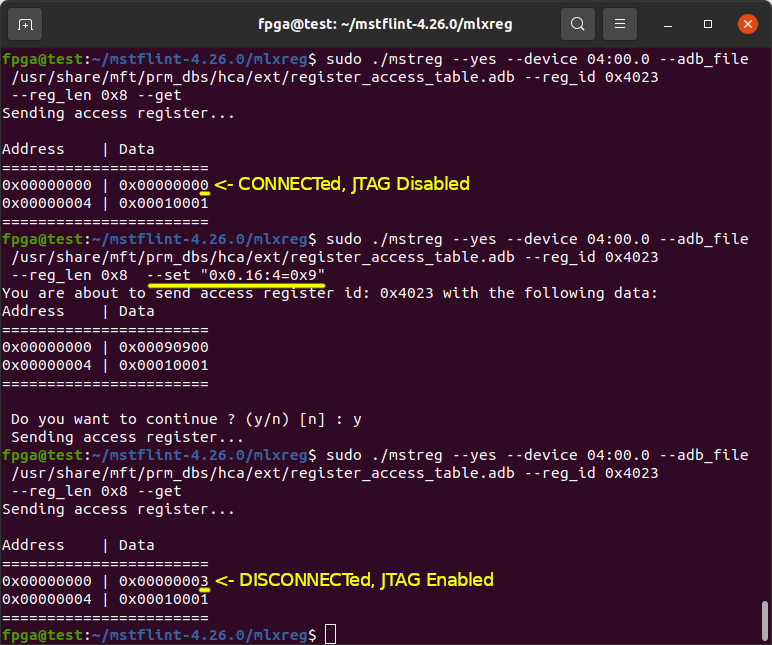

Similarly, writing the `4`-bit value `0xA` at the `16`th bit position of register `0x0` connects JTAG signals to the ConnectX-5 and disables the board's JTAG header.
```
sudo ./mstreg --yes --device 04:00.0 --adb_file /usr/share/mft/prm_dbs/hca/ext/register_access_table.adb --reg_id 0x4023 --reg_len 0x8 --get
sudo ./mstreg --yes --device 04:00.0 --adb_file /usr/share/mft/prm_dbs/hca/ext/register_access_table.adb --reg_id 0x4023 --reg_len 0x8 --set "0x0.16:4=0xA"
sudo ./mstreg --yes --device 04:00.0 --adb_file /usr/share/mft/prm_dbs/hca/ext/register_access_table.adb --reg_id 0x4023 --reg_len 0x8 --get
```


#### Set Active FPGA Configuration Bitstream Image

The [FPGA Configuration Memory Layout](https://docs.nvidia.com/networking/display/innova2flex/using+the+mellanox+innova-2+flex+open+bundle#src-11995976_UsingtheMellanoxInnova2FlexOpenBundle-FlashFormat) allows for 3 configuration bitstreams, *Factory*, *User*, and *Flex*.


When the User Image is scheduled using `innova2_flex_app` under *MLNX_OFED 5.2*, `0x00030000` is written to word `0` of the control register `0x4023`.

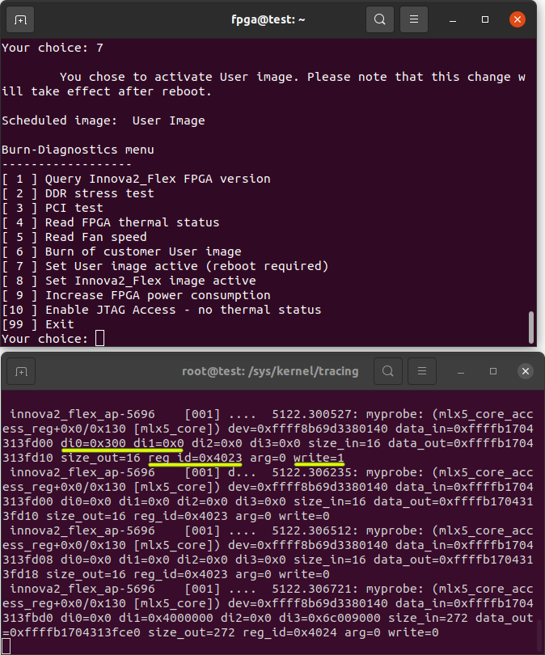

When the Flex Image is scheduled using `innova2_flex_app` under *MLNX_OFED 5.2*, `0x00030001` is written to word `0` of the control register `0x4023`.

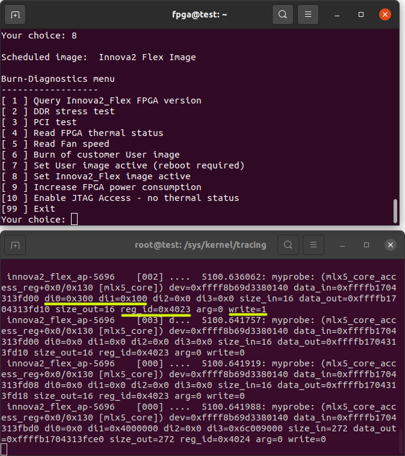

The User Image can be activated using `mstreg`:

```
sudo ./mstreg --yes --device 04:00.0 --adb_file /usr/share/mft/prm_dbs/hca/ext/register_access_table.adb --reg_id 0x4023 --reg_len 0x8 --get
sudo ./mstreg --yes --device 04:00.0 --adb_file /usr/share/mft/prm_dbs/hca/ext/register_access_table.adb --reg_id 0x4023 --reg_len 0x8 --set "0x0.16:4=0x3,0x4.16:4=0x1"
sudo ./mstreg --yes --device 04:00.0 --adb_file /usr/share/mft/prm_dbs/hca/ext/register_access_table.adb --reg_id 0x4023 --reg_len 0x8 --get
```

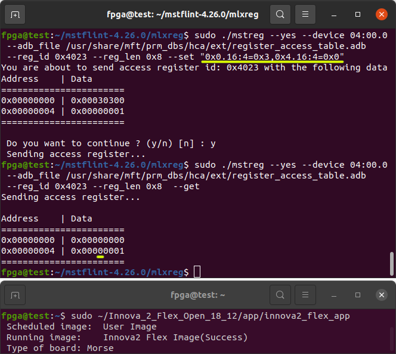

The Flex Image can be activated using `mstreg`:

```
sudo ./mstreg --yes --device 04:00.0 --adb_file /usr/share/mft/prm_dbs/hca/ext/register_access_table.adb --reg_id 0x4023 --reg_len 0x8 --get
sudo ./mstreg --yes --device 04:00.0 --adb_file /usr/share/mft/prm_dbs/hca/ext/register_access_table.adb --reg_id 0x4023 --reg_len 0x8 --set "0x0.16:4=0x3,0x4.16:4=0x0"
sudo ./mstreg --yes --device 04:00.0 --adb_file /usr/share/mft/prm_dbs/hca/ext/register_access_table.adb --reg_id 0x4023 --reg_len 0x8 --get
```

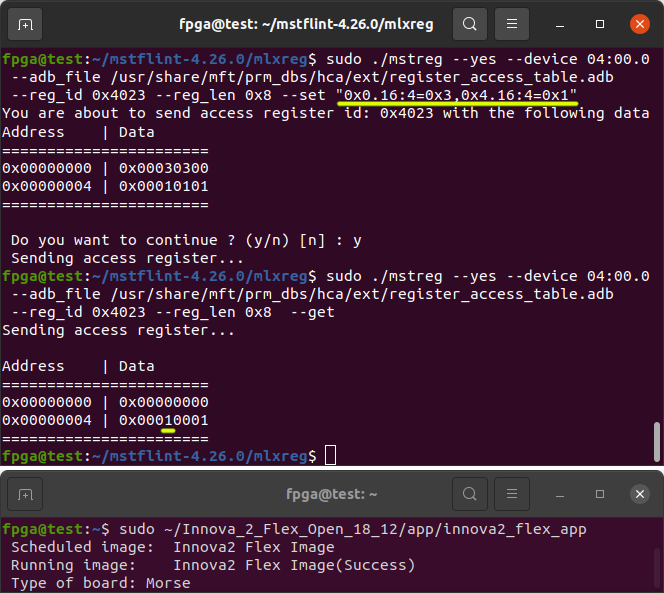

The `innova2_flex_app` Status and Image Register Defines may prove useful:

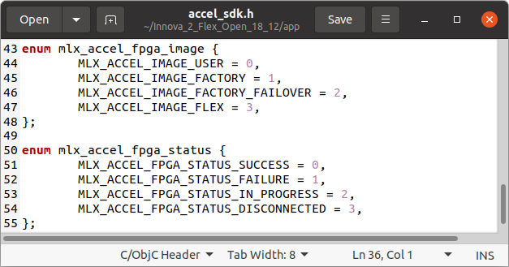


### How Does the Flex Image Work?

To see if the Flex and/or Factory Images alter FPGA configuration I ran [readback](https://docs.amd.com/r/en-US/ug908-vivado-programming-debugging/Readback-and-Verify) after making changes in `innova2_flex_app`.

Connect a **1.8V** [Xilinx-compatible JTAG Adapter](https://docs.amd.com/r/en-US/ug908-vivado-programming-debugging/JTAG-Cables-and-Devices-Supported-by-hw_server), then Open Vivado Hardware Manager and *Add Configuration Memory Device*:

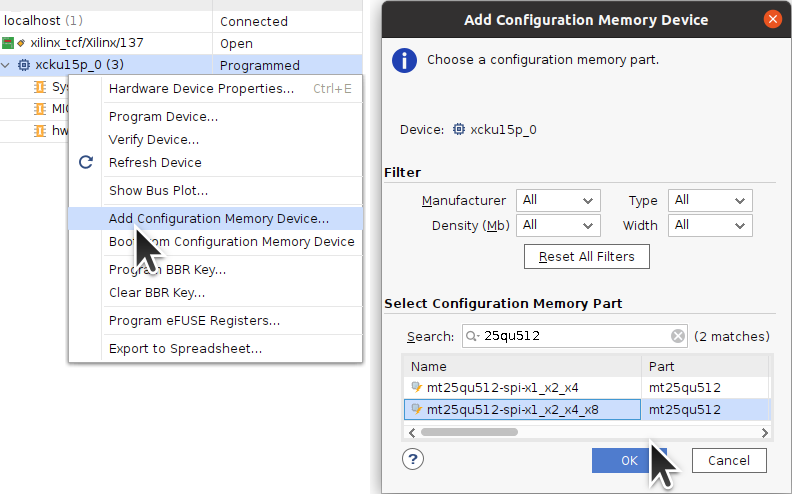

Right-click and *Readback Configuration Memory Device*:

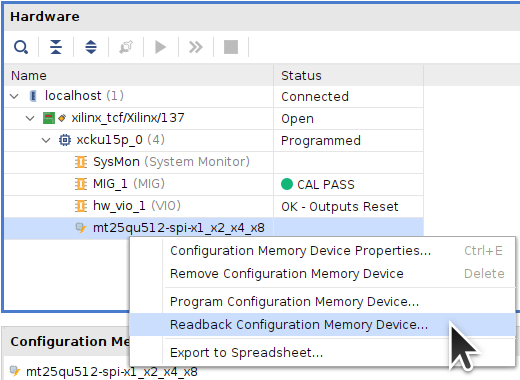

The Flex Image is at offset `03000000` and I read `0x1000 = 4096 bytes` as [`BITSTREAM.CONFIG.NEXT_CONFIG_ADDR`](https://docs.amd.com/r/en-US/ug570_7Series_Config/Golden-Image-and-MultiBoot-Image-Design-Requirements)/[`WBSTAR`](https://docs.amd.com/r/en-US/ug570_7Series_Config/WBSTAR-Register) is at the [start of the bitstream configuration image](https://docs.amd.com/r/en-US/ug570_7Series_Config/Bitstream-Composition). The Factory Image is at `0`. There were no changes in the images after changing the settings in `innova2_flex_app`. The Factory and Flex Images do not appear to make use of a standard multiboot setup.

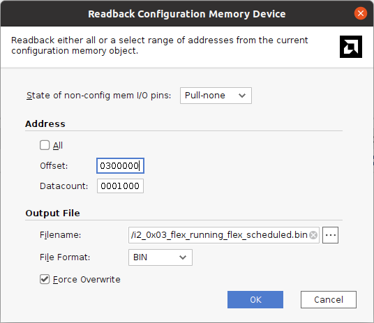

However, when the Flex Image is running, [`IPROG`](https://docs.amd.com/r/en-US/ug570_7Series_Config/IPROG) has been run.

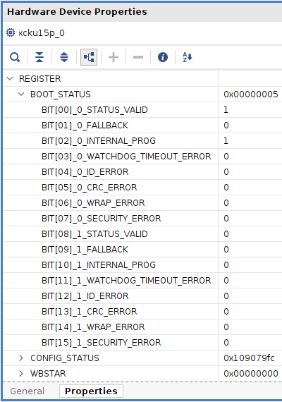

That implies the Factory Image used [ICAP](https://docs.amd.com/v/u/en-US/pg134-axi-hwicap) to [run the IPROG command](https://docs.amd.com/r/en-US/ug570_7Series_Config/IPROG-Using-ICAP). The Factory and/or Flex images must be communicating with the ConnectX-5.


#### Tracing FPGA-to-ConnectX-5 I2C Signals

The [Original Constraints XDC File](https://docs.nvidia.com/networking/download/attachments/11995849/Verilog_VHDL_and_Xilinx_Design_Constrains.zip)([Archive](https://web.archive.org/web/20220706190318/https://docs.nvidia.com/networking/download/attachments/11995849/Verilog_VHDL_and_Xilinx_Design_Constrains.zip?api=v2&modificationDate=1554374888353&version=3)) lists I2C signals that connect the FPGA to the ConnectX-5:

```
#i2c (from ConnectX)
set_property PACKAGE_PIN D2 [get_ports i2c_scl] 
set_property PACKAGE_PIN D1 [get_ports i2c_sda]		
set_property IOSTANDARD LVCMOS33 [get_ports i2c_scl]
set_property IOSTANDARD LVCMOS33 [get_ports i2c_sda]
```

I have a `Rev.A2` board. I flattened the tip of an axial resistor's lead with pliers and wound it around a multimeter lead so that I could get under the FPGA and try to trace the `D1-SDA` signal.

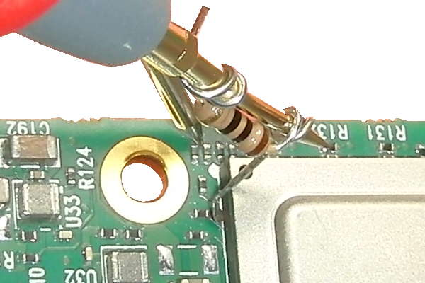

Luckily the I2C pull-up resistors are nearby.

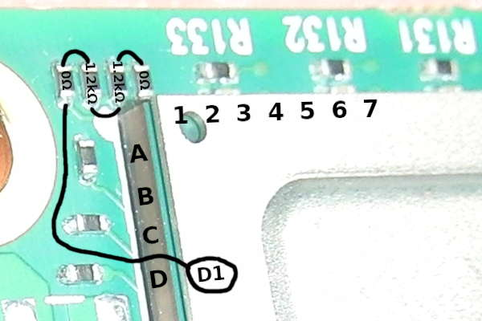

I traced the signals to test points on the opposite side of the board and soldered some wires to them so that I can capture the I2C bus data. I also soldered a 0.1" header across a 3.3V capacitor for access to an associated power supply.

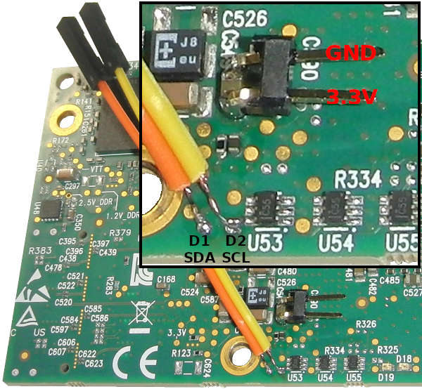

**TODO**: Capture the I2C bus. Do the Flex and/or Factory Images communicate with the CX5?


## Ignoring Innova2 Flex Multiboot and innova2_flex_app

If you have a JTAG adapter so that you can recover from failed bitstream writes you can ignore the Innova2 configuration system. Simply add a [Quad SPI IP Block](https://docs.amd.com/r/en-US/pg153-axi-quad-spi) to your designs and use [XRT](https://github.com/Xilinx/XRT) for configuration.

Configure your project's XDMA Block to include the `M_AXI_Lite` interface:

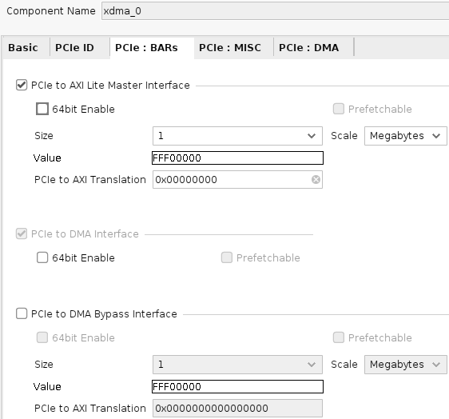

Add a [Quad SPI IP Block](https://docs.amd.com/r/en-US/pg153-axi-quad-spi) block and configure it for `2` devices, *Dual Quad Mode*, `256` *FIFO Depth*, and *Use STARTUP Primitive Internal to IP*:

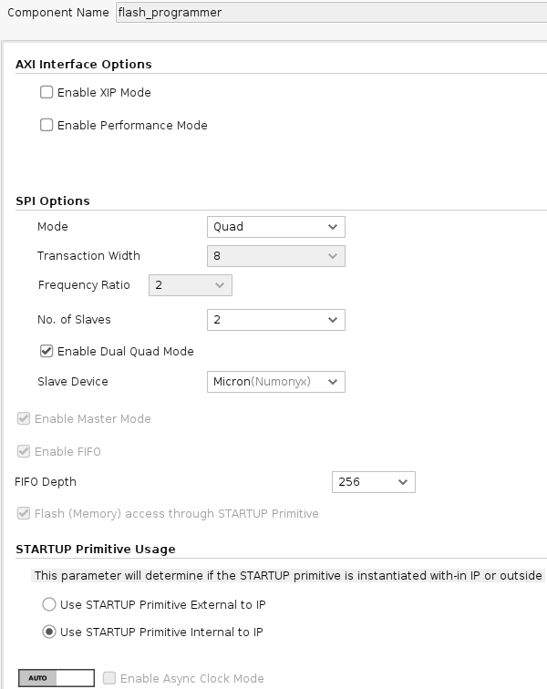

Assign the block an address of `0x40000`:

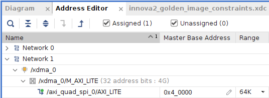

Connect `usrcclkts` to `0`. The Block Diagram should look something like the following, plus the rest of your system.

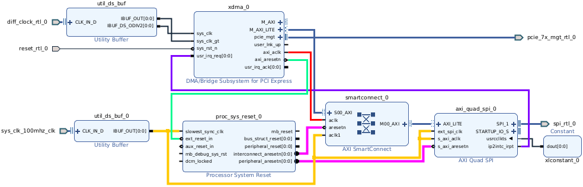

Add the following to your project's constraints `.xdc` file:
```
# Secondary Quad SPI Configuration Flash - Bank 65
# Primary Quad SPI Configuration Flash pins are single-purpose in STARTUPE3
set_property PACKAGE_PIN AM12     [get_ports spi_rtl_0_io0_io]
set_property IOSTANDARD  LVCMOS18 [get_ports spi_rtl_0_io0_io]
set_property PACKAGE_PIN AN12     [get_ports spi_rtl_0_io1_io]
set_property IOSTANDARD  LVCMOS18 [get_ports spi_rtl_0_io1_io]
set_property PACKAGE_PIN AR13     [get_ports spi_rtl_0_io2_io]
set_property IOSTANDARD  LVCMOS18 [get_ports spi_rtl_0_io2_io]
set_property PACKAGE_PIN AR12     [get_ports spi_rtl_0_io3_io]
set_property IOSTANDARD  LVCMOS18 [get_ports spi_rtl_0_io3_io]
set_property PACKAGE_PIN AV11     [get_ports spi_rtl_0_ss_io]
set_property IOSTANDARD  LVCMOS18 [get_ports spi_rtl_0_ss_io]

# Differential System Clock - 100MHz - Bank 65
set_property PACKAGE_PIN AR14        [get_ports {sys_clk_100MHz_clk_p[0]}]
set_property IOSTANDARD  DIFF_SSTL12 [get_ports {sys_clk_100MHz_clk_p[0]}]
```

After Synthesis+Implementation write your Memory Configuration File as an `mcs` file:

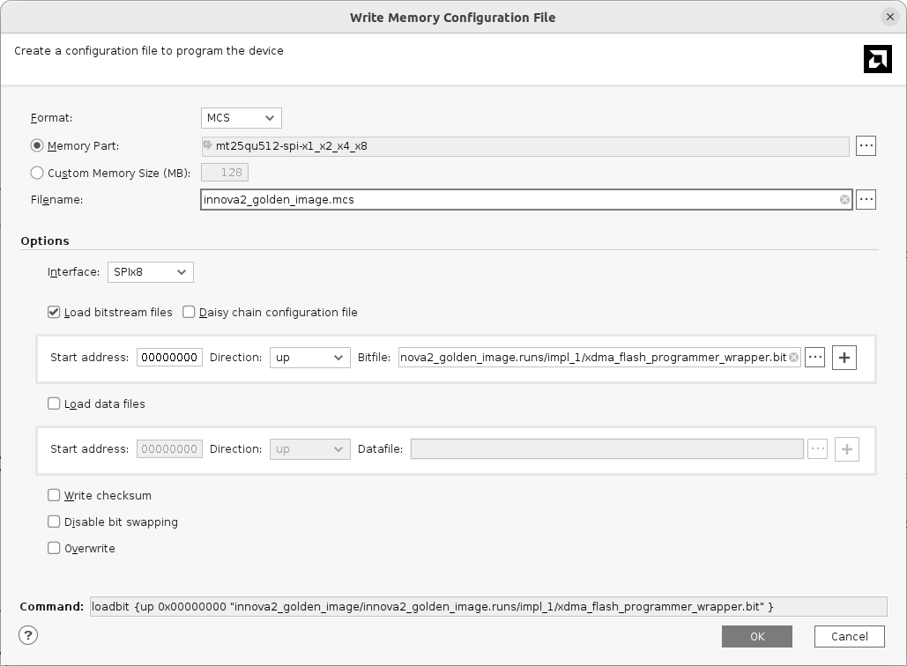

Use JTAG to write your configuration image to the Innova2 initially.

Subsequently, the [`xbflash`](https://xilinx.github.io/XRT/master/html/xbflash2.html) command can be used to program new bitstreams over existing ones.

```
lspci -d 10ee:
xbflash --card 3:00.0 --primary PROJECT_NAME_primary.mcs --secondary PROJECT_NAME_secondary.mcs
```

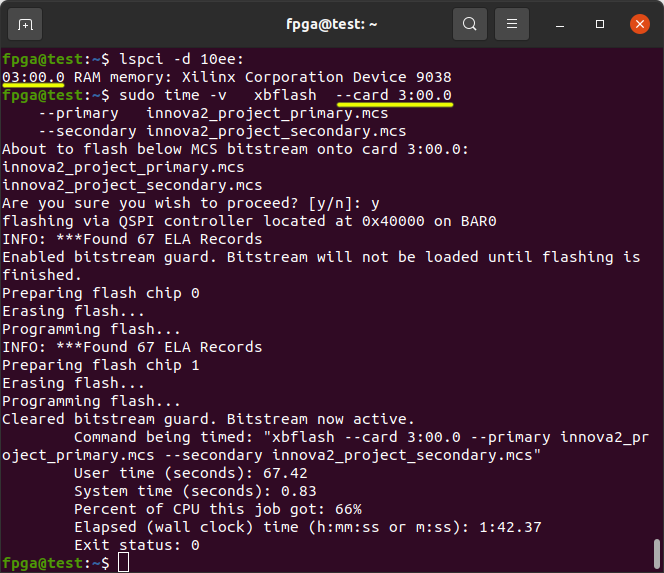


## Tracing OpenCAPI Connector Signals


## Debugging Vivado xsdb xsct JTAG Errors

If commands in `xsdb` lead to Memory Write Errors or Debug Transport Module errors:
```Shell
Failed to download /home/user/boot.elf
Memory write error at 0x8022D500. FPGA reprogrammed, wait for debugger resync
xsdb% Info: Hart #0 (target 3) Stopped at 0x10dd4 (Suspended)
...
Failed to download vivado-risc-v/workspace/boot.elf
Memory write error at 0x80000100. Debug Transport Module timeout
xsdb% Info: Hart #0 (target 3) Running (Debug Transport Module: data corruption (ID))
```

Edit the `xsdb.tcl` script to add debug logging to the call to `exec $server ...` which is on line 2986 in Vivado 2021.2's `xsdb`:
```Shell
sudo gedit /tools/Xilinx/Vivado/2021.2/scripts/xsdb/xsdb/xsdb.tcl
```

The core JTAG-related logging options are:
```Tcl
-l protocol,context,jtag,jtag2 -L hw_server_log_xsdb
```

Logging *everything* is also an option but the log file generates about 5MB/sec:
```
-l alloc,eventcore,waitpid,events,protocol,context,children,discovery,asyncreq,proxy,tcflog,elf,stack,plugin,shutdown,disasm,jtag,jtag2,slave,dpc -L hw_server_log_xsdb
```


To interleave JTAG log data with `xsdb`, its `stdout` and `stderr` can be append-redirected to the log file `>>`.
```Shell
source /tools/Xilinx/Vivado/2021.2/settings64.sh
/tools/Xilinx/Vitis/2021.2/bin/unwrapped/lnx64.o/rlwrap -rc -f /tools/Xilinx/Vitis/2021.2/scripts/xsdb/xsdb/cmdlist /tools/Xilinx/Vitis/2021.2/bin/loader -exec rdi_xsdb  >>hw_server_log_xsdb  2>>hw_server_log_xsdb
```

However, this means commands must be sent blindly to `xsdb`. Try running a regular interactive `xsdb` session prior to a logging session to get a sense of the delay required between commands.
```
connect
targets 3
dow boot.elf
exit
```


It is possible to redirect `xsdb` output to both the screen and the log file but usage is messy. Lines are repeated or disappear.
```Shell
(/tools/Xilinx/Vitis/2021.2/bin/unwrapped/lnx64.o/rlwrap -rc -f /tools/Xilinx/Vitis/2021.2/scripts/xsdb/xsdb/cmdlist /tools/Xilinx/Vitis/2021.2/bin/loader -exec rdi_xsdb 2>  >(tee -a /dev/stderr)) | tee -a hw_server_log_xsdb
```


Edit `hw_server_log_xsdb` and look for the `Memory write` error:


The above notes are a result of working on [`eugene-tarassov/vivado-risc-v` Issue 97](https://github.com/eugene-tarassov/vivado-risc-v/issues/97).


## Debugging PCIe Using Xilinx IBERT

**Work-In-Progress**


Create an `xdma_0_ex` example design with all debugging options enabled. Connect a JTAG debugger to the board and run `source test_rd.tcl` in the [**Tcl Console**](https://docs.xilinx.com/r/2021.1-English/ug893-vivado-ide/Using-the-Tcl-Console). It will be in the `xdma_0_ex/xdma_0_ex.gen/sources_1/ip/xdma_0/ip_0/xdma_0_pcie4_ip/pcie_debugger` directory. Refer to the [IBERT Product Guide](https://docs.xilinx.com/v/u/en-US/pg246-in-system-ibert).


In your OS's terminal, `cd` into the `xdma_0_ex/xdma_0_ex.gen/sources_1/ip/xdma_0/ip_0/xdma_0_pcie4_ip/pcie_debugger` directory and run the various state diagrams.
```
tclsh draw_ltssm.tcl
tclsh draw_reset.tcl
```


Run a Sweep in Vivado to see an [Eye Diagram](https://en.wikipedia.org/wiki/Eye_pattern).


## Useful Hardware for Debug

A PCIe x16-to-x1 Adapter forces x1 lane width.


A PCIe Extender can be used to solder directly to individual lanes.


## Platform Cable for JTAG

### Xilinx DLC10 Platform Cable USB II

The [Xilinx Platform Cable USB II](https://docs.xilinx.com/v/u/en-US/ds593) is based on an [FX2 USB MCU](https://www.infineon.com/cms/en/product/universal-serial-bus/usb-2.0-peripheral-controllers/ez-usb-fx2lp-fx2g2-usb-2.0-peripheral-controller/) and [Spartan-3 FPGA](https://www.xilinx.com/products/silicon-devices/fpga/spartan-3.html).


### Waveshare Platform Cable USB Clone

The [Waveshare Platform USB Cable clone](https://www.waveshare.com/platform-cable-usb.htm) is also based on an [FX2 USB MCU](https://www.infineon.com/cms/en/product/universal-serial-bus/usb-2.0-peripheral-controllers/ez-usb-fx2lp-fx2g2-usb-2.0-peripheral-controller/) but instead uses a [Lattice MachXO2 CPLD](https://www.latticesemi.com/Products/FPGAandCPLD/MachXO2).


